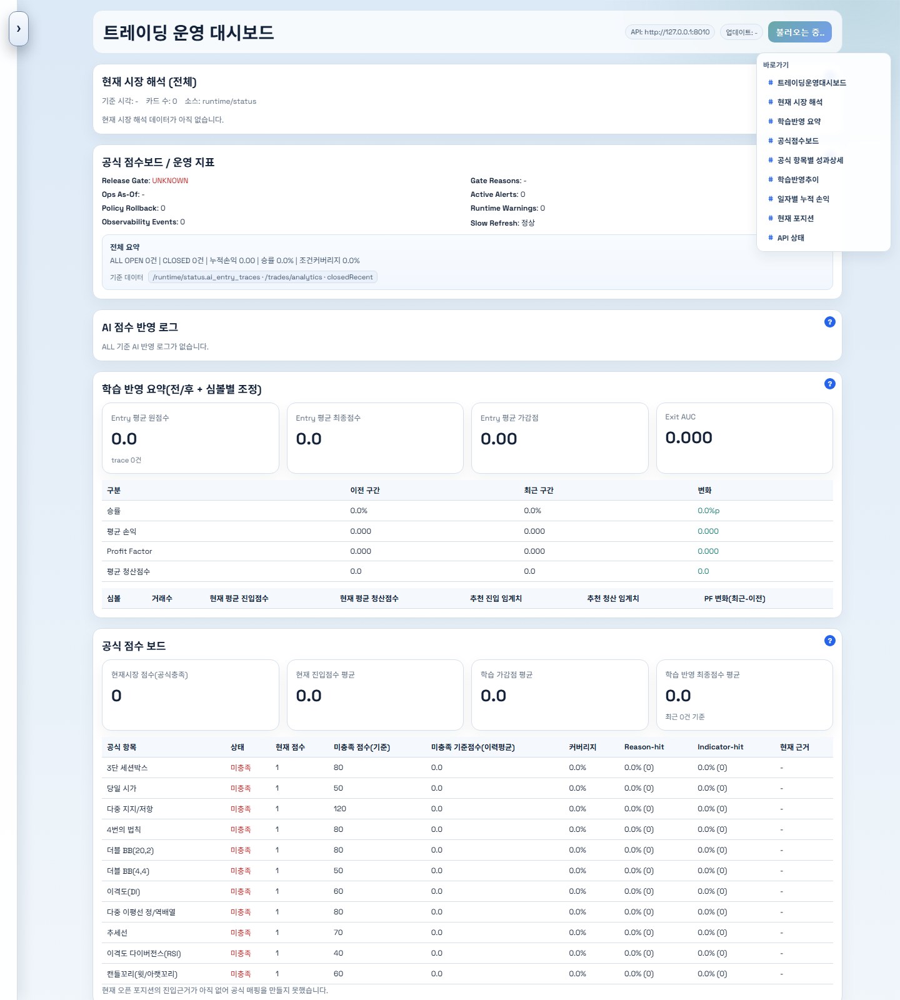
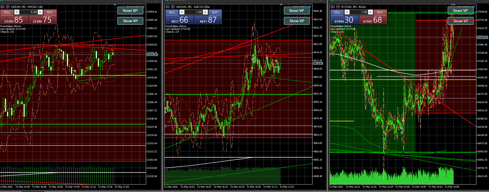
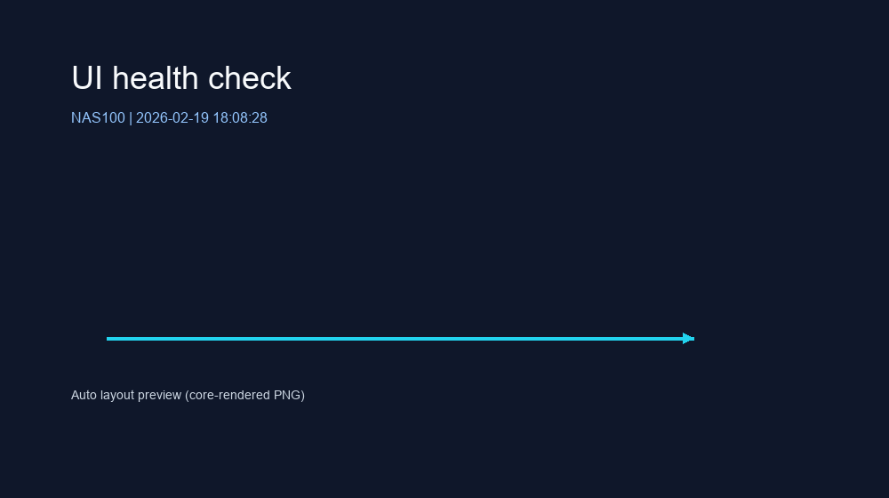

# CFD 데이터 기반 트레이딩 분석 시스템

이 프로젝트는 실시간 시장 데이터를 가공하고, 상태 기반 해석 로직과 머신러닝 보조 예측을 결합해,  
트레이딩 의사결정 과정을 구조화하고 모니터링할 수 있도록 설계한 개인 프로젝트입니다.

기획, 구조 설계, 데이터 처리, 백엔드, 프론트엔드, 테스트, 문서화까지 전 과정을 직접 구현했습니다.

이 프로젝트는 단순한 매매 자동화 스크립트가 아니라,

- 시장 데이터 수집 및 정규화
- 상태/신호 해석 로직 설계
- ML 학습 및 재학습 보조 파이프라인
- FastAPI 기반 운영 API
- Next.js 기반 모니터링 대시보드
- 테스트 및 문서화

까지 하나의 시스템으로 연결해 본 작업입니다.

현재는 배포형 서비스보다는 연구, 운영 자동화, 구조 설계, 데이터 해석 역량을 보여주는 포트폴리오 성격이 더 강합니다.

## 프로젝트 개요

트레이딩에서는 단순히 "가격이 올랐다/내렸다"를 보는 것보다,
시장 데이터를 어떤 기준으로 가공하고, 어떤 상태로 해석하며, 그 판단을 어떻게 재검증하고 추적할 수 있는지가 중요하다고 생각했습니다.

이 프로젝트에서는 그 문제를 다음과 같이 풀고자 했습니다.

1. 실시간 가격과 거래 관련 데이터를 수집한다.
2. 데이터를 정리 가능한 구조로 변환한다.
3. 규칙 기반 판단 로직과 상태 모델을 만든다.
4. 학습 가능한 형태의 피처와 이력을 쌓는다.
5. ML을 이용해 일부 판단을 보조하거나 재검토한다.
6. 결과를 API와 대시보드로 시각화해 운영 관점에서 확인 가능하게 만든다.

즉, 이 저장소는 "차트 몇 개를 보는 프로젝트"가 아니라  
"데이터를 구조화하고, 판단 로직을 만들고, 그 판단을 다시 시스템적으로 검증하는 과정"을 구현한 프로젝트입니다.

## 무엇을 만들었는가

### 1. 데이터 처리와 상태 해석 파이프라인

실시간으로 들어오는 시장/거래 데이터를 바로 쓰지 않고,  
분석과 판단에 사용할 수 있도록 정규화하고 해석 가능한 상태로 변환하는 구조를 만들었습니다.

핵심 방향은 다음과 같습니다.

- 원시 데이터를 바로 소비하지 않고 중간 해석 레이어를 둠
- 심볼별 상태, 진입/대기/청산 맥락을 구조화함
- 단순 가격 조회가 아니라 "현재 어떤 상황으로 해석되는가"를 남김
- 후속 학습과 리포트에서 재사용할 수 있도록 로그/상태를 설계함

### 2. 규칙 기반 판단 + ML 보조 예측 결합

이 프로젝트는 ML만으로 판단하는 구조가 아니라,
규칙 기반 판단 로직 위에 ML을 보조 레이어로 붙이는 방향으로 설계했습니다.

이 접근을 택한 이유는 다음과 같습니다.

- 트레이딩 맥락에서는 설명 가능성이 중요함
- 완전 블랙박스보다 규칙 기반 해석과 결합하는 편이 검토가 쉬움
- ML은 "최종 진실"보다 점수 보정, 필터링, 보조 판단에 더 적합하다고 판단함

그래서 프로젝트 안에는 다음 흐름이 함께 들어 있습니다.

- 피처 생성
- 학습/평가 스크립트
- 재학습 및 배포 보조 스크립트
- 런타임에서의 AI 보조 판단
- 결과 비교 및 운영용 점검 로직

### 3. 운영 모니터링용 API와 대시보드

백엔드에서 계산된 상태를 사람이 바로 확인할 수 있도록  
FastAPI와 Next.js를 이용해 운영 대시보드를 구성했습니다.

이 대시보드에서는 단순 숫자 나열이 아니라 다음과 같은 정보를 볼 수 있습니다.

- 현재 런타임 상태
- 최근 거래/포지션 관련 정보
- 학습 반영 요약
- 공식 점수 보드
- 운영 준비 상태와 관측성 정보

즉, "모델이 있다"에서 끝나는 것이 아니라,  
"실제로 운영자가 무엇을 확인하고 어떤 상태를 해석할 수 있는가"까지 연결하는 데 초점을 맞췄습니다.

### 4. 테스트와 문서화

이 저장소에는 테스트와 문서가 매우 많이 포함되어 있습니다.  
단순 구현보다 "변경 가능한 구조"를 만드는 데 신경 썼기 때문입니다.

프로젝트에는 다음 성격의 자산이 함께 있습니다.

- 단위 테스트
- 통합 테스트
- 검증용 스크립트
- 로드맵/설계 메모
- 단계별 구현 문서
- 관측성과 검증을 위한 운영 보조 문서

포트폴리오 관점에서 이 부분은  
"기능을 만든 것"뿐 아니라 "복잡한 코드를 어떻게 유지하고 설명 가능하게 만들었는가"를 보여주는 부분입니다.

## 이 프로젝트에서 보여주고 싶은 역량

이 프로젝트는 아래 역량을 한 번에 보여주기 위해 구성했습니다.

- Python 기반 백엔드 설계 역량
- 데이터 전처리 및 구조화 능력
- ML을 실제 시스템 안에 연결하는 감각
- API 설계 및 운영용 상태 노출 방식
- 대시보드 구성과 시각화 연결 능력
- 테스트, 검증, 문서화 습관
- 단일 파일이 아닌 중대형 구조를 다루는 능력

## 화면 예시

### 운영 대시보드 메인 화면



실제 로컬에서 구동한 대시보드 화면입니다.  
런타임 상태, 운영 지표, 학습 반영 요약, 공식 점수 보드 등을 한 화면 안에서 확인할 수 있도록 구성했습니다.

### MT5 멀티 차트 운영 화면 예시



실제 차트 운용 화면 예시입니다.  
NAS100, XAUUSD, BTCUSD를 나란히 보며 시장 상태와 주요 레벨을 함께 확인하는 운영 흐름을 보여줍니다.

### UI 헬스 체크 / 레이아웃 미리보기



UI 렌더링과 레이아웃 파이프라인이 정상 동작하는지 확인하기 위한 보조 이미지입니다.  
이 프로젝트가 단순한 분석 코드 저장소가 아니라, 시각화와 운영 화면까지 포함한 시스템이라는 점을 보여줍니다.

## 기술적으로 집중한 포인트

### 데이터 중심 구조화

트레이딩 데이터를 단순 CSV 수준에서 끝내지 않고,  
이후 학습/검증/시각화에 재사용할 수 있도록 구조화한 점에 집중했습니다.

### 해석 가능한 의사결정

모든 판단을 블랙박스 ML로 던지는 대신,  
상태 기반 해석과 규칙 로직을 유지하면서 ML을 보조적으로 결합했습니다.

### 운영 가능성

백엔드 내부 계산 결과를 API와 대시보드로 바로 이어서,  
개발자나 운영자가 현재 상태를 관찰하고 점검할 수 있게 했습니다.

### 유지보수성

서비스, 포트, 어댑터, 테스트, 문서가 분리된 구조를 통해  
로직이 커져도 추적 가능하도록 설계하려고 했습니다.

## 기술 스택

- Python 3.12
- FastAPI
- pandas
- Next.js 14
- React 18
- Node.js 20.x
- MetaTrader 5 연동

## 저장소 구조

- `main.py`
  메인 런타임 진입점

- `backend/`
  도메인, 서비스, FastAPI, 핵심 애플리케이션 로직

- `adapters/`
  MT5, 알림, 관측성 등 외부 연동 어댑터

- `ports/`
  계층 분리를 위한 포트 인터페이스

- `ml/`
  피처 생성, 학습, 재학습, 평가 관련 스크립트

- `frontend/next-dashboard/`
  운영 대시보드 UI

- `scripts/`
  검증, 리포트, 배포 전 점검, 정리 작업용 스크립트

- `tests/`
  단위/통합 테스트

- `docs/`
  설계 문서, 구현 메모, 로드맵, 검증 기록

## 현재 상태

이 프로젝트는 현재 기준으로 "배포 완료 서비스"보다는  
"복잡한 도메인을 데이터/ML/시스템 설계 관점에서 어떻게 풀어냈는가"를 보여주는 포트폴리오 프로젝트입니다.

즉, 지금 단계에서 가장 강조하고 싶은 점은 다음과 같습니다.

- 실제 문제를 코드 구조로 풀어낸 경험
- 데이터 가공과 상태 모델링 경험
- ML을 시스템 안에 연결한 경험
- 운영용 UI/API까지 연결한 풀스택 경험
- 테스트와 문서화로 복잡도를 관리한 경험

## 실행 관련 메모

배포를 전제로 정리한 저장소는 아니기 때문에,  
현재 README는 설치 가이드보다 프로젝트 소개와 구조 설명에 더 무게를 두고 있습니다.

필요하면 로컬에서는 아래 흐름으로 실행할 수 있습니다.

```bat
manage_cfd.bat start
```

또는 수동으로 아래처럼 실행할 수 있습니다.

```bat
python main.py
python -m uvicorn backend.fastapi.app:app --host 127.0.0.1 --port 8010 --workers 1
cd frontend\next-dashboard
npm install
npm run dev
```

## 참고

공개 저장소 기준으로 실제 `.env`, 대용량 데이터, 모델 산출물, 로그 등은 제외했습니다.  
이 저장소는 민감한 운영 자산을 공개하지 않으면서도, 프로젝트의 구조와 역량이 드러나도록 정리한 버전입니다.
