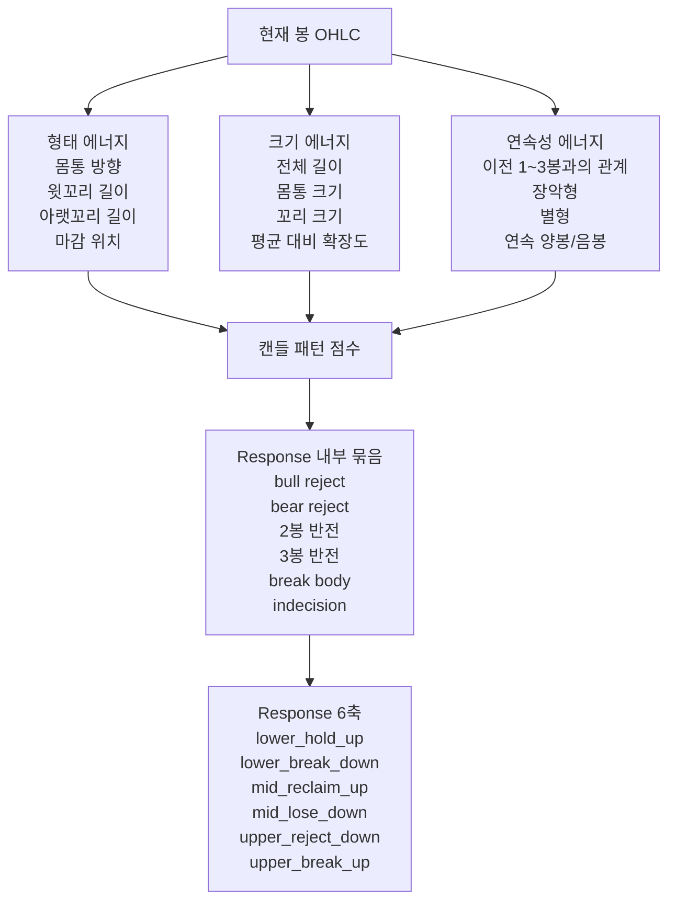

# 캔들 에너지 스키마

## 목적

이 문서는 캔들을 점수화할 때 왜 `하나의 -1~1 값`만으로는 부족한지,
그리고 어떤 식으로 나눠서 봐야 `Response`와 잘 연결되는지를 정리한 문서다.

핵심은 아주 단순하다.

- 캔들은 `모양`이 있고
- 캔들은 `크기`가 있고
- 캔들은 `앞뒤 봉과의 관계`가 있다

이 3개를 분리해서 봐야 한다.

---

## 한눈에 보기

### 잘못 보기

- 캔들 하나를 그냥 `-1~1` 하나로만 보려는 것

문제:

- 양봉/음봉 방향은 보이지만
- 얼마나 컸는지
- 꼬리가 얼마나 의미 있었는지
- 앞 봉을 얼마나 덮었는지

를 잃어버리기 쉽다.

### 더 좋은 보기

- `형태 에너지`
- `크기 에너지`
- `연속성 에너지`

이 3개로 나눠서 본다.

---

## 그림으로 보면



---

## 1. 형태 에너지

형태 에너지는
`이 캔들이 어떻게 생겼는가`
를 말한다.

여기서는 주로 `-1~1` 또는 `0~1` 정규화가 잘 맞는다.

### 기본 요소

#### 1) 몸통 방향 에너지

```text
body_signed_energy = (close - open) / range
```

뜻:

- `+1`에 가까우면 강한 양봉
- `-1`에 가까우면 강한 음봉

#### 2) 몸통 크기 에너지

```text
body_shape_energy = abs(close - open) / range
```

뜻:

- 0에 가까우면 몸통이 작다
- 1에 가까우면 몸통이 크다

#### 3) 윗꼬리 에너지

```text
upper_wick_energy = (high - max(open, close)) / range
```

뜻:

- 클수록 위에서 많이 밀렸다

#### 4) 아랫꼬리 에너지

```text
lower_wick_energy = (min(open, close) - low) / range
```

뜻:

- 클수록 아래에서 많이 받쳤다

#### 5) 마감 위치 에너지

```text
close_location_energy = 2 * ((close - low) / range) - 1
```

뜻:

- `+1`이면 고가 부근 마감
- `-1`이면 저가 부근 마감

#### 6) 꼬리 균형 에너지

```text
wick_balance_energy = lower_wick_energy - upper_wick_energy
```

뜻:

- `+`면 아래꼬리 우세
- `-`면 위꼬리 우세

---

## 2. 크기 에너지

이 부분이 중요하다.

형태 에너지만 보면

- 작은 망치형
- 엄청 큰 망치형

이 둘이 비슷하게 보일 수 있다.

하지만 실전 의미는 다르다.

그래서 크기 에너지를 따로 둬야 한다.

### 기본 생각

지금 봉이

- 평소보다 큰지
- 평소보다 몸통이 큰지
- 평소보다 꼬리가 긴지

를 따로 본다.

### 예시

#### 1) 전체 길이 크기

```text
range_size_energy = (high - low) / avg_range_20
```

뜻:

- 1.0이면 최근 평균 정도
- 1.5면 최근 평균보다 꽤 큼
- 2.0 이상이면 매우 큰 봉

#### 2) 몸통 크기

```text
body_size_energy = abs(close - open) / avg_body_20
```

#### 3) 윗꼬리 크기

```text
upper_wick_size_energy = upper_wick / avg_upper_wick_20
```

#### 4) 아랫꼬리 크기

```text
lower_wick_size_energy = lower_wick / avg_lower_wick_20
```

### 해석

- 형태 에너지는 `어떻게 생겼나`
- 크기 에너지는 `그 생김새가 얼마나 의미 있게 컸나`

를 말한다.

---

## 3. 연속성 에너지

캔들 패턴은 단일봉으로 끝나지 않는다.

특히:

- 장악형
- Morning Star
- Evening Star
- Three White Soldiers
- Three Black Crows

이런 건 앞뒤 봉 관계가 핵심이다.

즉 `현재 봉만` 봐서는 안 된다.

### 예시

#### 1) 장악형 관계

```text
engulf_up_energy
= 이전 봉이 음봉인지
+ 현재 봉이 양봉인지
+ 현재 몸통이 이전 몸통을 얼마나 덮는지
```

#### 2) Morning Star 관계

```text
morning_star_sequence
= 1봉의 하락 강도
+ 2봉의 정지/축소
+ 3봉의 회복 강도
```

#### 3) Three White Soldiers 관계

```text
three_white_sequence
= 3개 연속 양봉 여부
+ 각 봉의 몸통 강도
+ 고가/종가 갱신 정도
```

즉 연속성 에너지는
`앞뒤 봉 관계가 패턴처럼 맞아떨어지는가`
를 본다.

---

## 4. 왜 하나의 -1~1로 부족한가

예를 들어 두 봉이 모두 `hammer_like = 0.8`로 보일 수 있다.

하지만 실제론:

- A는 작은 꼬리 반등
- B는 아주 큰 유동성 흡수 꼬리 반등

일 수 있다.

즉 모양은 비슷해도
크기 의미는 다르다.

또 어떤 봉은

- 단일봉만 보면 괜찮아 보여도
- 이전 봉과 연결하면 장악형이 아니거나
- 3봉 구조상 별형이 안 될 수 있다.

그래서 캔들은 최소한 아래처럼 나눠야 한다.

```text
캔들 의미
= 형태
* 크기
* 연속성
```

---

## 5. 이해 쉽게 예시로 보면

### 예시 1. Hammer

#### 형태

- 아래꼬리 길다
- 몸통은 위쪽
- 양봉 또는 덜 약한 음봉

#### 크기

- 꼬리 길이가 최근 평균보다 긴가
- 전체 봉 길이가 최근 평균보다 충분히 큰가

#### 연속성

- 이전 봉들이 하락 흐름이었는가
- 다음 봉이 실제로 상승 확인을 주는가

#### 점수식 느낌

```text
hammer_like
= lower_wick_energy * 0.45
+ max(close_location_energy, 0) * 0.30
+ max(body_signed_energy, 0) * 0.25
```

```text
hammer_size_weight
= range_size_energy * 0.4
+ lower_wick_size_energy * 0.6
```

```text
hammer_score
= hammer_like
* hammer_size_weight
```

---

### 예시 2. Shooting Star

#### 형태

- 위꼬리 길다
- 몸통은 아래쪽
- 보통 상단에서 나옴

#### 크기

- 위꼬리가 평균보다 충분히 길어야 한다

#### 연속성

- 이전 흐름이 상승이었는가
- 다음 봉이 하락 확인을 주는가

#### 점수식 느낌

```text
shooting_star_like
= upper_wick_energy * 0.45
+ max(-close_location_energy, 0) * 0.30
+ max(-body_signed_energy, 0) * 0.25
```

---

### 예시 3. Bullish Engulfing

이건 단일봉 에너지보다 `연속성 에너지`가 더 중요하다.

#### 형태

- 현재 봉은 강한 양봉이어야 한다

#### 크기

- 몸통이 충분히 커야 한다

#### 연속성

- 이전 봉이 음봉이어야 한다
- 현재 봉 몸통이 이전 몸통을 덮어야 한다

#### 점수식 느낌

```text
bullish_engulfing_score
= bull_body_shape * 0.30
+ body_size_energy * 0.20
+ engulf_up_energy * 0.50
```

---

## 6. Response와 연결하는 방식

캔들은 여기서 끝나지 않는다.

캔들 점수는 직접 진입 점수가 아니라,
`Response 6축` 안으로 들어가는 재료다.

### 연결 구조

```text
형태 에너지
+ 크기 에너지
+ 연속성 에너지
-> 캔들 패턴 점수
-> 캔들 묶음 점수
-> Response 6축 기여
```

### 예시

- Hammer
  - `lower_hold_up` 가산
- Shooting Star
  - `upper_reject_down` 가산
- Bullish Engulfing
  - `lower_hold_up`, `mid_reclaim_up` 가산
- Bearish Engulfing
  - `upper_reject_down`, `mid_lose_down` 가산
- Three White Soldiers
  - `upper_break_up` 가산
- Three Black Crows
  - `lower_break_down` 가산
- Doji
  - 직접 가산보다 `indecision` 패널티

---

## 7. 실전용 정리

### 꼭 분리해서 봐야 하는 것

1. `형태`
- 양봉/음봉
- 몸통 위치
- 꼬리 우세
- 마감 위치

2. `크기`
- 전체 길이
- 몸통 길이
- 꼬리 길이
- 평균 대비 얼마나 큰지

3. `연속성`
- 이전 1봉 대비
- 이전 2봉 대비
- 이전 3봉 구조 대비

### 가장 중요한 문장

캔들은 `모양 하나`가 아니라

- `어떻게 생겼는가`
- `얼마나 컸는가`
- `앞뒤 봉과 어떤 관계인가`

이 3개를 같이 봐야 패턴 점수가 의미를 가진다.

---

## 8. 결론

캔들을 전부 `-1~1` 하나로 보내는 건 부족하다.

더 좋은 방식은:

- `형태 에너지`
- `크기 에너지`
- `연속성 에너지`

를 나눠서 계산하고,
그 결과를 `캔들 패턴 점수`로 만든 뒤,
그 점수를 `Response 6축`에 기여시키는 것이다.

즉 한 줄로 요약하면:

```text
캔들 = 모양 * 크기 * 관계
```

이 구조가 가장 이해하기 쉽고,
나중에 확장하기도 가장 좋다.

---

## 9. 점수 스케일 기준표

이 섹션은 실제로 캔들 점수를 몇 점 범위로 다룰지 정리한 표다.

핵심은:

- 모든 값을 같은 범위로 두지 않는다
- 의미에 따라 다른 스케일을 쓴다

---

### 9-1. 형태 에너지 스케일

| 항목 | 범위 | 뜻 |
|---|---:|---|
| `body_signed_energy` | `-1 ~ 1` | 양봉/음봉 방향성과 강도 |
| `body_shape_energy` | `0 ~ 1` | 몸통이 전체 봉에서 차지하는 비중 |
| `upper_wick_energy` | `0 ~ 1` | 위꼬리 비중 |
| `lower_wick_energy` | `0 ~ 1` | 아래꼬리 비중 |
| `close_location_energy` | `-1 ~ 1` | 고가 부근/저가 부근 마감 정도 |
| `wick_balance_energy` | `-1 ~ 1` | 아래꼬리 우세인지 위꼬리 우세인지 |

#### 해석 예시

- `body_signed_energy = 0.85`
  - 강한 양봉
- `body_signed_energy = -0.75`
  - 강한 음봉
- `upper_wick_energy = 0.60`
  - 위꼬리 비중이 꽤 큼
- `close_location_energy = 0.90`
  - 거의 고가 부근 마감

---

### 9-2. 크기 에너지 스케일

크기 에너지는 `정규화 방향값`보다
`평균 대비 배수`가 더 적합하다.

| 항목 | 추천 범위 | 뜻 |
|---|---:|---|
| `range_size_energy` | `0 ~ 3+` | 전체 봉 길이의 평균 대비 배수 |
| `body_size_energy` | `0 ~ 3+` | 몸통 길이의 평균 대비 배수 |
| `upper_wick_size_energy` | `0 ~ 3+` | 위꼬리 길이의 평균 대비 배수 |
| `lower_wick_size_energy` | `0 ~ 3+` | 아래꼬리 길이의 평균 대비 배수 |

#### 해석 기준

| 구간 | 해석 |
|---|---|
| `< 0.7` | 작은 봉 / 작은 꼬리 |
| `0.7 ~ 1.3` | 평균 수준 |
| `1.3 ~ 1.8` | 의미 있게 큼 |
| `> 1.8` | 매우 큼 / 강한 이벤트 |

#### 해석 예시

- `range_size_energy = 0.55`
  - 최근 평균보다 꽤 작은 봉
- `body_size_energy = 1.40`
  - 최근 평균보다 확실히 큰 몸통
- `lower_wick_size_energy = 2.10`
  - 평균보다 매우 긴 아래꼬리

---

### 9-3. 연속성 에너지 스케일

연속성 에너지는 보통 `0 ~ 1`이 좋다.

| 항목 | 범위 | 뜻 |
|---|---:|---|
| `engulf_up_energy` | `0 ~ 1` | 상승 장악형 완성도 |
| `engulf_down_energy` | `0 ~ 1` | 하락 장악형 완성도 |
| `morning_star_sequence` | `0 ~ 1` | Morning Star 구조 완성도 |
| `evening_star_sequence` | `0 ~ 1` | Evening Star 구조 완성도 |
| `three_white_sequence` | `0 ~ 1` | 3연속 강세 구조 완성도 |
| `three_black_sequence` | `0 ~ 1` | 3연속 약세 구조 완성도 |

#### 해석 기준

| 점수 | 해석 |
|---:|---|
| `0.0 ~ 0.2` | 거의 해당 패턴 아님 |
| `0.2 ~ 0.4` | 약하게 비슷함 |
| `0.4 ~ 0.6` | 절반 이상 맞음 |
| `0.6 ~ 0.8` | 꽤 잘 맞음 |
| `0.8 ~ 1.0` | 거의 이상적인 구조 |

---

### 9-4. 패턴 점수 스케일

개별 패턴 점수는 최종적으로 `0 ~ 1`로 압축하는 것이 좋다.

| 항목 예시 | 범위 | 뜻 |
|---|---:|---|
| `hammer_score` | `0 ~ 1` | Hammer 유사도 |
| `shooting_star_score` | `0 ~ 1` | Shooting Star 유사도 |
| `bullish_engulfing_score` | `0 ~ 1` | Bullish Engulfing 완성도 |
| `morning_star_score` | `0 ~ 1` | Morning Star 완성도 |
| `doji_score` | `0 ~ 1` | Doji 유사도 |

#### 해석 기준

| 점수 | 해석 |
|---:|---|
| `0.00 ~ 0.20` | 거의 없음 |
| `0.20 ~ 0.40` | 약함 |
| `0.40 ~ 0.60` | 의미 있음 |
| `0.60 ~ 0.80` | 강함 |
| `0.80 ~ 1.00` | 매우 강함 |

---

### 9-5. Response 축 점수 스케일

각 캔들 묶음은 결국 `Response 6축` 안의 기여 점수로 들어간다.
최종 축 점수도 `0 ~ 1`이 좋다.

| 축 | 범위 | 뜻 |
|---|---:|---|
| `lower_hold_up` | `0 ~ 1` | 하단 반등 쪽 강도 |
| `lower_break_down` | `0 ~ 1` | 하단 붕괴 쪽 강도 |
| `mid_reclaim_up` | `0 ~ 1` | 중심 회복 상승 강도 |
| `mid_lose_down` | `0 ~ 1` | 중심 상실 하락 강도 |
| `upper_reject_down` | `0 ~ 1` | 상단 거절 하락 강도 |
| `upper_break_up` | `0 ~ 1` | 상단 돌파 상승 강도 |

#### 해석 기준

| 점수 | 해석 |
|---:|---|
| `0.00 ~ 0.25` | 축이 거의 안 섬 |
| `0.25 ~ 0.50` | 약한 방향성 |
| `0.50 ~ 0.70` | 실질적 방향성 |
| `0.70 ~ 1.00` | 매우 강한 방향성 |

---

### 9-6. 전체 구조를 한 줄로 쓰면

```text
형태 에너지   = -1~1, 0~1
크기 에너지   = 0~3+ 배수
연속성 에너지 = 0~1
패턴 점수     = 0~1
축 점수       = 0~1
```

즉:

- 방향과 모양은 정규화
- 길이와 크기는 배수
- 최종 패턴과 축은 다시 `0~1`

이 흐름으로 보는 것이 가장 안정적이다.
