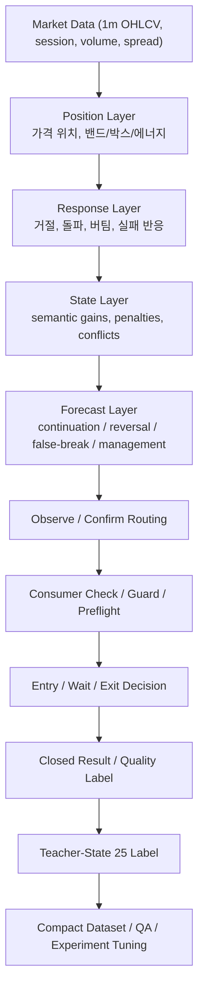

# CFD 프로젝트 소개서
## 발표자료, 블로그, Git 소개글, 투자/협업 설명용 상세 스토리보드

## 1. 이 문서의 목적

이 문서는 CFD 프로젝트를 외부에 설명할 때 사용할 수 있는 "상세 원문"이다.
짧은 PPT 문구나 README 요약본이 아니라, 아래를 충분히 설명할 수 있는 전문적인 기준 문서로 쓰는 것을 목표로 한다.

1. 이 프로젝트가 무엇을 해결하려는지
2. 왜 단순 자동매매가 아니라 해석 가능한 상태 기계로 설계했는지
3. 어떤 철학으로 기획했고 무엇을 실제로 구축했는지
4. 어떻게 검증, 수정, backfill, QA, 실험 단계까지 연결했는지
5. 지금 무엇이 이미 끝났고 무엇이 아직 남아 있는지
6. 발표자료에서 어떤 화면과 어떤 지표를 보여주면 가장 설득력 있는지

이 문서는 "압축본"이 아니라 "원문"이다.
발표자료를 만들 때는 여기서 필요한 부분만 덜어내면 된다.

---

## 2. 이 프로젝트를 한 줄로 정의하면

CFD 프로젝트는 **차트의 위치와 반응을 사람의 직관처럼 해석하고, 그 해석을 다시 진입-기다림-청산 전 과정의 데이터 구조로 남겨 학습 가능한 형태로 바꾸는 시스템**이다.

더 짧게 말하면:

**"결과를 맞추는 매매 로직"이 아니라 "결과가 나오기까지의 판단 과정을 기록하고 학습 가능하게 만드는 매매 운영 시스템"**이다.

---

## 3. 이 프로젝트는 무엇이 아닌가

이 프로젝트를 설명할 때 가장 먼저 잘라 말해야 하는 오해가 있다.

### 3-1. 단순 룰 엔진이 아니다

이 프로젝트는 "조건 몇 개가 맞으면 진입" 같은 평면적인 규칙 집합이 아니다.

예를 들어 외부에서 보기에는 아직도

- BB20 breakout 점수
- BB4 expansion 점수
- flow 점수
- topdown 점수

같은 raw surface가 눈에 들어올 수 있다.
하지만 현재 실제 메인 구조는 이미 그보다 위 계층으로 올라와 있다.

### 3-2. 단순 score threshold 엔진이 아니다

이 프로젝트의 현재 판단축은

- 점수 하나가 높다
- threshold를 넘었다
- 그래서 진입한다

가 아니다.

현재 구조에서 더 중요한 것은

- 지금 가격이 어디에 있는가
- 그 위치에서 어떤 반응이 나타났는가
- 그 반응이 continuation인지 reversal인지
- forecast가 그 해석을 얼마나 지지하는가
- 지금은 observe가 맞는가 confirm이 맞는가
- 최종적으로 consumer check와 guard를 통과하는가

이다.

즉 이 프로젝트는 legacy raw score surface를 아직 보조 지표로 유지할 수는 있어도, 메인 판단의 중심은 이미 `position -> response -> state -> forecast`로 옮겨진 상태다.

### 3-3. 단순히 수익 그래프만 보여주는 프로젝트가 아니다

이 프로젝트의 핵심 산출물은 단지 PnL이 아니다.

핵심 산출물은 오히려 아래다.

- 어떤 장세(state)였는가
- 왜 진입했는가
- 왜 기다렸는가
- 왜 잘랐는가
- 그 판단이 결과적으로 맞았는가
- 그 정보를 다음 학습 단계에서 다시 어떻게 사용할 것인가

즉 이 프로젝트는 "거래가 일어나는 시스템"이면서 동시에 "거래가 왜 그렇게 일어났는지 설명하는 시스템"이다.

---

## 4. 왜 이 프로젝트가 필요했는가

### 4-1. 사람은 차트를 보고 맥락을 읽는데, 시스템은 결과만 남기기 쉽다

사람은 1분봉만 봐도 아래 같은 상태를 직관적으로 읽는다.

- 조용한 장
- 추세 지속장
- 브레이크아웃 직전
- 페이크아웃 반전
- 데드캣 바운스

그런데 전통적인 자동매매 엔진은 그 직관을 데이터로 남기지 못하는 경우가 많다.

결국 로그에는

- 진입했다
- 손익이 났다
- 청산했다

만 남고, **왜 그런 판단을 했는지**는 희미해진다.

### 4-2. 결과만 기록하면 학습보다 회고에 머무른다

수익/손실만 남는 시스템은 사후 회고는 가능해도, 다음 학습 단계로 넘어가기 어렵다.

왜냐하면 학습이 되려면 아래 연결이 남아야 하기 때문이다.

- 시장 상태
- 의사결정
- 기다림 또는 청산
- 결과

즉 `state -> action -> outcome`이 남아야 한다.

### 4-3. 실전 운영에서는 "왜 안 들어갔는가"도 중요하다

이 프로젝트는 진입한 것만큼이나 **막힌 신호**, **관찰로 돌려진 신호**, **기다림으로 밀린 신호**도 중요하게 본다.

왜냐하면 실제 운영에서는 아래가 핵심이기 때문이다.

- 진입한 신호보다 더 많았던 후보가 왜 막혔는가
- guard가 너무 강한가, 아니면 적절한가
- wait가 너무 많아지는가
- observe 단계가 과도하게 길어지는가

즉 이 프로젝트는 "무엇을 했다"뿐 아니라 "무엇을 하지 않았고 왜 그렇게 했는가"까지 관리하려는 프로젝트다.

---

## 5. 설계 철학

이 프로젝트의 설계 철학은 네 가지로 요약할 수 있다.

### 5-1. 신호를 납작하게 만들지 않는다

진입 신호를 단일 score나 단일 flag로 줄이지 않는다.
대신 계층을 분리한다.

- 위치(position)
- 반응(response)
- 상태(state)
- 예측(forecast)
- 라우팅(observe / confirm)
- 최종 진입/대기/청산

이렇게 분리하면 시스템이 더 복잡해지지만, 나중에 설명 가능성과 수정 가능성이 훨씬 높아진다.

### 5-2. 기존 구조를 버리지 않고 위에 쌓는다

이 프로젝트는 "새 엔진을 처음부터 다시 만든다"는 방식이 아니다.

이미 있는 구조:

- `position`
- `state`
- `forecast`
- `decision`
- `wait`
- `exit`
- `close result`

를 유지한 채, 그 위에

- `teacher-state 25`
- `micro-structure Top10`
- compact schema
- QA / experiment tuning

을 덧붙이는 방식으로 갔다.

### 5-3. 실전 데이터로 누적하고, compact하게 남긴다

이 프로젝트는 raw를 영구히 쌓는 방향이 아니다.

운영 관점에서는 다음이 더 중요하다.

- 런타임 동안 raw/entry/close 기록
- compact dataset row로 요약
- 학습에 필요한 구조만 유지
- 오래된 raw는 정리

즉 "계속 쌓는 것"보다 **"구조화해서 남기는 것"**이 더 중요하다.

### 5-4. 실행 반영은 마지막에 한다

이 프로젝트는 teacher-label을 만들었다고 바로 execution 로직을 바꾸지 않는다.

순서는 항상 아래를 따른다.

1. 정의
2. 구축
3. 라벨 부착
4. QA
5. 실험
6. confusion tuning
7. execution handoff 판단

즉 **실행 반영은 항상 마지막 gate**다.

---

## 6. 현재 구조를 가장 잘 설명하는 계층

현재 시스템은 아래 계층으로 설명하는 것이 가장 정확하다.

이 구조를 발표에서 설명할 때는 아래처럼 풀면 좋다.

### 6-1. Position Layer

여기는 "가격이 지금 어디 있는가"를 설명한다.

- 상단/하단/중앙
- 박스 안/밖
- 밴드 위/아래
- 세션 위치
- 에너지 상태

이 단계는 아직 행동이 아니라 **맥락의 좌표계**를 만든다.

### 6-2. Response Layer

여기는 "그 위치에서 어떤 반응이 나왔는가"를 본다.

- 상단 거절
- 하단 버팀
- 중간 회복
- 돌파 성공
- 돌파 실패

즉 단순 지표가 아니라 **행동 직전의 반응 해석**이다.

### 6-3. State Layer

여기는 반응을 semantic state로 바꾼다.

- continuation gain
- range reversal gain
- conflict damp
- volatility penalty
- patience / fast cut pressure

즉 "상태를 수치화한 계층"이다.

### 6-4. Forecast Layer

여기는 state를 바탕으로 다음 가능성을 예측한다.

- continuation 가능성
- reversal 가능성
- false-break 위험
- wait가 더 좋은지
- 지금 잘라야 하는지

즉 시스템이 단순히 현재만 읽는 것이 아니라, **다음 한 걸음의 방향성**까지 읽는 층이다.

### 6-5. Observe / Confirm / Consumer Check

여기가 중요한 이유는 "점수가 높다 = 진입"이 깨지는 지점이기 때문이다.

이 단계에서는

- observe
- probe
- blocked
- ready

로 신호가 분기된다.

즉 진입하지 않은 신호도 중요한 데이터로 남는다.

### 6-6. Entry / Wait / Exit Lifecycle

최종 행동은 아래 lifecycle로 이어진다.

- entry
- wait
- exit
- close result

그리고 이 모든 과정이 나중에 compact dataset row로 축약된다.

---

## 7. Teacher-State 25를 왜 만들었는가

### 7-1. 목적

`teacher-state 25`는 1분봉 차트를 사람이 읽는 방식과 시스템이 남기는 state를 이어주는 라벨층이다.

즉 시스템 입장에서는

- micro feature
- state vector
- forecast feature

가 있고, 사람 입장에서는

- 쉬운 루즈장
- 공허한 횡보
- 삼각수렴 압축
- 브레이크아웃 직전
- 눌림목 반등
- 페이크아웃 반전

같은 이름이 있다.

state25는 이 둘을 연결하기 위해 만든 것이다.

### 7-2. 25개를 단일 정답으로 강제하지 않은 이유

이 프로젝트는 패턴을 "하나만 맞는 정답"으로 만들지 않았다.

대신 아래 구조를 택했다.

- primary pattern
- secondary pattern
- entry bias
- wait bias
- exit bias

왜냐하면 실제 시장은 자주 겹치기 때문이다.

예:

- 브레이크아웃 직전 + 삼각수렴
- 눌림목 반등 + 플래그
- 페이크아웃 반전 + 꼬리물림장

즉 이 프로젝트는 패턴을 label로 쓰되, 현실의 혼합성을 보존하는 쪽을 택했다.

### 7-3. Threshold v2가 필요한 이유

패턴 이름만 있어서는 안 되고, 실제로 붙일 수 있는 수치 기준이 필요했다.

그래서 threshold v2에서는 아래를 반영했다.

- 자산별 ATR 정규화
- 절대 퍼센트 + 상대 기준 혼합
- 혼동쌍 confusion watch
- 구조 확인 강화
- volume burst 단계화

참고 문서:

- [state25 최종 패턴 기준표](/C:/Users/bhs33/Desktop/project/cfd/docs/product_acceptance_teacher_label_25_minute_state_mapping_ko.md)
- [threshold calibration 기준](/C:/Users/bhs33/Desktop/project/cfd/docs/product_acceptance_teacher_label_state25_threshold_calibration_detailed_reference_ko.md)

---

## 8. Micro-Structure Top10을 왜 만들었는가

state25만으로는 부족했다.
이름표는 붙일 수 있어도, 차트 모양 자체를 직접 수치화하는 재료가 부족했기 때문이다.

그래서 도입한 것이 `Top10 micro-structure`다.

도입 범위는 아래 10개다.

- `body_size_pct_20`
- `upper_wick_ratio_20`
- `lower_wick_ratio_20`
- `doji_ratio_20`
- `direction_run_stats`
- `range_compression_ratio_20`
- `volume_burst_decay_20`
- `swing_high_retest_count_20`
- `swing_low_retest_count_20`
- `gap_fill_progress`

이 10개는 단순 지표 추가가 아니라, **차트 모양을 canonical state로 승격하는 작업**이었다.

### 8-1. 왜 새로 만들지 않고 재활용했는가

이미 response/state에 좋은 재료가 많았기 때문이다.

예:

- candle descriptor
- wick energy
- indecision / doji motif
- double top / bottom pattern response
- compression score
- session / box 위치

그래서 이 프로젝트는 "새로 전부 만드는 방식"이 아니라,

- 그대로 사용
- 보강 후 승격
- anchor 추가 후 재구축

이라는 세 갈래 전략을 택했다.

### 8-2. 왜 중요한가

Top10은 teacher-state 25의 "몸체" 역할을 한다.

즉 state25가 패턴 이름이라면,
Top10은 그 패턴을 실제로 계산하고 다시 학습할 수 있게 해주는 수치 재료다.

참고 문서:

- [micro-structure Top10 상세](/C:/Users/bhs33/Desktop/project/cfd/docs/product_acceptance_teacher_label_micro_structure_top10_detailed_reference_ko.md)
- [micro-structure 실행 로드맵](/C:/Users/bhs33/Desktop/project/cfd/docs/product_acceptance_teacher_label_micro_structure_top10_execution_roadmap_ko.md)

---

## 9. 이 프로젝트가 실제로 구축한 스킬

발표에서 "무엇을 만들었는가"를 말할 때는 기능 목록보다 **시스템이 얻게 된 스킬**로 설명하는 것이 더 좋다.

### 스킬 1. 위치 해석 스킬

시스템은 현재 가격을 단순 시세가 아니라 위치 정보로 읽는다.

- 세션 내 위치
- 박스 내 위치
- 밴드 내 위치
- 중간/상단/하단 에너지

즉 "지금 가격이 어디에 있는가"를 해석하는 능력이다.

### 스킬 2. 반응 해석 스킬

시스템은 단순 캔들보다 반응을 본다.

- 거절
- 버팀
- 재탈환
- 돌파
- 돌파 실패

즉 "지금 움직임이 어떤 의미를 갖는가"를 읽는다.

### 스킬 3. semantic state 형성 스킬

시스템은 raw를 바로 쓰지 않고 semantic state로 올린다.

- continuation gain
- reversal gain
- conflict damp
- volatility penalty
- patience / fast-cut pressure

즉 상태를 추상화해 의사결정 친화적인 벡터로 만든다.

### 스킬 4. forecast 스킬

시스템은 현재를 해석하는 데서 끝나지 않고 다음 가능성을 계산한다.

- continuation 가능성
- reversal 가능성
- false-break 위험
- wait 가치
- exit urgency

즉 "현재 상태가 다음 행동으로 어떻게 이어질 가능성이 있는가"를 본다.

### 스킬 5. lifecycle 기록 스킬

이 프로젝트는 entry만 남기지 않는다.

- entry
- wait
- exit
- close result

를 하나의 lifecycle로 이어서 남긴다.

즉 이 시스템은 거래 자체보다 **거래 과정의 서사**를 저장한다.

### 스킬 6. teacher labeling 스킬

이 프로젝트는 시스템 state를 사람이 이해하는 패턴으로 번역한다.

- state25 primary / secondary
- bias
- confidence
- provenance

즉 "엔진 내부 상태"를 "사람이 읽는 패턴"으로 바꾼다.

### 스킬 7. QA / experiment gating 스킬

라벨을 붙이는 것에서 끝나지 않고 아래를 관리한다.

- look-ahead bias 금지
- rare pattern 경고
- low-confidence review
- confusion pair watch
- execution handoff gate

즉 이 프로젝트는 결과뿐 아니라 **라벨의 신뢰도와 실험의 순서**까지 관리한다.

### 스킬 8. 운영 관찰 스킬

최근엔 장시간 런타임에서 판단이 다소 루즈해지는지 관찰하는 운영 노트까지 분리했다.

즉 이제는 모델/엔진뿐 아니라

- runtime drift
- cache/adaptive state 누적
- guarded hourly recycle 가설

까지 운영 문제로 다루고 있다.

참고 문서:

- [runtime recycle 운영 노트](/C:/Users/bhs33/Desktop/project/cfd/docs/product_acceptance_teacher_label_state25_runtime_recycle_operating_note_ko.md)

---

## 10. 기획 -> 생성 -> 수정의 실제 순서

### 10-1. 기획 단계

기획 단계에서 먼저 한 것은 아래를 문서화하는 일이었다.

- state25 패턴 정의
- threshold v2
- micro-structure Top10 범위 고정
- compact schema 설계
- labeling QA 규칙
- experiment tuning roadmap

즉 구현보다 먼저 **무엇을 만들지와 어떻게 검증할지를 고정**했다.

### 10-2. 생성 단계

생성 단계에서는 상위 10개 재료를 실제 파이프라인에 심었다.

대략 아래 흐름이다.

1. 1분봉 OHLCV helper
2. raw snapshot 편입
3. vector / forecast harvest
4. hot payload 연결
5. closed-history compact bridge
6. regression bundle
7. casebook bridge
8. teacher-pattern schema
9. labeler
10. QA gate

### 10-3. 수정 단계

수정 단계에서는 실제 데이터에서 문제가 드러날 때마다 고쳤다.

대표 수정 주제:

- labeled row 부족 문제
- payload가 0으로 평평해지는 문제
- ATR ratio가 1.0으로 고정되는 문제
- tuned relabel
- confusion tuning
- execution handoff gate 보수화

즉 이 프로젝트는 "한 번 설계하고 끝난 것"이 아니라,
**실데이터에서 문제를 확인하고 다시 구조를 다듬는 방식으로 발전한 프로젝트**다.

---

## 11. 현재 상태를 어떻게 이해하면 되는가

기준 문서:

- [state25 current handoff](/C:/Users/bhs33/Desktop/project/cfd/docs/product_acceptance_teacher_label_state25_current_handoff_ko.md)
- [experiment tuning 로드맵](/C:/Users/bhs33/Desktop/project/cfd/docs/product_acceptance_teacher_label_state25_experiment_tuning_roadmap_ko.md)

현재 상태는 아래처럼 설명하는 것이 가장 정확하다.

### 11-1. 기반 공사는 끝났다

아래는 이미 구축됐다.

- Top10 파이프라인
- compact schema
- state25 labeler
- QA gate
- bounded/richer backfill
- Step 9-E1~E5 실험 인프라

즉 지금은 "만들 수 있는가"가 아니라 "이제 얼마나 잘 누적되고 넓어지느냐"의 문제다.

### 11-2. 지금은 coverage 확장과 재평가 구간이다

현재 수치 기준:

- total closed rows: `8705`
- labeled rows: `2596`
- unlabeled rows: `6109`

symbol별 labeled:

- `BTCUSD 785`
- `XAUUSD 1030`
- `NAS100 781`

현재 primary로 관측된 패턴:

- `1, 5, 9, 12, 14, 21, 25`

즉 state25 전체 틀은 깔렸지만,
25개 패턴 전체가 충분히 고르게 관측된 것은 아니다.

이건 실패가 아니라 시장 현실에 가깝다.

- 조용한 장은 많다
- 발작장과 희귀 패턴은 적다
- 따라서 데이터는 계속 누적하면서 봐야 한다

### 11-3. 지금의 메인 작업은 execution 변경이 아니다

현재 로드맵상 메인 작업은 아래다.

- labeled row를 계속 누적
- watchlist pair를 관찰
- E4 confusion tuning을 다시 확인
- E5 execution handoff를 다시 판단

즉 지금은 실전 로직을 크게 흔드는 단계보다, **데이터와 라벨의 신뢰도를 더 높이는 단계**다.

---

## 12. 발표자료에서 지금 바로 보여주기 좋은 핵심 지표 2개

사용자님이 CSV로 직접 그래프를 만들 예정이라면,
지금 시점에서 가장 추천하는 지표는 아래 2개다.

## 지표 A. Teacher-Pattern Coverage

이 지표는 이 프로젝트의 정체성을 가장 잘 드러낸다.

### 왜 좋은가

- state25가 실제로 row에 붙고 있는지 보여준다
- "시장 상태를 읽기 시작했다"는 걸 보여준다
- 단순 손익보다 현재 프로젝트의 진척을 더 정확하게 보여준다

### 추천 그래프

- 날짜별 cumulative labeled rows
- 날짜별 cumulative unique primary pattern count
- pattern group 비중 변화
- confidence 분포 추이

### 추천 CSV

- [trade_closed_history.csv](/C:/Users/bhs33/Desktop/project/cfd/data/trades/trade_closed_history.csv)

### 추천 컬럼

- `close_time`
- `teacher_pattern_id`
- `teacher_pattern_group`
- `teacher_label_confidence`
- `teacher_label_source`
- `teacher_label_review_status`

### 발표 문장 예시

"이 프로젝트는 거래 수를 늘리는 것이 아니라, 실제 시장 상태를 점점 더 넓게 읽고 구조화하는 방향으로 진화하고 있습니다."

## 지표 B. Activation Funnel / Why Blocked

이 지표는 운영적 설득력이 가장 높다.

### 왜 좋은가

- 진입뿐 아니라 "왜 안 들어갔는지"를 보여준다
- 시스템의 판단 근거가 보인다
- 운영 화면과 바로 이어진다

### 추천 그래프

- `consumer_check_stage` 분포
- `blocked_by` 상위 항목 분포
- `observe_reason` 상위 항목 분포
- `teacher_label_exploration_active` True/False 추이

### 추천 CSV

- [entry_decisions.csv](/C:/Users/bhs33/Desktop/project/cfd/data/trades/entry_decisions.csv)

### 추천 컬럼

- `time`
- `symbol`
- `observe_reason`
- `blocked_by`
- `consumer_check_stage`
- `consumer_check_reason`
- `teacher_label_exploration_active`
- `effective_entry_threshold`
- `entry_stage`

### 발표 문장 예시

"CFD는 들어간 신호만 기록하는 시스템이 아니라, 무엇이 왜 막혔는지까지 운영 관점에서 설명하는 시스템입니다."

### 참고로 지금 바로 분포가 잘 보이는 항목

현재 `entry_decisions.csv`에서 바로 보기 좋은 항목은 아래다.

- `observe_reason`
  - `lower_rebound_probe_observe`
  - `outer_band_reversal_support_required_observe`
  - `lower_rebound_confirm`
- `blocked_by`
  - `range_lower_buy_requires_lower_edge`
  - `energy_soft_block`
  - `outer_band_guard`
  - `hard_guard_volatility_too_low`
  - `forecast_guard`
- `consumer_check_stage`
  - `BLOCKED`
  - `PROBE`
  - `OBSERVE`

즉 이 데이터는 발표에서도 "판단 과정이 남아 있는 시스템"이라는 점을 강조하기 좋다.

---

## 13. 운영 화면 1장 구상

이 프로젝트는 아직 시각 자료가 부족하다.
그래서 PPT에는 "지금 당장 실제 UI가 없어도 보여줄 수 있는 운영 화면 1장"이 필요하다.

추천 이름:

`CFD Lifecycle Intelligence Board`

### 목적

- 신호가 어디서 살아나는지
- 어디서 막히는지
- 어떤 state가 쌓이고 있는지
- wait와 exit가 어떤 이유로 나오는지

를 한 화면에서 보이게 한다.

### 추천 레이아웃

| 영역 | 보여줄 것 | 데이터 |
|---|---|---|
| 좌상단 | Activation Funnel | `entry_decisions.csv` |
| 우상단 | Teacher-Pattern Coverage | `trade_closed_history.csv` |
| 좌하단 | Top Observe / Top Blocked Reasons | `entry_decisions.csv` |
| 우하단 | Wait / Exit Quality Mix | `trade_closed_history.csv` |

### 넣으면 좋은 카드

- total signals
- blocked ratio
- probe ratio
- labeled rows
- covered primary patterns
- top blocked reason
- top observe reason
- top wait quality
- top exit reason

### 이 화면의 메시지

"CFD는 결과를 보는 대시보드가 아니라, 판단의 경로가 보이는 운영 대시보드가 필요하다."

---

## 14. 지금 단계에서 기대치를 어떻게 말해야 하는가

이 프로젝트를 발표할 때는 기대치를 과장하지 않는 것이 오히려 좋다.

### 이렇게 말하는 것이 좋다

- state25 전체 구조는 구축됐다
- micro-structure 파이프라인도 구축됐다
- 라벨링과 QA, backfill, experiment gate까지 있다
- 다만 coverage는 시장 현실을 따라 천천히 넓어진다
- execution 반영은 gate를 통해 보수적으로 진행한다

### 이렇게 말하지 않는 것이 좋다

- 모든 패턴이 완벽히 커버됐다
- 이미 완성된 자동매매 시스템이다
- 수익만으로 검증이 끝났다

이 프로젝트의 강점은 "과장된 완성도"가 아니라,
**구축-검증-운영-학습의 연결 구조가 이미 있다는 점**이다.

---

## 15. 발표 마무리 문장 예시

### 버전 1

"CFD는 시장 상태를 읽고 거래 전 과정을 기록한 뒤, 그것을 다시 학습 가능한 teacher-label 데이터로 바꾸는 프로젝트입니다."

### 버전 2

"이 프로젝트의 핵심은 매매 규칙을 많이 만드는 것이 아니라, 시장을 어떻게 읽고 왜 그렇게 행동했는지까지 lifecycle로 남기는 데 있습니다."

### 버전 3

"차트를 보고 느끼는 직관을 시스템의 상태 구조와 compact dataset으로 번역했다는 점이 CFD의 핵심입니다."

---

## 16. 이 문서를 읽은 뒤 바로 봐야 할 참고 문서

다른 스레드나 다른 작업자가 이어받는다면 아래 순서가 가장 좋다.

1. [state25 current handoff](/C:/Users/bhs33/Desktop/project/cfd/docs/product_acceptance_teacher_label_state25_current_handoff_ko.md)
2. [state25 master plan](/C:/Users/bhs33/Desktop/project/cfd/docs/product_acceptance_teacher_label_state25_master_plan_ko.md)
3. [micro-structure 실행 로드맵](/C:/Users/bhs33/Desktop/project/cfd/docs/product_acceptance_teacher_label_micro_structure_top10_execution_roadmap_ko.md)
4. [experiment tuning 로드맵](/C:/Users/bhs33/Desktop/project/cfd/docs/product_acceptance_teacher_label_state25_experiment_tuning_roadmap_ko.md)
5. [labeling QA 기준서](/C:/Users/bhs33/Desktop/project/cfd/docs/product_acceptance_teacher_label_state25_labeling_qa_detailed_reference_ko.md)
6. [runtime recycle 운영 노트](/C:/Users/bhs33/Desktop/project/cfd/docs/product_acceptance_teacher_label_state25_runtime_recycle_operating_note_ko.md)

---

## 17. 최종 요약

CFD 프로젝트는 "매매 결과를 잘 내는가"만을 목표로 하지 않는다.
그보다 더 깊게,

- 시장을 어떤 상태로 읽었는지
- 그 상태에서 왜 진입/기다림/청산을 선택했는지
- 그 결과가 무엇이었는지
- 그 기록을 다음 실험과 학습에 어떻게 넘길 것인지

를 하나의 구조로 만든 프로젝트다.

즉 이 프로젝트의 핵심은 자동매매 기능 그 자체보다,
**시장 해석, 거래 lifecycle, teacher labeling, compact dataset, QA, experiment tuning까지 이어지는 하나의 운영형 학습 시스템을 만들었다는 점**에 있다.
