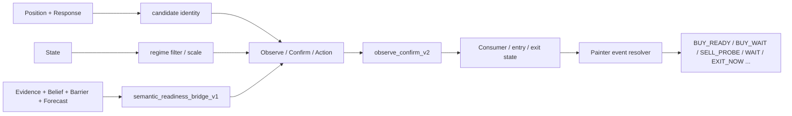

# 차트 Buy / Wait / Sell 표현 가이드

## 목적

이 문서는 현재 구축되어 있는 semantic routing -> consumer -> chart painter 흐름을 기준으로,
차트에 `buy / wait / sell`이 어떻게 표현되어야 하는지 설명하는 운영 가이드다.

특히 아래 질문에 답하도록 작성한다.

- 현재 어떤 레이어가 실제 방향 후보를 만들고 있는가
- `BUY`, `SELL`, `WAIT`는 어디서 결정되고 어디서 화면 표시로 번역되는가
- 왜 어떤 경우에는 `buy`가 `WAIT`로 보이고, 어떤 경우에는 아예 안 보이는가
- 최근 수정된 표시 이슈는 무엇이며, 현재 기준은 무엇인가
- 이후 10단계 strength 표기를 넣으려면 어떤 축을 따라가야 하는가


## 한 줄 요약

차트는 `Position / Response / State / Evidence / Belief / Barrier / Forecast`를 직접 그리지 않는다.
상위 라우터가 이 레이어들을 합쳐 `observe_confirm_v2`, `edge_pair_law_v1`, `probe_*`, `entry_decision_result_v1`, `exit_wait_state_v1` 같은 최종 요약값으로 내보내고,
`Painter`는 그 요약값을 다시 `BUY_READY`, `BUY_WAIT`, `SELL_PROBE`, `WAIT`, `EXIT_NOW` 같은 차트 이벤트로 번역한다.


## 적용 범위

- 라우팅 기준: `backend/trading/engine/core/observe_confirm_router.py`
- 차트 번역 기준: `backend/trading/chart_painter.py`
- 런타임 스냅샷/exit 전달 기준: `backend/app/trading_application_runner.py`
- 회귀 테스트 기준:
  - `tests/unit/test_chart_painter.py`
  - `tests/unit/test_trading_application_runner_profile.py`


## 핵심 코드 포인터

### Router

- `_state_execution_scales(...)`
  - state가 `buy_scale`, `sell_scale`로 readiness를 얼마나 누르거나 살리는지 정한다
- semantic readiness bridge
  - `base + evidence + belief + forecast - barrier` 형태의 최종 support를 만든다
- `_attach_routing_policy_metadata(...)`
  - 어떤 레이어가 identity를 만들고 어떤 레이어가 readiness만 조절하는지 metadata에 기록한다
- `_emit_confirm(...)`, `_emit_observe(...)`
  - 최종 `observe_confirm_v2` handoff를 만든다

### Painter

- `_event_price(...)`
  - 이벤트를 캔들 어디에 찍을지 결정한다
- `_resolve_flow_event_kind(...)`
  - 최종 row를 `BUY_READY`, `BUY_WAIT`, `EXIT_NOW` 같은 차트 이벤트로 번역한다
- `_resolve_blocked_structural_wait(...)`
  - structural guard에 막힌 directional wait를 복원한다
- `_resolve_probe_visual_allowed(...)`
  - probe를 차트에 보여줄지 판단한다
- `_flow_event_signal_score(...)`
  - 표시 강도용 score를 계산한다
- `_flow_event_color(...)`
  - wait 계열 밝기 보정을 포함한 최종 색을 결정한다
- `add_decision_flow_overlay(...)`
  - history를 읽고 실제 오버레이 선을 그린다

### Runner

- `_snapshot_exit_fields(...)`
  - flat 상태일 때 stale exit payload가 다음 snapshot으로 넘어가지 않게 정리한다


## 전체 흐름




## 1. 현재 구축되어 있는 핵심 구조

### 1-1. 방향 정체성은 `Position + Response`가 만든다

현재 라우팅 정책은 다음 원칙을 따른다.

- `PositionSnapshot + ResponseVector v2`만 archetype identity를 만든다.
- 즉 `buy인지 sell인지의 정체성`은 여기서 처음 생긴다.
- `State`, `Evidence`, `Belief`, `Barrier`, `Forecast`는 identity를 새로 만들거나 이름을 바꾸면 안 된다.

이 원칙은 `observe_confirm_routing_policy_v2`에 반영되어 있고,
코드에서는 `position_response_role = archetype_candidate_generation`으로 metadata에 남는다.


### 1-2. `State`는 방향 후보를 필터링하고 스케일링한다

`State`는 보통 다음 역할을 가진다.

- trend/range 같은 장 상태 해석
- upper / middle / lower 문맥 필터
- `buy_scale`, `sell_scale`로 candidate support를 증폭 또는 감쇠

즉 `State`는 보통 `BUY를 SELL로 뒤집는 층`이 아니라,
`이미 생긴 후보가 지금 시장 문맥에서 얼마나 자연스러운지`를 조절하는 층이다.


### 1-3. `Evidence / Belief / Barrier / Forecast`는 readiness를 조절한다

현재 semantic readiness bridge는 아래 형태로 support를 조합한다.

```text
final_support
= (base_support
 + evidence_boost
 + belief_boost
 + forecast_boost
 - barrier_penalty)
 * state_scale
```

핵심 포인트는 이렇다.

- `Evidence`: setup strength를 올린다
- `Belief`: persistence bias를 반영한다
- `Barrier`: 실행을 누르거나 차단한다
- `Forecast`: confirm/wait split과 confidence를 조절한다

중요:

- `Forecast`는 현재 정책상 side를 뒤집지 않는다
- `Forecast`는 confirm으로 올릴지 wait에 남길지를 조절하는 역할이다
- readiness score는 `확률`이 아니라 `실행 준비도` 의미에 가깝다


### 1-4. `Observe / Confirm / Action`이 최종 semantic handoff를 만든다

라우터는 최종적으로 아래 필드를 내보낸다.

- `action`: `WAIT`, `BUY`, `SELL`, `NONE`
- `side`: `BUY`, `SELL`, `""`
- `reason`
- `confidence`
- `metadata.semantic_readiness_bridge_v1`
- `metadata.edge_pair_law_v1`

여기서 차트가 가장 중요하게 보는 값은 사실상 이 요약 결과다.


### 1-5. `Consumer`는 실행 상태를 덧붙인다

차트 입장에서는 라우터뿐 아니라 consumer 결과도 중요하다.

- `entry_decision_result_v1`
  - 실제 진입이 되었는지
  - `ENTER_BUY`, `ENTER_SELL`를 찍어야 하는지
- `exit_wait_state_v1`
  - `EXIT_NOW`, `HOLD`, `REVERSE_READY` 같은 반대 계열 이벤트가 있는지
- `my_position_count`
  - flat 상태인지
  - exit 계열 표시를 허용해도 되는지


### 1-6. `Painter`는 요약값을 차트 이벤트로 번역한다

`Painter`는 upstream raw layer를 직접 보지 않는다.
실제로 읽는 값은 대체로 아래다.

- `observe_confirm_v2.action`
- `observe_confirm_v2.side`
- `observe_confirm_v2.reason`
- `observe_confirm_v2.confidence`
- `observe_confirm_v2.metadata.edge_pair_law_v1`
- `probe_candidate_support`
- `probe_pair_gap`
- `probe_candidate_active`
- `probe_plan_active`
- `probe_plan_ready`
- `blocked_by`
- `action_none_reason`
- `entry_decision_result_v1`
- `exit_wait_state_v1`
- `my_position_count`


## 2. 차트에서 실제로 쓰는 이벤트 종류

| Event Kind | 의미 | 성격 |
| --- | --- | --- |
| `BUY_READY` | 방향이 `BUY`로 승인됨 | directional confirm |
| `SELL_READY` | 방향이 `SELL`로 승인됨 | directional confirm |
| `BUY_WAIT` | 방향은 `BUY`지만 아직 실행 확정 전 | directional wait |
| `SELL_WAIT` | 방향은 `SELL`지만 아직 실행 확정 전 | directional wait |
| `BUY_PROBE` | 초기 buy probe 시각화 | directional early probe |
| `SELL_PROBE` | 초기 sell probe 시각화 | directional early probe |
| `BUY_WATCH` | buy 감시 상태 | directional watch |
| `SELL_WATCH` | sell 감시 상태 | directional watch |
| `WAIT` | 중립 또는 conflict 또는 방향 미확정 | neutral wait |
| `ENTER_BUY` | 실제 buy 진입 발생 | terminal entry |
| `ENTER_SELL` | 실제 sell 진입 발생 | terminal entry |
| `EXIT_NOW` | 즉시 정리 계열 | terminal exit |
| `REVERSE_READY` | 반전 준비 | terminal reversal |
| `HOLD` | 보유 유지 | terminal hold |


## 3. `buy / wait / sell`은 어떻게 표현되어야 하는가

### 3-1. `WAIT`는 무조건 중립이 아니다

현재 구조에서 가장 중요한 원칙 중 하나는 이것이다.

- `WAIT + BUY`는 유효하다
- `WAIT + SELL`도 유효하다
- 즉 방향은 있으나 confirm이 아닌 상태를 표현할 수 있어야 한다

그래서 차트에서도 아래 둘을 구분해야 한다.

- `WAIT + side=""` -> 중립 `WAIT`
- `WAIT + side="BUY"` -> `BUY_WAIT`
- `WAIT + side="SELL"` -> `SELL_WAIT`

이 구분이 무너지면 실제로는 하단 반등 buy 후보가 있는데도 화면에서는 아무 `buy`가 안 보이는 문제가 생긴다.


### 3-2. `BUY`와 `SELL`은 실행 승인이고, `BUY_WAIT`/`SELL_WAIT`는 방향 보존이다

표현 원칙은 아래처럼 가져가는 것이 맞다.

- `BUY_READY`: 방향과 실행 승인이 모두 `BUY`
- `SELL_READY`: 방향과 실행 승인이 모두 `SELL`
- `BUY_WAIT`: 방향은 `BUY`지만 barrier, confirm 부족, promotion 부족 등으로 아직 wait
- `SELL_WAIT`: 방향은 `SELL`지만 같은 이유로 아직 wait

즉 wait는 `약한 신호`라기보다,
`방향성은 남아 있지만 실행은 아직 열리지 않은 상태`로 보는 편이 더 정확하다.


### 3-3. `PROBE`는 directional wait보다 더 이른 단계다

`BUY_PROBE`, `SELL_PROBE`는 다음 성격을 가진다.

- `probe_candidate_active` 또는 `probe_plan_active` 같은 초기 후보가 있음
- 아직 ready는 아니지만, 시각적으로 "이 방향을 보고 있다"를 더 이른 시점에 보여주고 싶음
- 다만 구조 가드나 context가 맞지 않으면 `PROBE`는 억제될 수 있음

현재 구현은 `probe_candidate_support`, `probe_pair_gap`, scene direction, box/bb 문맥을 보고 probe를 허용한다.


### 3-4. 구조적으로 막힌 경우에도 directional wait는 살아 있어야 한다

현재 운영 기준은 아래와 같다.

- `middle_sr_anchor_guard`
- `outer_band_guard`

같은 structural guard에 걸렸더라도,
해당 row가 명확한 directional 문맥을 갖고 있으면 `BUY_WAIT` 또는 `SELL_WAIT`로 남기는 편이 맞다.

단, 아래 경우는 중립 `WAIT`로 눌리는 것이 맞다.

- probe visual인데 promotion gate에서 막힌 경우
- direction이 실제로 비어 있고 conflict만 있는 경우
- context와 scene이 맞지 않아 probe를 억제해야 하는 경우


### 3-5. soft block은 ready를 wait로 낮춰야지, 방향을 지우면 안 된다

현재 기준상 아래 상태는 과한 ready 표기가 아니다.

- `action_none_reason = execution_soft_blocked`
- `blocked_by = energy_soft_block`
- `*_soft_block`

이때 적절한 표현은 보통 다음이다.

- `BUY_READY -> BUY_WAIT`
- `SELL_READY -> SELL_WAIT`

즉 soft block은 `방향을 뒤집는 이유`가 아니라 `실행을 늦추는 이유`로 취급하는 것이 맞다.


### 3-6. exit 계열은 buy/sell과 다른 축이다

`EXIT_NOW`, `REVERSE_READY`, `HOLD`는 진입 방향 신호가 아니라 보유 관리 신호다.

따라서 다음 원칙이 필요하다.

- 포지션이 없으면 exit 계열은 화면에 나오면 안 된다
- flat 상태에서 남아 있는 stale exit payload를 painter가 그대로 그리면 안 된다
- `my_position_count <= 0`이면 `exit_wait_state_v1`는 무시 또는 초기화하는 것이 맞다


## 4. Painter의 현재 번역 규칙

현재 `Painter`는 대체로 아래 순서로 이벤트를 해석한다.

1. `entry_decision_result_v1.outcome == entered`이고 action이 `BUY`/`SELL`이면 `ENTER_BUY` 또는 `ENTER_SELL`
2. `exit_wait_state_v1.state`가 `REVERSE_READY`면 `REVERSE_READY`
3. `exit_wait_state_v1.state`가 `CUT_IMMEDIATE / EXIT_NOW / EXIT_READY`면 `EXIT_NOW`
4. `exit_wait_state_v1.state`가 `HOLD / GREEN_CLOSE / ACTIVE`면 `HOLD`
5. `observe_confirm_v2.action == BUY`면 `BUY_READY`
6. `observe_confirm_v2.action == SELL`면 `SELL_READY`
7. `action == WAIT` + directional watch면 `BUY_WATCH` / `SELL_WATCH`
8. `action == WAIT` + probe 허용이면 `BUY_PROBE` / `SELL_PROBE`
9. `action == WAIT` + directional side면 `BUY_WAIT` / `SELL_WAIT`
10. 위 조건이 아니면 중립 `WAIT`

여기서 중요한 보정 규칙이 몇 가지 더 있다.

- soft block이면 `BUY/SELL` action도 `WAIT`로 낮춘다
- probe promotion 실패는 중립 `WAIT`로 눌릴 수 있다
- structural guard는 경우에 따라 `BUY_WAIT`/`SELL_WAIT`로 복원된다
- `edge_pair_law_v1` winner/context를 이용해 side를 보조 추론할 수 있다


## 5. 현재 구현된 시각화 기준

### 5-1. 색상

현재 색상 체계는 아래 방향을 따른다.

- `BUY_*`: 차트의 기존 support/trend 초록보다 더 밝게
- `SELL_*`: 기존 빨강/주황 계열 유지
- `WAIT`: 중립 회색 계열
- `EXIT_NOW`: 방향 체크와 구분되는 십자형 계열

추가로 현재는 완전한 10단계 discrete 색상 체계는 아니고,
`BUY_WAIT`, `SELL_WAIT`에 대해 score가 높을수록 더 밝아지는 보정만 들어가 있다.


### 5-2. 위치

현재 buy 마커는 예전처럼 무조건 캔들 `low`에 찍지 않는다.

- `upper_reclaim` / `upper_support_hold` 계열 buy: 몸통 하단 근처
- `middle_` / `mid_` 계열 buy: low보다 위
- `BUY_PROBE`, `BUY_WATCH`: low보다 위쪽의 더 이른 probe 위치
- generic `BUY_WAIT`: low보다 살짝 위
- sell 계열: 대체로 `high` 기준

이 기준을 둔 이유는 buy 마커가 볼린저밴드 하단 틈에 뭉쳐 보이는 문제를 줄이기 위해서다.


### 5-3. 표시 강도 score

현재 painter score는 아래 값을 합성하지 않고, 최대값 중심으로 사용한다.

- `observe_confirm_v2.confidence`
- `probe_candidate_support`
- `probe_pair_gap`
- `quick_trace_state == PROBE_READY`인 경우 일부 kind에 작은 bonus

즉 현재 strength는 "semantic bundle 전체를 세밀하게 10등분"한 것은 아니고,
최종 readiness를 시각적으로 약간 보정하는 수준이다.


## 6. 최근 반영된 운영 수정사항

### 6-1. directional buy wait 복원

구조적으로 막힌 buy 후보가 전부 중립 `WAIT`로 묻히던 문제를 완화했다.

- `middle_sr_anchor_guard`
- `outer_band_guard`

문맥상 buy 또는 sell 방향이 유지되는 경우에는 `BUY_WAIT` 또는 `SELL_WAIT`를 살린다.


### 6-2. soft-blocked ready downgrade

sell 쪽이 과하게 많이 찍히던 문제를 완화하기 위해,
soft block 상태의 directional confirm은 `SELL_READY`나 `BUY_READY` 대신 `SELL_WAIT`/`BUY_WAIT`로 낮춘다.


### 6-3. buy 가시성 개선

buy 계열 색을 더 밝게 바꿨고,
강한 wait는 밝기 보정으로 조금 더 잘 보이게 했다.


### 6-4. buy 위치 개선

buy 마커가 하단 밴드 끝점에 몰려 보이지 않도록,
reason 계열별로 body-low 또는 lifted-low를 사용하도록 조정했다.


### 6-5. flat 상태 exit 십자가 억제

포지션이 없는데도 이전 루프의 `exit_wait_state_v1`가 남아 빨간 십자가가 보이던 문제를 수정했다.

- runner는 `my_position_count <= 0`이면 exit payload를 비운다
- painter도 방어적으로 flat 상태면 exit payload를 무시한다

중요:

- 이미 저장된 `{SYMBOL}_flow_history.json`에는 예전 이벤트가 남아 있을 수 있다
- 따라서 과거 십자가가 잠시 남아 보여도, 새 이벤트가 계속 생기지 않으면 현재 로직은 정상일 가능성이 높다


## 7. 공통 baseline -> symbol override 정책

방향성 표현을 안정적으로 맞추려면,
처음부터 심볼별로 따로 튜닝하는 것보다 먼저 `공통 baseline`을 고정하는 편이 맞다.

권장 순서는 아래와 같다.

1. 모든 심볼에 공통으로 적용되는 semantic 의미를 먼저 고정한다
2. 그 공통 의미를 차트에서 어떻게 번역할지 공통 painter 규칙을 고정한다
3. 마지막에 심볼별 특수성만 override로 분리한다

### 7-1. 공통 baseline에서 반드시 같아야 하는 것

아래는 심볼마다 달라지면 안 되는 축이다.

- `BUY`, `SELL`, `WAIT`의 의미
- `WAIT + BUY -> BUY_WAIT`, `WAIT + SELL -> SELL_WAIT` 같은 directional wait 해석
- soft block이면 `READY`가 아니라 `WAIT`로 낮추는 규칙
- flat 상태에서는 `EXIT_NOW`를 그리지 않는 규칙
- `PROBE`, `WATCH`, `READY`, `ENTER`, `EXIT`의 계층 순서
- buy/sell 마커의 기본 형태와 이벤트 family

즉 공통 baseline 단계에서는 먼저 `semantic meaning`과 `chart vocabulary`를 고정해야 한다.


### 7-2. 공통 baseline에서 먼저 맞춰야 하는 수치 축

수치도 처음엔 심볼별로 갈라놓기보다, 아래 축을 공통으로 맞추는 것이 좋다.

- directional wait로 살려줄 최소 readiness 구간
- probe로 보여줄 최소 support / pair gap 구간
- ready로 승격할 confirm floor 구간
- wait 밝기 보정에 쓰는 strength bucket
- buy 마커를 low에서 얼마나 띄울지의 기본 비율

즉 첫 단계에서는
`공통 floor / 공통 gap / 공통 brightness bucket / 공통 anchor ratio`
를 먼저 정하고,
그 다음에만 symbol override를 허용하는 방식이 좋다.


### 7-3. 심볼 override로 남겨야 하는 것

아래는 공통 baseline 위에 예외로 남겨도 되는 축이다.

- `XAUUSD`의 second-support relief 같은 특수 구조 예외
- `BTCUSD`의 lower structural probe relief 같은 변동성 적응 규칙
- `NAS100`의 clean confirm probe 같은 상품별 scene 예외
- confirm floor/advantage의 미세 조정
- 특정 probe scene의 context 완화 조건

즉 override는 `의미를 바꾸는 용도`가 아니라,
`같은 의미를 유지한 채 상품 특성 때문에 문턱만 조금 다르게 두는 용도`로 남겨야 한다.


### 7-4. 운영 원칙

정리하면 아래처럼 가져가는 것이 가장 안전하다.

- 1차: 모든 심볼이 같은 말로 같은 이벤트를 찍게 만든다
- 2차: 공통 threshold로도 너무 과하거나 너무 약한 심볼만 골라낸다
- 3차: 그 심볼에만 floor, advantage, relief, context gate를 미세 조정한다

이 순서를 지켜야,

- `XAU는 buy가 안 뜨고`
- `BTC는 sell만 너무 많고`
- `NAS는 wait가 먼저 보이고`

같은 현상을 각각 다른 의미로 해석하지 않고,
공통 기준에서 얼마나 벗어났는지로 비교할 수 있다.


## 8. 심볼별 예외와 현재 해석 포인트

### 8-1. XAU second support probe

`xau_second_support_buy_probe`는 특수한 예외가 있다.

- 보통은 lower-edge 문맥이 강해야 보인다
- 다만 `xau_second_support_probe_relief`가 있으면 `MID`에서도 제한적으로 probe를 허용한다

즉 XAU는 하단 반등 buy가 보여도 항상 밴드 최하단에서만 보이는 구조는 아니다.


### 8-2. NAS / XAU / BTC는 같은 문턱을 쓰더라도 체감이 다를 수 있다

현재 chart 표현 차이는 대체로 두 가지에서 나온다.

- upstream에서 실제 `WAIT + BUY`가 자주 나오는지
- painter에 내려오는 시점의 `reason`, `blocked_by`, `probe_*`, `edge_pair_law_v1`가 어떤지

즉 `buy가 안 보인다`는 문제는 항상 painter 문제는 아니고,
상류 라우팅이 이미 `SELL` 문맥으로 굳어진 결과일 수도 있다.


## 9. 앞으로 10단계 strength를 넣을 때의 기준

10단계 strength는 가능하지만, raw detector score 하나로 자르면 안 된다.
현재 구조에 가장 맞는 기준은 `최종 execution readiness`를 단계화하는 것이다.

권장 원칙:

- identity는 `Position + Response`
- context filter는 `State`
- strength modulation은 `Evidence + Belief + Barrier + Forecast`
- execution availability는 `Consumer`
- chart strength는 이 결과의 최종 readiness를 따라간다

권장 버킷 예시는 아래처럼 잡을 수 있다.

| Level | 해석 |
| --- | --- |
| 1 | 방향 약함, 거의 중립 |
| 2 | 방향은 있으나 conflict 큼 |
| 3 | 약한 directional wait |
| 4 | directional wait가 보일 만함 |
| 5 | probe/watch 수준 |
| 6 | 강한 probe 또는 약한 ready 직전 |
| 7 | confirm 근접 |
| 8 | 강한 confirm |
| 9 | confirm이지만 soft block 존재 |
| 10 | 실제 enter 수준 |

주의:

- `10단계 = 확률 10단계`로 이해하면 안 된다
- `10단계 = 실행 준비도 + 방향 보존도 + block 상태를 반영한 표현 강도`로 보는 편이 맞다


## 10. buy가 안 보일 때 점검 순서

1. `observe_confirm_v2.action`, `side`, `reason`를 본다
2. `blocked_by`, `action_none_reason`를 본다
3. `edge_pair_law_v1.context_label`, `winner_side`를 본다
4. `probe_candidate_active`, `probe_plan_active`, `probe_candidate_support`, `probe_pair_gap`를 본다
5. `box_state`, `bb_state`, `probe_scene_id`가 현재 scene과 맞는지 본다
6. `entry_decision_result_v1`에 실제 entered 결과가 있는지 본다
7. `my_position_count`, `exit_wait_state_v1`가 flat/position 상태와 일치하는지 본다
8. `{SYMBOL}_flow_history.json`에 예전 캐시가 남아 있는지 본다


## 11. 운영 결론

현재 구조에서 `buy / wait / sell`을 제대로 표현한다는 것은,
단순히 초록색과 빨간색을 많이 찍는 문제가 아니다.

정확한 기준은 아래와 같다.

- 방향 정체성은 `Position + Response`에서 만든다
- `State / Evidence / Belief / Barrier / Forecast`는 그 정체성의 readiness를 조절한다
- `WAIT`는 중립만 뜻하지 않고 directional wait를 포함해야 한다
- soft block은 방향 삭제가 아니라 wait downgrade로 표현한다
- exit 계열은 보유 상태가 있을 때만 보인다
- chart painter는 raw semantic layer가 아니라 최종 요약값을 번역한다

이 원칙이 유지되어야,

- buy가 전혀 안 보이는 문제
- sell이 과하게 많이 보이는 문제
- 보유도 없는데 빨간 십자가가 뜨는 문제
- buy가 항상 밴드 하단 끝에만 붙어 보이는 문제

를 각각 다른 층에서 분리해서 점검할 수 있다.


## 12. 구현 로드맵

이 목표를 실현하는 로드맵은 `공통 의미 고정 -> 공통 수치 고정 -> 시각화 강도 표준화 -> symbol override 분리 -> 운영 검증` 순서로 가는 것이 가장 안전하다.

### Phase 0. 현황 고정

목표:

- 지금 기준의 의미와 예외를 더 이상 암묵적으로 두지 않고 문서와 코드 포인터로 고정한다

해야 할 일:

- 현재 문서 기준을 source of truth로 삼는다
- `BUY / SELL / WAIT / PROBE / WATCH / EXIT` 의미를 freeze한다
- 현재 심볼별 특례 목록을 따로 뽑는다
- Phase 0 기준 문서 `docs/chart_flow_phase0_freeze_ko.md`를 유지한다

완료 기준:

- "공통 baseline"과 "symbol override"를 구분한 목록이 준비되어 있다


### Phase 1. 공통 semantic baseline 고정

목표:

- 모든 심볼이 같은 semantic meaning을 공유하게 만든다

해야 할 일:

- `WAIT + BUY -> BUY_WAIT`, `WAIT + SELL -> SELL_WAIT`를 공통 원칙으로 고정한다
- soft block downgrade 규칙을 공통 원칙으로 고정한다
- flat 상태 exit 억제 규칙을 공통 원칙으로 고정한다
- `PROBE -> WATCH -> WAIT -> READY -> ENTER` 계층을 문서와 코드에서 동일하게 맞춘다

대상 파일:

- `backend/trading/chart_painter.py`
- `backend/trading/engine/core/observe_confirm_router.py`

완료 기준:

- 심볼이 달라도 같은 row semantic이면 같은 event family로 번역된다


### Phase 2. 공통 threshold baseline 도입

상세 기준 문서:

- `docs/chart_flow_phase2_common_threshold_baseline_spec_ko.md`
- `docs/chart_flow_phase2_common_threshold_implementation_checklist_ko.md`

목표:

- 심볼 특례 없이도 돌아가는 기본 문턱값 세트를 만든다

해야 할 일:

- probe 최소 `support`, 최소 `pair_gap` 공통값 정의
- directional wait로 살릴 최소 readiness 공통값 정의
- ready 승격용 confirm floor 공통값 정의
- buy/sell wait 밝기 구간 공통값 정의
- buy anchor ratio 공통값 정의

권장 방식:

- 값들을 상수로 흩뿌리지 말고 공통 policy 묶음으로 모은다
- painter와 router가 각자 임의값을 들고 있지 않게 한다

완료 기준:

- "공통 policy만 켜도" XAU/BTC/NAS가 최소한 같은 언어로 표시된다


### Phase 3. strength 10단계 표준화

상세 기준 문서:

- `docs/chart_flow_phase3_strength_standard_spec_ko.md`
- `docs/chart_flow_phase3_strength_implementation_checklist_ko.md`

목표:

- `약함`, `보통`, `강함` 체감이 심볼마다 달라지지 않도록 공통 강도 축을 만든다

해야 할 일:

- `strength_level 1..10` 버킷 정의
- `observe_confirm_v2.confidence`, `probe_candidate_support`, `probe_pair_gap`, `blocked_by`를 반영한 공통 strength 계산식 정의
- `BUY_WAIT`, `SELL_WAIT`, `BUY_PROBE`, `SELL_PROBE`, `BUY_READY`, `SELL_READY`에 동일한 단계 체계를 연결
- 색, 선 굵기, 밝기 중 어떤 축을 level에 연결할지 표준화

완료 기준:

- 같은 6단계 buy는 심볼이 달라도 비슷한 체감 강도로 보인다


### Phase 4. symbol override 분리

상세 기준 문서:

- `docs/chart_flow_phase4_symbol_override_isolation_spec_ko.md`
- `docs/chart_flow_phase4_symbol_override_implementation_checklist_ko.md`

목표:

- override를 "예외"로만 남기고 baseline을 흐리지 않게 만든다

해야 할 일:

- `XAUUSD`, `BTCUSD`, `NAS100` 특례를 한 파일 또는 한 policy table로 모은다
- override가 바꾸는 축을 제한한다
- 의미 변경 override는 금지하고 threshold/context 완화만 허용한다

허용 예:

- confirm floor multiplier
- advantage multiplier
- structural relief on/off
- 특정 probe scene context 완화

비허용 예:

- 어떤 심볼만 `BUY_WAIT`를 아예 쓰지 않기
- 어떤 심볼만 soft block을 `READY`로 유지하기

완료 기준:

- override를 꺼도 baseline은 유지되고, override는 "빈도/문턱"만 조절한다


### Phase 5. 관측/검증 체계 추가

상세 spec:

- `docs/chart_flow_phase5_observation_validation_spec_ko.md`
- `docs/chart_flow_phase5_observation_validation_implementation_checklist_ko.md`

목표:

- 체감으로만 튜닝하지 않고, 실제로 buy/sell/wait 분포를 비교할 수 있게 만든다

해야 할 일:

- 심볼별 `BUY_WAIT / SELL_WAIT / BUY_PROBE / SELL_PROBE / BUY_READY / SELL_READY / WAIT` 발생 빈도 집계
- lower/middle/upper 구간별 분포 집계
- signal score와 실제 표시 단계의 분포 기록
- flat 상태에서 exit 계열이 재발하지 않는지 감시

권장 산출물:

- 최근 N시간 또는 N캔들 기준 분포 리포트
- 심볼별 baseline 대비 편차 표

완료 기준:

- "buy가 너무 안 뜬다"를 체감이 아니라 수치로 비교할 수 있다


### Phase 6. 순차 rollout

상세 spec:

- `docs/chart_flow_phase6_sequential_rollout_spec_ko.md`
- `docs/chart_flow_phase6_sequential_rollout_implementation_checklist_ko.md`

목표:

- 한 번에 다 바꾸지 않고, baseline부터 안정화한다

권장 순서:

1. semantic baseline 정리
2. 공통 threshold 적용
3. strength 10단계 적용
4. symbol override 복원
5. 분포 비교 후 미세 조정

완료 기준:

- 공통 기준만으로도 차트가 과하게 한쪽으로 쏠리지 않는다
- override는 미세조정 역할만 한다


## 13. 실무 권장 다음 단계

실제로 바로 진행할 때는 아래 순서를 추천한다.

1. `common expression policy` 초안을 코드 상수/테이블로 분리한다
2. painter의 probe/wait/ready 기준을 그 공통 policy로 읽게 바꾼다
3. router의 confirm floor/advantage도 가능한 범위에서 공통 baseline으로 맞춘다
4. 분포 로그를 추가해 XAU/BTC/NAS를 같은 기준으로 비교한다
5. 그 다음에만 symbol override를 다시 얹는다

가장 중요한 원칙은 이것이다.

- baseline은 모두 같게
- override는 나중에
- 의미는 공통으로
- 문턱만 예외로


## 14. 현재 이미 가지고 있는 기반

지금 상태를 냉정하게 보면,
우리는 `아무 것도 없는 상태`가 아니라 `이미 충분한 구성요소를 가지고 있는 상태`에 가깝다.

문제는 부품이 부족한 것이 아니라,
이미 있는 부품들이 여러 층에서 동시에 조금씩 다른 기준으로 움직이면서 체감이 흔들린다는 점이다.

즉 현재 구조는 아래처럼 볼 수 있다.

- semantic 해석 자산은 이미 충분하다
- chart vocabulary도 이미 충분하다
- 예외 처리 경험도 이미 충분하다
- 하지만 그 경험이 공통 baseline 아래 정렬되지 않아서 안정성이 떨어진다


### 14-1. 자산 inventory

| 영역 | 현재 이미 있는 것 | 왜 자산인가 | 지금 상태 |
| --- | --- | --- | --- |
| Semantic layer chain | `Position -> Response -> State -> Evidence -> Belief -> Barrier -> Forecast -> Observe/Confirm/Action -> Consumer` | 방향 정체성, readiness, 실행 상태를 분리해서 다룰 수 있다 | 강점 |
| Routing policy | `observe_confirm_routing_policy_v2` | 어떤 레이어가 identity를 만들고 어떤 레이어가 조절만 하는지 원칙이 있다 | 강점 |
| Final semantic handoff | `observe_confirm_v2`, `semantic_readiness_bridge_v1`, `edge_pair_law_v1` | 차트가 raw detector가 아니라 요약 semantic을 읽게 되어 있다 | 강점 |
| Chart vocabulary | `BUY_READY`, `SELL_READY`, `BUY_WAIT`, `SELL_WAIT`, `BUY_PROBE`, `SELL_PROBE`, `WAIT`, `ENTER_*`, `EXIT_NOW`, `HOLD` | 표현 단위가 이미 충분해서 새 이벤트 family를 많이 만들 필요가 없다 | 강점 |
| Directional wait recovery | structural guard에 막혀도 `BUY_WAIT`, `SELL_WAIT`로 복원하는 로직 | buy가 중립 `WAIT`에 묻히는 문제를 줄일 수 있다 | 이미 확보 |
| Soft block downgrade | `READY -> WAIT` 완화 로직 | 과한 ready 남발을 누르고 방향만 유지할 수 있다 | 이미 확보 |
| Probe visualization | `probe_candidate_support`, `probe_pair_gap`, `probe_scene_id`, context gate 기반 probe 표시 | 초기 신호를 아예 잃지 않고 시각화할 수 있다 | 이미 확보 |
| Buy visibility tuning | buy 색 강화, buy 위치 보정 | buy가 안 보이는 문제를 로직과 렌더링 양쪽에서 줄일 수 있다 | 이미 확보 |
| Exit safety guard | flat 상태에서 `EXIT_NOW` 억제 | 포지션이 없는데 관리 신호가 보이는 오류를 줄인다 | 이미 확보 |
| Runtime/history trail | `runtime_status.detail.json`, `{SYMBOL}_flow_history.json`, 단위 테스트 | 회귀 확인과 원인 추적이 가능하다 | 이미 확보 |
| Symbol-specific knowledge | XAU/BTC/NAS별 relief, floor, advantage, probe scene 조정 경험 | 상품별 특성을 이미 많이 학습한 상태다 | 자산이자 부채 |


### 14-2. 이 자산들이 의미하는 것

이 표가 의미하는 바는 분명하다.

- 새 개념을 더 많이 만들 필요는 없다
- 이미 있는 개념을 공통 baseline 아래 재정렬하는 것이 우선이다
- 심볼 특례를 계속 늘리는 것보다, 이미 있는 특례를 분리 정리하는 것이 더 중요하다

즉 앞으로의 안정화 작업은 `새 시스템 구축`보다는
`이미 있는 시스템의 기준선 정렬 작업`에 가깝다.


## 15. 안정화를 망치는 자유도

지금 가장 큰 리스크는 버그 하나가 아니라 `자유도가 너무 많다`는 점이다.

여기서 말하는 자유도는,
같은 semantic 의미가 여러 층에서 각자 다르게 해석되거나,
같은 threshold 성격의 값이 여러 위치에 흩어져 있어서
한쪽을 조정하면 다른 쪽 체감이 달라지는 포인트를 말한다.

즉 안정화를 망치는 것은 "코드가 많아서"가 아니라
"조절 포인트가 여러 층에 분산되어 있어서 기준선이 흔들리는 것"이다.


### 15-1. 자유도 inventory

| 자유도 | 어디서 생기는가 | 왜 위험한가 | 잠그는 방법 | 우선순위 |
| --- | --- | --- | --- | --- |
| 의미와 문턱이 섞여 있음 | router 분기 + painter 분기 | `WAIT` 의미 조정과 threshold 조정이 동시에 일어나 체감이 흔들린다 | semantic meaning을 먼저 freeze한다 | 높음 |
| 공통 baseline 부재 | probe/floor/gap/brightness 값이 각 코드에 흩어짐 | 같은 상황도 심볼과 위치에 따라 다른 강도로 보인다 | common policy table을 만든다 | 높음 |
| symbol 특례 분산 | router와 painter 양쪽에 XAU/BTC/NAS 특례가 산재 | 한쪽에서 풀어주고 다른 쪽에서 다시 누를 수 있다 | override를 한 테이블로 모은다 | 높음 |
| side 추론이 중복됨 | router가 side 결정, painter가 context로 side 보조 추론 | 같은 row가 층마다 다르게 해석될 수 있다 | side owner를 더 명확히 한다 | 높음 |
| probe/wait/ready 경계 불일치 | probe candidate, pair gap, soft block, blocked guard가 섞여 작동 | buy는 probe, sell은 ready처럼 비대칭 체감이 생긴다 | 승격 규칙을 공통 계층으로 재정의한다 | 높음 |
| strength 표준 부재 | 일부 kind만 밝기 보정, 전체 10단계 체계 부재 | 강한 buy와 강한 sell의 체감이 심볼마다 다르게 느껴진다 | `strength_level 1..10`을 공통화한다 | 중간 |
| 렌더링이 의미를 보정함 | 색/위치 조정이 semantic 문제를 일부 덮음 | 로직 문제를 디자인으로 임시 봉합하게 된다 | semantic과 rendering 역할을 분리한다 | 중간 |
| history 잔상 | `{SYMBOL}_flow_history.json`에 예전 이벤트가 남음 | 현재 버그와 과거 흔적이 섞여 보인다 | live/new event와 persisted history를 구분해서 본다 | 중간 |
| 분포 검증 부족 | 캡처와 체감 중심 튜닝 | "buy가 적다", "sell이 많다"를 수치로 비교하지 못한다 | event 분포 로그를 추가한다 | 높음 |
| entry/exit/hold 시각 어휘 혼재 | 체크, 십자가, 대기 표시가 한 화면에 섞임 | 방향 신호와 보유 관리 신호를 혼동할 수 있다 | event family별 시각 규칙을 표준화한다 | 중간 |


### 15-2. 이 자유도들이 실제로 만드는 문제

위 자유도는 실제로 아래 현상으로 나타난다.

- `buy`가 아예 없는 것처럼 보인다
- `sell`만 지나치게 많이 보인다
- 같은 `WAIT`인데 어떤 것은 directional wait이고 어떤 것은 완전 중립 wait인데 화면상 구분이 약하다
- 심볼마다 `강한 신호`의 체감이 제각각이다
- 포지션 관리 신호가 방향 신호처럼 오해된다

즉 문제는 단순히 "buy가 적다"가 아니라,
`동일한 의미 체계가 모든 심볼과 모든 층에서 일관되게 유지되지 않는다`는 데 있다.


### 15-3. 가장 먼저 잠가야 할 자유도

실무적으로는 아래 5개를 먼저 잠그는 것이 효과가 가장 크다.

1. `BUY / SELL / WAIT` 의미
2. probe/wait/ready 승격 기준
3. common threshold baseline
4. symbol override 위치
5. event 분포 계측

왜 이 5개가 먼저냐 하면,
이 다섯 개가 잠기면 나머지 조정은 거의 전부 `미세 조정`으로 내려오기 때문이다.


### 15-4. 운영 관점의 결론

정리하면 현재 우리는 두 가지를 동시에 가지고 있다.

- 이미 충분한 semantic 자산과 예외 처리 경험
- 그 자산을 흔들리게 만드는 과도한 자유도

안정화의 본질은 새 로직을 더 얹는 것이 아니라,
이 자유도를 baseline 아래로 접어 넣는 것이다.

즉 방향은 아래처럼 잡는 것이 맞다.

- 이미 가진 것은 살린다
- 흩어진 문턱은 모은다
- 예외는 override로 분리한다
- 의미는 공통으로 묶는다
- 조정은 체감이 아니라 분포로 본다


## 16. 전체 로드맵 재편안

앞에서 정리한 내용을 바탕으로,
실제로 추진할 전체 로드맵은 기존의 "좋은 방향"을 유지하되 더 분명한 실행 순서와 게이트를 가진 형태로 재편하는 것이 좋다.

핵심은 아래 한 줄이다.

`의미 잠금 -> 공통 baseline 추출 -> router/painter 정렬 -> 계측 기반 안정화 -> override 복원 -> strength 확장`


### 16-1. 왜 로드맵을 다시 짜야 하는가

기존 로드맵의 방향은 맞지만,
현재 상태에서는 아래 세 가지가 더 분명해야 한다.

- 무엇을 먼저 고정하고 무엇을 나중에 튜닝할지
- 어떤 단계가 끝나야 다음 단계로 넘어갈 수 있는지
- 어떤 변경은 지금 금지해야 하는지

즉 지금 필요한 것은 "더 많은 아이디어"가 아니라
"흔들리지 않는 추진 순서"다.


### 16-2. 재편안의 목표

이 재편안의 목표는 다음 네 가지다.

1. 모든 심볼이 먼저 같은 의미 체계를 사용하게 만든다
2. 그 의미 체계를 공통 threshold로 화면에 일관되게 표현하게 만든다
3. 체감이 아니라 분포와 계측으로 편향을 본다
4. 마지막에만 symbol override로 미세조정한다


### 16-3. 단계별 추진 순서

| 단계 | 이름 | 핵심 질문 | 산출물 | 성공 기준 |
| --- | --- | --- | --- | --- |
| 1 | Meaning Freeze | `BUY / SELL / WAIT`를 모두가 같은 뜻으로 쓰는가 | event semantics 정리, 테스트 기준 | 같은 semantic row는 같은 event family로 번역된다 |
| 2 | Common Baseline | 공통 threshold만으로도 최소한 같은 언어로 보이는가 | common expression policy | 특례 없이도 buy/wait/sell 계층이 유지된다 |
| 3 | Router/Painter Alignment | router와 painter가 같은 기준값을 보는가 | 공통 policy 연결, side owner 정리 | router/painter 엇갈림이 크게 줄어든다 |
| 4 | Measurement | 체감이 아니라 분포를 수치로 볼 수 있는가 | event distribution 리포트 | 심볼별 imbalance를 수치로 설명할 수 있다 |
| 5 | Override Isolation | 예외가 baseline을 깨지 않고 얇게 얹히는가 | symbol override table | override는 의미가 아니라 문턱만 조절한다 |
| 6 | Strength Expansion | 그 다음에 강도 단계를 확장해도 되는가 | `strength_level 1..10` | 같은 단계의 체감이 심볼 간 유사하다 |


### 16-4. 실제 실행 기준

#### Step 1. Meaning Freeze

가장 먼저 잠글 것:

- `WAIT + BUY -> BUY_WAIT`
- `WAIT + SELL -> SELL_WAIT`
- soft block은 `READY`가 아니라 `WAIT`
- flat 상태에서는 exit 계열 무효
- `PROBE -> WATCH -> WAIT -> READY -> ENTER -> EXIT/HOLD`의 가족 관계

이 단계에서는 threshold를 많이 건드리지 않는다.
먼저 의미를 잠그는 것이 우선이다.


#### Step 2. Common Baseline

그 다음에 묶을 것:

- probe 최소 `support`
- probe 최소 `pair_gap`
- wait로 살릴 readiness 하한
- ready 승격 floor
- wait brightness 구간
- buy anchor ratio

중요:

- 이 값들은 코드 여러 곳에 흩어져 있으면 안 된다
- `common expression policy` 하나로 모이는 것이 이상적이다


#### Step 3. Router / Painter Alignment

이 단계의 핵심은,
의미와 baseline이 정해졌는데도 router와 painter가 서로 다른 판단을 하는 부분을 줄이는 것이다.

특히 아래를 우선 본다.

- side owner를 router 쪽으로 최대한 명확히 두기
- painter의 보조 추론 최소화
- probe/wait/ready 승격 경계가 router/painter에서 비슷하게 작동하도록 정렬


#### Step 4. Measurement

상세 spec:

- `docs/chart_flow_phase5_observation_validation_spec_ko.md`
- `docs/chart_flow_phase5_observation_validation_implementation_checklist_ko.md`

이제부터는 눈대중을 줄인다.

반드시 수집할 것:

- 심볼별 `BUY_WAIT / SELL_WAIT / BUY_PROBE / SELL_PROBE / BUY_READY / SELL_READY / WAIT`
- `lower / middle / upper` 위치대별 분포
- `blocked_by`, `action_none_reason`, `probe_scene_id`별 편향
- flat 상태 exit 계열 재발 여부

이 단계가 있어야 "buy가 너무 안 뜬다"를 실제 숫자로 설명할 수 있다.


#### Step 5. Override Isolation

공통 baseline이 돌아가는 것이 확인된 뒤에만 예외를 다시 얹는다.

허용할 override:

- floor multiplier
- advantage multiplier
- structural relief
- 특정 scene context 완화

허용하지 않을 override:

- 심볼마다 `BUY_WAIT` 의미 바꾸기
- 심볼마다 soft block 의미 바꾸기
- 심볼마다 wait/ready 계층 다르게 쓰기


#### Step 6. Strength Expansion

10단계 강도 체계는 마지막에 한다.

이유:

- baseline이 흔들리는데 strength만 세밀하게 나누면 더 복잡해진다
- 먼저 의미와 threshold가 공통화되어야 단계화가 안정적으로 먹힌다


### 16-5. 단계별 게이트

다음 단계로 넘어가기 위한 게이트는 아래처럼 잡는 것이 좋다.

| Gate | 통과 조건 |
| --- | --- |
| Gate A | 문서/코드/테스트에서 event semantics가 일치한다 |
| Gate B | 공통 baseline만으로도 XAU/BTC/NAS의 event family가 크게 어긋나지 않는다 |
| Gate C | 분포 리포트로 심볼별 편향을 수치화할 수 있다 |
| Gate D | override를 꺼도 baseline은 유지된다 |
| Gate E | 그 다음에만 10단계 strength 확장에 들어간다 |


### 16-6. 지금 시점의 1차 실행 플랜

현실적으로 바로 움직일 1차 플랜은 아래 5개면 충분하다.

1. `common expression policy` 초안 만들기
   - `docs/chart_flow_common_expression_policy_draft_ko.md`
   - `docs/chart_flow_common_expression_policy_v1_ko.md`
   - `docs/chart_flow_painter_priority1_policy_extraction_list_ko.md`
   - `docs/chart_flow_phase1_painter_implementation_checklist_ko.md`
2. painter가 그 policy를 읽도록 정리하기
3. router의 공통 floor/advantage 기준을 가능한 만큼 policy로 이동하기
4. event distribution 계측 추가하기
5. symbol override를 테이블화하기

이 1차 플랜의 목표는 "완성"이 아니라
"공통 baseline 체계가 실제로 돌아가게 만드는 것"이다.


### 16-7. 안정화 기간의 금지사항

안정화 작업 중에는 아래를 피하는 편이 좋다.

- 새 심볼 예외를 본문 분기에 바로 추가
- 의미 변경과 threshold 변경을 한 번에 같이 적용
- 계측 없이 체감만 보고 threshold 조정
- painter 색/위치만으로 semantic 문제를 임시 봉합
- 분포 확인 전에 "buy가 적으니 예외 추가" 식으로 반응


### 16-8. 결론

전체적으로 다시 짠 로드맵의 핵심은 이것이다.

- 먼저 모두 같게 만든다
- 그 다음에 얼마나 다른지 측정한다
- 정말 필요한 것만 예외로 남긴다
- 강도 단계화는 맨 마지막에 한다

즉 지금의 목표는 "더 많은 미세조정"이 아니라
"미세조정이 덜 필요해지는 구조"를 만드는 것이다.
