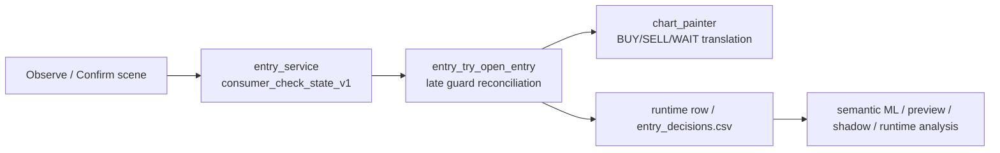

# Consumer-Coupled Check / Entry Scene Refinement Roadmap

## 1. 목적

이 문서는 현재 차트 체크 표기와 실제 진입 체인을 더 정교하게 맞추기 위한
`scene refinement` 로드맵이다.

현재까지는 아래를 이미 구축했다.

- chart_flow 안정화
- consumer-coupled check / entry alignment
- semantic ML refinement / promotion-ready 정리
- chart 7-stage display system 초안
- `display_score -> 1/2/3개 체크` 반복 표기 연결

지금부터의 목표는 새 구조를 만드는 것이 아니라,
이미 구축한 구조 위에서 아래 문제를 정교하게 다듬는 것이다.

- `있어야 할 자리`에 체크가 빠지는 문제
- `있으면 안 되는 자리`에 체크가 남는 문제
- BTC / NAS / XAU가 비슷한 장면인데 서로 다른 의미로 읽히는 문제
- 차트 체감상 비슷한 장면인데 내부 scene 분류가 너무 다르게 갈리는 문제
- `OBSERVE / PROBE / READY`가 시각적으로는 분리되지만 실제 사용감은 아직 어색한 문제

---

## 2. 현재까지 구축된 기반

### 2.1 chart_flow 기반

이미 아래 축은 안정화되어 있다.

- 공통 policy
- symbol override 분리
- strength / color / width 정책
- distribution / rollout / baseline compare

대표 문서:

- [chart_flow_phase0_freeze_ko.md](c:\Users\bhs33\Desktop\project\cfd\docs\chart_flow_phase0_freeze_ko.md)
- [chart_flow_buy_wait_sell_guide_ko.md](c:\Users\bhs33\Desktop\project\cfd\docs\chart_flow_buy_wait_sell_guide_ko.md)
- [chart_flow_common_expression_policy_v1_ko.md](c:\Users\bhs33\Desktop\project\cfd\docs\chart_flow_common_expression_policy_v1_ko.md)

### 2.2 consumer-coupled check / entry 기반

현재 체크 표기는 painter가 독자적으로 의미를 만들지 않는다.

owner 체인은 아래와 같다.

- [entry_service.py](c:\Users\bhs33\Desktop\project\cfd\backend\services\entry_service.py)
  - `consumer_check_state_v1` 생성
- [entry_try_open_entry.py](c:\Users\bhs33\Desktop\project\cfd\backend\services\entry_try_open_entry.py)
  - late guard 이후 effective consumer check state 보정
- [chart_painter.py](c:\Users\bhs33\Desktop\project\cfd\backend\trading\chart_painter.py)
  - `consumer_check_state_v1`를 chart event로 번역

관련 문서:

- [consumer_coupled_check_entry_alignment_spec_ko.md](c:\Users\bhs33\Desktop\project\cfd\docs\consumer_coupled_check_entry_alignment_spec_ko.md)
- [consumer_coupled_check_entry_runtime_propagation_followup_ko.md](c:\Users\bhs33\Desktop\project\cfd\docs\consumer_coupled_check_entry_runtime_propagation_followup_ko.md)
- [consumer_coupled_check_entry_visual_binding_followup_ko.md](c:\Users\bhs33\Desktop\project\cfd\docs\consumer_coupled_check_entry_visual_binding_followup_ko.md)

### 2.3 7단계 표기 기반

현재 목표 시각 체계는 아래 7단계다.

- `SELL-3`
- `SELL-2`
- `SELL-1`
- `WAIT`
- `BUY-1`
- `BUY-2`
- `BUY-3`

그리고 최근 구현으로 아래 기준이 들어갔다.

- `< 0.70`: 방향 체크 없음
- `0.70 ~ 0.79`: 1개 체크
- `0.80 ~ 0.89`: 2개 체크
- `>= 0.90`: 3개 체크

중요:

- 이건 raw flow score가 아니라 `display_score` 기준이다.
- `display_score`는 현재 `consumer_check_state_v1`에서 계산된다.

대표 문서:

- [chart_check_seven_stage_display_system_spec_ko.md](c:\Users\bhs33\Desktop\project\cfd\docs\chart_check_seven_stage_display_system_spec_ko.md)

---

## 3. 현재 구조가 어떻게 동작하는가

현재 체크 / 진입 흐름은 아래처럼 읽으면 된다.

즉 핵심은:

- scene 의미는 upstream에서 만들어지고
- painter는 그걸 그린다
- late guard가 있으면 chart와 entry가 같이 내려가야 한다

이 방향은 맞다.

지금 남은 건 이 체계를 버리는 것이 아니라,
어떤 scene를 `표시할 것인가 / 숨길 것인가`를 더 정교하게 조정하는 일이다.

---

## 4. 지금 남은 핵심 문제

## 4.1 must-show scene가 아직 완전히 잠기지 않았다

사용자 체감상 아래 같은 자리들은 약한 체크라도 있어야 한다.

- 하단 rebound 말단
- 상단 reject 말단
- middle reclaim / middle reject
- 구조적 lower / upper edge 접근

그런데 현재는 일부가

- `generic observe`라서 숨겨지거나
- `blocked scene`이라서 과하게 눌리거나
- 반대로 너무 넓게 살아서 과다 표기가 되기도 한다

즉 `must-show scene contract`가 아직 완전히 고정되지 않았다.

## 4.2 must-hide scene가 아직 완전히 잠기지 않았다

반대로 아래 같은 장면은 체크가 남으면 안 된다.

- conflict인데 방향 체크처럼 보이는 경우
- energy soft block인데 READY처럼 보이는 경우
- 계속 하락 중인데 weak buy가 반복 표기되는 경우
- default side를 거스르는 약한 probe가 반복 강조되는 경우

최근 수정으로 일부는 잡혔지만,
여전히 `scene별 예외 규칙`이 더 정리되어야 한다.

## 4.3 visually similar but semantically diverged 문제가 남아 있다

사용자 관점에서는 비슷한 하락 말단처럼 보이는데
엔진은 아래처럼 다르게 읽는 경우가 있다.

- BTC/NAS: `lower_rebound_confirm`
- XAU: `conflict_box_*`

물론 항상 같은 장면으로 보면 안 되지만,
현재는 `시각적 유사성` 대비 `semantic divergence`가 너무 큰 case가 남아 있다.

이건 scene contract를 더 묶어야 할지, 진짜 다르게 남겨야 할지 casebook이 필요하다.

## 4.4 symbol별 밀도 균형이 아직 덜 맞다

최근까지의 체감 문제:

- XAU는 sell surface가 너무 쉽게 많이 떴다
- BTC는 weak lower observe가 많아 보였다
- NAS는 중간/하단 observe가 과하게 눌리는 구간이 있었다

지금은 예전보다 나아졌지만,
`심볼별로 다르게 보이되 과하게 다르지 않게` 맞추는 balance tuning이 남아 있다.

## 4.5 display_score ladder는 붙었지만 scene score calibration은 아직 시작 단계다

현재는 stage 기반으로 아래처럼 mapping했다.

- `OBSERVE`: 대체로 0.72~0.79
- `PROBE`: 대체로 0.82~0.89
- `READY`: 대체로 0.92+

이건 좋은 시작점이지만,
향후에는 같은 `OBSERVE`라도

- 구조적으로 의미 있는 observe
- 숨겨야 할 blocked observe
- generic watch

가 더 세밀하게 갈려야 한다.

즉 지금 score ladder는 붙었고,
다음은 `scene별 calibration`이 남아 있다.

---

## 5. 왜 이런 문제가 생기는가

핵심 원인은 현재 판단 체인이 여전히 아래 3축의 타협 위에 있기 때문이다.

### 5.1 reason 문자열 기반 규칙이 아직 남아 있다

현재도 체크 후보 선정은 일부가 아래에 의존한다.

- `observe_reason`
- `blocked_by`
- `action_none_reason`
- `probe_scene_id`

이건 디버깅에는 좋지만,
궁극적으로는 `scene contract`보다 문자열 패턴이 강하게 작동할 수 있다.

### 5.2 scene meaning과 display meaning이 아직 완전히 1:1은 아니다

지금은 많이 가까워졌지만,
아직도 일부 scene는

- internal meaning은 애매한데
- display는 너무 강하거나
- 반대로 internal meaning은 분명한데 display는 아예 없다

즉 `semantic meaning -> display meaning` 변환이 완전히 닫히진 않았다.

### 5.3 symbol temperament가 scene selection에 미세하게 섞여 있다

XAU / BTC / NAS는 아래가 다르다.

- 구조 완화 강도
- probe relief
- hold/soft block tolerance
- scene visibility 성향

그래서 같은 장면처럼 보여도 실제 engine decision이 다르게 나올 수 있다.

---

## 6. 앞으로 지켜야 할 원칙

### 6.1 구조를 갈아엎지 않는다

지금까지 만든 아래 체인은 유지한다.

- `entry_service -> consumer_check_state_v1`
- `entry_try_open_entry -> effective reconciliation`
- `chart_painter -> translation`

즉 새 체계를 만드는 게 아니라
기존 체계 위에서 scene contract를 정밀화한다.

### 6.2 painter가 의미를 만들지 않는다

painter는 의미 owner가 아니다.

painter는:

- `display_score`
- `repeat_count`
- `color / width / shape`

만 담당한다.

scene의 의미와 표기 허용 여부는 upstream에서 결정해야 한다.

### 6.3 must-show와 must-hide를 문서로 먼저 잠근다

앞으로는 “느낌상 이 자리는 떠야 함”을 바로 코드로 옮기지 않는다.

먼저:

- casebook
- scene contract
- symbol별 예외 원칙

을 문서로 잠근 뒤 코드에 반영한다.

### 6.4 weak observe는 더 자주 보이되 강한 표기처럼 보이면 안 된다

사용자 요청의 핵심은:

- 관찰 시점은 훨씬 많아야 한다
- 하지만 READY처럼 보이면 안 된다

그래서 현재 방향은 맞다.

- weak observe -> 1개
- probe -> 2개
- ready -> 3개

이 체계를 유지하되, weak observe가 과대 해석되지 않게 계속 보정한다.

---

## 7. 권장 로드맵

## Phase S0. Baseline Snapshot

목표:

- 현재 `BTC / NAS / XAU` 각각에서 어떤 장면이 어떻게 표기되는지 스냅샷을 고정한다.

봐야 할 것:

- `observe_reason`
- `blocked_by`
- `action_none_reason`
- `consumer_check_stage`
- `consumer_check_display_ready`
- `consumer_check_display_score`
- `consumer_check_display_repeat_count`

대상 파일:

- [entry_decisions.csv](c:\Users\bhs33\Desktop\project\cfd\data\trades\entry_decisions.csv)
- [runtime_status.json](c:\Users\bhs33\Desktop\project\cfd\data\runtime_status.json)
- [chart_flow_distribution_latest.json](c:\Users\bhs33\Desktop\project\cfd\data\analysis\chart_flow_distribution_latest.json)

완료 기준:

- symbol별 최근 20~40개에서 어떤 장면이 어떤 단계로 보이는지 표가 있다.

## Phase S1. Must-Show Scene Casebook

목표:

- 반드시 약한 체크라도 보여야 하는 장면을 고정한다.

예시 후보:

- `outer_band_reversal_support_required_observe`
- `middle_sr_anchor_required_observe`
- `lower_rebound_probe_observe`
- `upper_reject_probe_observe`
- `btc_midline_sell_watch`

핵심 질문:

- 이 장면은 `OBSERVE` 1개로 남겨야 하나
- `PROBE`로 올려야 하나
- symbol별로 예외가 필요한가

완료 기준:

- must-show scene whitelist가 문서화되어 있다.

## Phase S2. Must-Hide Scene Casebook

목표:

- 숨겨야 하는 장면을 명시적으로 고정한다.

예시 후보:

- balanced conflict + observe_state_wait
- energy_soft_block + falling breakdown lower rebound buy
- default side against weak probe
- repeated upper sell soft block spam

핵심 질문:

- 완전 hidden인가
- `BLOCKED but hidden`인가
- 중립 `WAIT`로 낮출 것인가

완료 기준:

- must-hide scene blacklist가 문서화되어 있다.

## Phase S3. Visually Similar Scene Alignment Audit

목표:

- 겉모양은 비슷한데 내부 의미가 크게 갈리는 장면을 분류한다.

작업:

- BTC/NAS/XAU에서 비슷한 모양의 하락 말단 10~20 case 수집
- 각각의:
  - box_state
  - bb_state
  - edge_pair_law winner
  - observe_reason
  - consumer_check_stage
  - 최종 표기
  를 비교

판단:

- 진짜 다르게 봐야 하는 장면
- 지금은 과하게 divergence된 장면

완료 기준:

- `same-look / same-meaning`
- `same-look / different-meaning`
  분류표가 있다.

## Phase S4. Scene Contract Refinement

목표:

- S1/S2/S3 결과를 코드 owner에 반영한다.

주 owner:

- [consumer_check_state.py](c:\Users\bhs33\Desktop\project\cfd\backend\services\consumer_check_state.py)
- [entry_try_open_entry.py](c:\Users\bhs33\Desktop\project\cfd\backend\services\entry_try_open_entry.py)
- 필요 시 [chart_painter.py](c:\Users\bhs33\Desktop\project\cfd\backend\trading\chart_painter.py)
  - 단, painter는 의미 owner가 아니라 rendering owner로만 제한

작업:

- must-show scene를 weak OBSERVE 1개로 연결
- must-hide scene를 display false로 연결
- PROBE/READY 승격 조건을 scene별로 더 좁게 조정

완료 기준:

- 같은 문제를 다시 “느낌상 이상하다”로 보지 않고 contract로 설명 가능

## Phase S5. Symbol Balance Tuning

목표:

- XAU / BTC / NAS가 과하게 다르게 보이는 체감을 줄인다.

원칙:

- 공통 contract를 먼저 맞추고
- symbol override는 마지막에만 최소한으로 쓴다

대상:

- XAU: 반복 upper sell spam 억제 유지
- BTC: weak structural buy observe 과다 여부
- NAS: 너무 눌린 observe/probe 복구 여부

완료 기준:

- symbol별로 “왜 이렇게 다르게 뜨는지”가 설명 가능하고
- 과도한 편차가 줄어든다.

## Phase S6. Acceptance

목표:

- 더 이상 “많다/적다” 감각이 아니라 숫자로 종료 시점을 말한다.

봐야 할 것:

- symbol별 recent display count
- stage 비율
- hidden / observe / probe / ready 비율
- display_score band 분포
- false-looking scene 재발 여부

완료 기준:

- must-show missing case가 반복 재현되지 않는다
- must-hide leaking case가 반복 재현되지 않는다
- symbol별 과다 편차가 수용 범위 안으로 들어온다

---

## 8. 실제 구현 순서 제안

가장 현실적인 순서는 아래다.

1. `S0 baseline snapshot`
2. `S1 must-show casebook`
3. `S2 must-hide casebook`
4. `S3 visually similar alignment audit`
5. `S4 consumer_check_state contract refinement`
6. `S5 symbol balance tuning`
7. `S6 acceptance memo`

즉 바로 숫자 튜닝부터 들어가기보다,
먼저 장면 정의를 문서로 잠그고 그다음 코드로 내리는 게 맞다.

---

## 9. 지금 당장 다음 액션

현재 시점의 가장 좋은 다음 액션은 이것이다.

### 바로 다음 1순위

`BTC / NAS / XAU visually similar scene casebook`

이유:

- 지금 사용자가 가장 크게 느끼는 위화감은
  - “차트 모양은 비슷한데 왜 얘만 buy고 쟤는 sell이냐”
  - “왜 여긴 체크가 없고 여긴 있냐”
  이기 때문이다.

이 문제는 단순 threshold 조정으로 해결되지 않는다.

### 바로 다음 2순위

`must-show / must-hide scene spec`

이유:

- 그 기준이 고정돼야 `consumer_check_state_v1`를 더 정교하게 손볼 수 있다.

---

## 10. 한 줄 결론

지금 남은 일은 새 체계를 만드는 것이 아니라,
이미 만든 `consumer-coupled check / entry + 7-stage display` 위에서
`어떤 장면을 보여주고 숨길지`를 scene contract 수준으로 정밀화하는 것이다.
