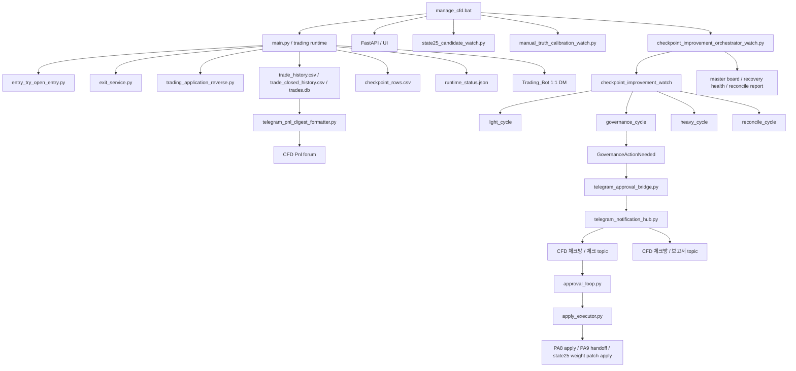

# Current All-In-One System Master Playbook

## 목적

이 문서는 2026-04-12 기준 CFD 프로젝트를 `한 문서에서 끝까지 다시 잡기 위한 올인원 기준서`다.

지금까지 문서는 레이어별로 잘 나뉘어 있었지만, 실제로는 아래 질문을 한 번에 보고 싶을 때가 많다.

1. 지금 시스템 전체가 어떤 층으로 구성되어 있는가
2. 자동 진입 / 자동 대기 / 자동 청산 / 자동 개선 / Telegram 승인 루프가 어떻게 이어지는가
3. 이미 끝난 것과 아직 남은 것은 무엇인가
4. 지금 당장 어디를 보강해야 체감 품질이 가장 많이 오르는가
5. 문제가 났을 때 어느 파일과 어느 artifact를 먼저 봐야 하는가

이 문서의 목적은 하나다.

`현재 코드 기준의 전체 구조, 현재 상태, 남은 일, 보강 우선순위를 한 장으로 고정한다.`

---

## 한 줄 결론

현재 시스템은 이미 아래 축이 거의 연결된 상태다.

1. `자동 진입 / 자동 대기 / 자동 청산` 실시간 런타임
2. `checkpoint -> review -> canary -> closeout` 자동 개선 루프
3. `Telegram check/report/control plane` 승인 인터페이스
4. `state25 / teacher / weight patch` 학습 결과 반영 통로
5. `PnL / 상태판 / orchestrator board` 운영 관찰 통로

즉 지금은 `새 기능을 아무 방향으로 더 붙이는 단계`가 아니라,

`어느 층의 설명력과 제안 생성기를 먼저 보강해야 전체 자동매매 품질이 올라가는지 다시 정리하는 단계`

로 보는 것이 맞다.

---

## 시스템 전체 지도

---

## 운영 방 구조

현재 Telegram 목적지는 3갈래로 읽는 것이 맞다.

### 1. `Trading_Bot` 1:1 방

역할:

- 실시간 진입
- 실시간 대기
- 실시간 청산
- 실시간 반전

원칙:

- 이 방은 `실행 승인용`이 아니다
- 매매는 계속 자동으로 돈다
- 사용자는 여기서 현재 runtime의 행동을 읽는다

### 2. `CFD Pnl`

역할:

- `15분 / 1시간 / 4시간 / 1일 / 1주 / 1달` 손익 보고

원칙:

- 구간별 순손익, 총손익, 비용, 진입 횟수, 총 랏, 승패율, reason 요약을 본다
- 운영 결산과 복기용이다

### 3. `CFD 체크방`

구성:

- `체크` topic
- `보고서` topic

원칙:

- `체크` topic은 개선안 inbox
- `보고서` topic은 원문 보고서
- 실시간 entry/wait/exit 승인용이 아니라 `학습/개선안 승인용`

---

## 레이어별 세부 틀

## L0. 런처 / 운영 진입점

핵심 파일:

- `manage_cfd.bat`

역할:

- 메인 런타임, API, UI, state25 candidate watch, manual truth calibration watch, orchestrator watch를 묶어 실행
- guarded restart / status / precheck / smoke / verify 진입점 제공

지금 확인 포인트:

- 실제로 무엇이 떠 있는가
- 안전 재시작이 가능한가
- orchestrator watch가 같이 올라와 있는가

## L1. 실시간 자동매매 런타임

핵심 파일:

- `main.py`
- `backend/app/trading_application.py`
- `backend/app/trading_application_runner.py`
- `backend/app/trading_application_reverse.py`
- `backend/services/entry_try_open_entry.py`
- `backend/services/exit_service.py`

역할:

- 실시간 데이터 수집
- 자동 진입
- 자동 대기
- 자동 청산
- 반전 후보 감지
- shock / plus-to-minus / opposite-score-spike 감시

현재 운영 원칙:

- 실시간 매매는 자동
- Telegram 승인은 실시간 실행용이 아님
- 반전은 `무조건 즉시 뒤집기`가 아니라 `pending reverse + flat wait + retry`
- 즉시 반전 문턱은 여전히 보수적이고, 사용자는 이 층의 설명력이 더 필요하다고 느끼는 상태

## L2. 거래 기록 / 집계 레이어

핵심 파일:

- `backend/trading/trade_logger.py`
- `backend/trading/trade_logger_close_ops.py`
- `backend/services/trade_sqlite_store.py`
- `backend/services/trade_csv_schema.py`
- `data/trades/trade_history.csv`
- `data/trades/trade_closed_history.csv`
- `data/trades/trades.db`

역할:

- 열린 거래 / 닫힌 거래 기록
- gross / cost / net / lot / reason 저장
- PnL digest, learning, replay의 원천 데이터 제공

현재 상태:

- 최근 formatter는 `순손익 / 승패 / 총 랏 / reason 집계`가 다시 살아남
- 앞으로 닫히는 거래는 `gross_pnl / cost_total / net_pnl_after_cost`를 같이 저장
- 과거 historical close row는 비용 컬럼 품질에 한계가 있음

## L3. checkpoint improvement / orchestrator

핵심 파일:

- `backend/services/checkpoint_improvement_watch.py`
- `backend/services/checkpoint_improvement_orchestrator.py`
- `backend/services/checkpoint_improvement_master_board.py`
- `backend/services/checkpoint_improvement_reconcile.py`
- `backend/services/checkpoint_improvement_recovery_health.py`
- `backend/services/system_state_manager.py`
- `backend/services/event_bus.py`

역할:

- `light_cycle`
  - fast refresh
  - action eval
  - live runner watch
  - canary refresh board
- `governance_cycle`
  - activation / rollback / closeout candidate 생성
- `heavy_cycle`
  - PA7 / PA78 / scene disagreement / scene preview
- `reconcile_cycle`
  - stale actionable / same-scope conflict / late callback invalidation 정리
- orchestrator tick
  - board -> reconcile -> health를 한 tick으로 조율

현재 상태:

- 실제로 `RUNNING`
- board 기준 핵심 blocker는 `pa8_live_window_pending`
- backlog 관리는 기본적으로 닫혀 있음

## L4. Telegram control plane

핵심 파일:

- `backend/services/checkpoint_improvement_telegram_runtime.py`
- `backend/services/telegram_state_store.py`
- `backend/services/approval_loop.py`
- `backend/services/apply_executor.py`
- `backend/services/telegram_approval_bridge.py`
- `backend/services/telegram_notification_hub.py`
- `backend/services/telegram_update_poller.py`

역할:

- 개선안 queue 저장
- check/report 메시지 렌더
- 승인 / 보류 / 거부 처리
- 승인된 bounded change만 apply

현재 운영 경계:

- 실시간 `entry / wait / exit`는 승인 대상 아님
- 승인 대상은
  - `PA8 activation / rollback / closeout`
  - `PA9 handoff`
  - `state25 weight patch review`
- check/report는 같은 forum 안 topic으로 분리

## L5. 학습 / 제안 생성 레이어

핵심 파일:

- `backend/services/teacher_pattern_active_candidate_runtime.py`
- `backend/services/teacher_pattern_labeler.py`
- `backend/services/forecast_state25_runtime_bridge.py`
- `backend/services/state25_weight_patch_review.py`
- `backend/services/state25_weight_patch_apply_handlers.py`

역할:

- state25 active candidate runtime surface 유지
- teacher pattern labeling
- runtime snapshot -> learning bridge
- 한국어 `weight patch proposal` 생성
- 승인 시 `log-only bounded patch` 반영

현재 상태:

- proposal payload -> 한국어 보고서 -> 승인 -> bounded patch apply 통로는 준비됨
- 하지만 `어떤 watcher가 자동으로 proposal event를 생성할지`는 아직 빈 상태

## L6. 보고 / 관찰 레이어

핵심 파일:

- `backend/services/telegram_pnl_digest_formatter.py`
- `backend/services/telegram_ops_service.py`
- `backend/integrations/notifier.py`
- `data/analysis/shadow_auto/checkpoint_improvement_master_board_latest.json`
- `data/analysis/shadow_auto/checkpoint_improvement_orchestrator_watch_latest.json`
- `data/analysis/shadow_auto/checkpoint_improvement_recovery_health_latest.json`

역할:

- PnL 구간 보고
- 실시간 DM
- 개선안 check/report UX
- 운영 health / blocker 가시화

---

## 현재 진행률

아래 퍼센트는 `문서 존재 여부`가 아니라 `코드 + artifact + 운영 wiring` 기준의 체감치다.

| 트랙 | 진행도 | 현재 상태 |
|---|---:|---|
| 실시간 자동매매 런타임 | 84% | 자동 진입/대기/청산은 동작, 설명력과 반전 timing refinement가 필요 |
| 거래 기록 / 집계 | 78% | 최근 집계는 복구, 과거 cost 메타는 한계 있음 |
| checkpoint orchestrator | 97% | watch / governance / heavy / reconcile / health / runner 거의 완료 |
| Telegram control plane | 92% | check/report/poll/apply 루프 연결 완료 |
| PA8 canary | 94% | activation/rollback/closeout 통로 완료, live window 대기 |
| PA9 handoff | 60% | scaffold / review / apply packet 준비 완료, 실제 승격은 closeout 이후 |
| SA preview/log-only | 60% | disagreement / preview는 있음, live adoption은 아직 아님 |
| state25 weight patch infra | 82% | 한국어 제안/승인/apply 통로 완료, 자동 detector는 미완성 |
| PnL / 운영 보고 | 80% | 합계 복구 완료, 오래된 historical cost는 제한적 |

---

## 현재 실제 blocker

### 1. `PA8 live window`

의미:

- closeout-ready symbol이 아직 충분히 쌓이지 않음
- 그래서 `PA9 handoff`는 scaffold 상태로 대기

### 2. `proposal detector 부재`

의미:

- weight patch 제안 보고서와 apply 루프는 준비됐음
- 하지만 `무엇을 근거로 자동 제안할지`를 만드는 watcher가 부족함

### 3. `실시간 판단 설명력 부족`

의미:

- 사용자는 `왜 여기서 상단/하단/대기/반전으로 읽었는지`를 더 명확히 알고 싶어함
- 지금 알림은 많이 좋아졌지만, 학습 제안으로 이어질 정도의 해석 노출은 아직 약함

### 4. `historical cost integrity`

의미:

- 과거 closed trade에 cost가 0인 행이 남아 있음
- 새 거래부터는 저장 보강이 됐지만, 오래된 구간은 완전 복원 한계가 있음

---

## 남은 로드맵

## A. 실시간 판단 설명력

목표:

- runtime이 왜 그 결정을 내렸는지 사람이 바로 읽을 수 있게

필요한 것:

- 진입 알림: `어느 축이 주도했는지` 1줄
- 대기 알림: `barrier / belief / forecast`를 짧게 표준화
- 청산 알림: `왜 손절/보호/회수로 읽었는지` 한 줄 설명 강화
- 반전 알림: `shock / opposite spike / plus-to-minus`를 사람 언어로 설명

예시 방향:

- `상단 힘 과다로 숏 추가 진입 보류`
- `하단 박스 근처이지만 상방 추진력이 더 강해 대기`
- `반대 점수 급변으로 기존 포지션 정리 후 반전 준비`

## B. 학습 기반 proposal detector

현재 detector 관찰 상세는 [current_p4_log_only_detector_detailed_plan_ko.md](C:\Users\bhs33\Desktop\project\cfd\docs\current_p4_log_only_detector_detailed_plan_ko.md)를 기준으로 보고,
feedback lane과 narrowing은 [current_p4_3_detector_confusion_and_feedback_narrowing_ko.md](C:\Users\bhs33\Desktop\project\cfd\docs\current_p4_3_detector_confusion_and_feedback_narrowing_ko.md)에서 확인한다.

목표:

- 학습 -> 제안 -> Telegram 보고서 -> 승인 -> bounded 반영이 자동으로 돈다

우선 후보:

- `상단/하단 힘 해석 왜곡`
- `윗꼬리 과대반영`
- `아랫꼬리 과대반영`
- `캔들 몸통 비중 과대`
- `조기 진입 역행 과다`
- `상방 추진력 과대인데 숏 즉시 진입`

핵심 원칙:

- raw 변수명 그대로 보내지 않는다
- 한국어 label로 보고서를 생성한다
- 같은 scope는 check 인박스 항목만 갱신한다
- 원문 보고서는 1회만 발송한다

## C. PA8 -> PA9 운영 closeout

목표:

- 최소 1개 symbol에서 실제 closeout 완료
- 그 결과로 PA9 handoff까지 실제 승격

남은 것:

- live first-window accumulation
- closeout trigger 신뢰도 재확인
- closeout review/apply 후 handoff ready 상태 진입

## D. PnL / 보고 정밀화

목표:

- 사용자가 숫자만 보고도 바로 운영 판단 가능

남은 것:

- historical cost integrity 보강 전략
- reason alias와 실시간 DM 용어 통일
- window별 anomaly note

## E. SA는 계속 preview-only 유지

현재 판단:

- disagreement / preview는 유지
- live adoption은 아직 아님

---

## 가장 추천하는 다음 구축 순서

1. `실시간 판단 설명력 quick-win`
   - DM에 `주도축 / 핵심리스크 / 강도` 3줄을 먼저 붙여 체감 개선을 만든다
2. `조건부 과제를 narrow lane으로 surface`
   - PA8 closeout readiness
   - PA9 handoff readiness
   - scene-aware detector log-only lane
   - reverse-ready / reverse-blocked surface
   - 상세 기준: [current_p1_readiness_surface_detailed_plan_ko.md](/Users/bhs33/Desktop/project/cfd/docs/current_p1_readiness_surface_detailed_plan_ko.md)
3. `실시간 판단 설명력 full 확장`
   - scene 1줄
   - 복기 힌트
   - 반전 설명
4. `학습 기반 proposal detector`
5. `PA8 closeout 1건 확보`
6. `PA9 handoff 실제 승격`

이 순서가 좋은 이유:

- 사용자는 매일 보는 DM에서 먼저 `시스템이 뭘 보고 있구나`를 체감할 수 있어야 하고
- 그 직후 `지금 무엇이 준비 중이고 무엇이 아직 조건 부족인지`를 계속 볼 수 있어야 하고
- 그 다음이 `full 설명과 복기 힌트`
- 그 다음이 `그 판단을 학습해서 실제 제안으로 올릴 수 있는가`
- 그 다음이 `closeout -> handoff` 운영 완성도이기 때문이다

---

## 문제별 첫 확인 위치

### 실시간 진입/대기/청산이 이상하다

먼저 볼 곳:

- `backend/app/trading_application.py`
- `backend/app/trading_application_runner.py`
- `backend/services/entry_try_open_entry.py`
- `backend/services/exit_service.py`
- `backend/app/trading_application_reverse.py`
- `data/runtime_status.json`
- `data/trades/trade_closed_history.csv`

### 개선안이 안 올라온다

먼저 볼 곳:

- `backend/services/checkpoint_improvement_watch.py`
- `backend/services/checkpoint_improvement_orchestrator.py`
- `backend/services/telegram_approval_bridge.py`
- `backend/services/telegram_notification_hub.py`
- `data/analysis/shadow_auto/checkpoint_improvement_master_board_latest.json`
- `data/analysis/shadow_auto/checkpoint_improvement_orchestrator_watch_latest.json`

### 학습 결과를 텔레그램 제안으로 못 올린다

먼저 볼 곳:

- `backend/services/state25_weight_patch_review.py`
- `backend/services/teacher_pattern_active_candidate_runtime.py`
- `backend/services/teacher_pattern_labeler.py`
- `backend/services/state25_weight_patch_apply_handlers.py`

### PnL 숫자가 이상하다

먼저 볼 곳:

- `backend/services/telegram_pnl_digest_formatter.py`
- `backend/services/telegram_ops_service.py`
- `backend/trading/trade_logger_close_ops.py`
- `data/trades/trade_closed_history.csv`
- `data/trades/trades.db`

---

## 이 문서와 기존 문서의 관계

이 문서는 `상위 올인원 기준서`다.

세부 문서는 아래처럼 내려가면 된다.

1. 전체 구조 / 현재 상태 / 우선순위는 이 문서
2. 실제 구현 순서까지 담은 상세 마스터 로드맵은 [current_detailed_reinforcement_master_roadmap_ko.md](/Users/bhs33/Desktop/project/cfd/docs/current_detailed_reinforcement_master_roadmap_ko.md)
3. `지금 바로 구축 / 조건부 구축 / 금지 영역` 구분은 [current_buildable_vs_conditioned_reinforcement_roadmap_ko.md](/Users/bhs33/Desktop/project/cfd/docs/current_buildable_vs_conditioned_reinforcement_roadmap_ko.md)
4. 조언/부족점/보강점 기반 실행 순서는 [current_advice_gap_reinforcement_execution_roadmap_ko.md](/Users/bhs33/Desktop/project/cfd/docs/current_advice_gap_reinforcement_execution_roadmap_ko.md)
5. `PA8 / PA9 / SA` 잔여 작업은 [current_checkpoint_improvement_watch_remaining_roadmap_ko.md](/Users/bhs33/Desktop/project/cfd/docs/current_checkpoint_improvement_watch_remaining_roadmap_ko.md)
6. orchestration 원칙은 [current_checkpoint_improvement_watch_orchestration_detailed_design_ko.md](/Users/bhs33/Desktop/project/cfd/docs/current_checkpoint_improvement_watch_orchestration_detailed_design_ko.md)
7. Telegram 승인/control plane 세부는 [current_telegram_control_plane_and_improvement_loop_ko.md](/Users/bhs33/Desktop/project/cfd/docs/current_telegram_control_plane_and_improvement_loop_ko.md)
8. `A1 ~ C5`, `B1 ~ B4` 구현 디테일은 각 단계 문서

---

## 같이 보면 좋은 참고 문서

- [current_system_reconfirmation_and_reinforcement_framework_ko.md](/Users/bhs33/Desktop/project/cfd/docs/current_system_reconfirmation_and_reinforcement_framework_ko.md)
- [current_p0_foundation_baseline_detailed_plan_ko.md](/Users/bhs33/Desktop/project/cfd/docs/current_p0_foundation_baseline_detailed_plan_ko.md)
- [current_p0_1_telegram_topic_role_baseline_detailed_plan_ko.md](/Users/bhs33/Desktop/project/cfd/docs/current_p0_1_telegram_topic_role_baseline_detailed_plan_ko.md)
- [current_p0_2_status_enum_baseline_detailed_plan_ko.md](/Users/bhs33/Desktop/project/cfd/docs/current_p0_2_status_enum_baseline_detailed_plan_ko.md)
- [current_detailed_reinforcement_master_roadmap_ko.md](/Users/bhs33/Desktop/project/cfd/docs/current_detailed_reinforcement_master_roadmap_ko.md)
- [current_buildable_vs_conditioned_reinforcement_roadmap_ko.md](/Users/bhs33/Desktop/project/cfd/docs/current_buildable_vs_conditioned_reinforcement_roadmap_ko.md)
- [current_advice_gap_reinforcement_execution_roadmap_ko.md](/Users/bhs33/Desktop/project/cfd/docs/current_advice_gap_reinforcement_execution_roadmap_ko.md)
- [current_checkpoint_improvement_watch_remaining_roadmap_ko.md](/Users/bhs33/Desktop/project/cfd/docs/current_checkpoint_improvement_watch_remaining_roadmap_ko.md)
- [current_checkpoint_improvement_watch_orchestration_detailed_design_ko.md](/Users/bhs33/Desktop/project/cfd/docs/current_checkpoint_improvement_watch_orchestration_detailed_design_ko.md)
- [current_telegram_control_plane_and_improvement_loop_ko.md](/Users/bhs33/Desktop/project/cfd/docs/current_telegram_control_plane_and_improvement_loop_ko.md)
- [current_telegram_dual_room_inbox_pattern_ko.md](/Users/bhs33/Desktop/project/cfd/docs/current_telegram_dual_room_inbox_pattern_ko.md)
- [current_telegram_alert_message_refresh_ko.md](/Users/bhs33/Desktop/project/cfd/docs/current_telegram_alert_message_refresh_ko.md)
- [current_pa8_closeout_autotrigger_pa9_handoff_restart_guard_ko.md](/Users/bhs33/Desktop/project/cfd/docs/current_pa8_closeout_autotrigger_pa9_handoff_restart_guard_ko.md)

---

## 최종 정리

지금 시스템은 이미 `자동매매 엔진`, `개선 오케스트레이터`, `텔레그램 control plane`, `학습 제안 통로`, `PnL 보고 체계`가 대부분 붙어 있다.

그래서 이제 중요한 질문은

`무엇을 더 만들까`

보다

`어느 층의 설명력과 제안 생성기를 먼저 보강해야 실제 체감 품질이 가장 크게 오를까`

다.

현재 기준으로는 아래 순서가 가장 맞다.

1. 실시간 판단 설명력 quick-win
2. readiness surface
3. 실시간 판단 설명력 full 확장
4. 학습 기반 proposal detector
5. PA8 closeout 1건 확보
6. PA9 handoff 실제 승격
7. SA는 계속 preview-only 유지
