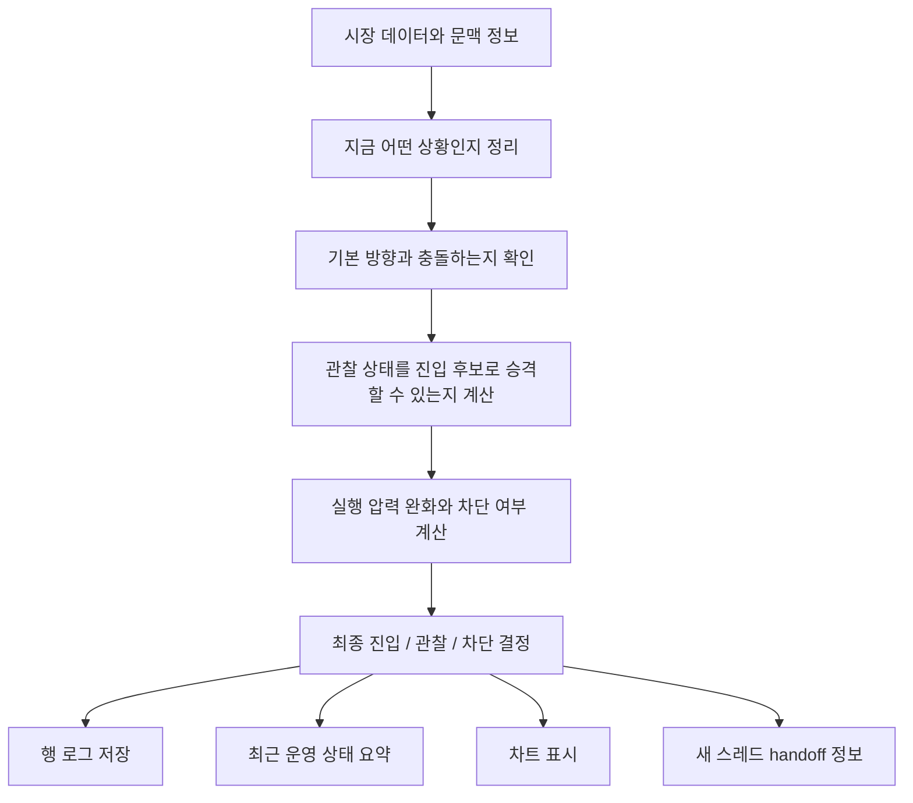

# CFD 현재까지 구축 상태 상세 설명서

작성일: 2026-03-27 (KST)

## 1. 문서 목적

이 문서는 지금까지 무엇이 어떻게 구축되었는지를
코드 변수 이름이 아니라 실제 역할과 흐름 중심으로 설명하기 위한 문서다.

즉 이 문서는 아래 질문에 답한다.

- 지금 시스템은 어떤 층으로 나뉘어 있는가
- 각 층은 무엇을 결정하고, 무엇은 결정하지 않는가
- 최근에 문제가 되었던 "막혀 있는데 준비된 것처럼 보이는 현상"은 왜 생겼고 어떻게 막았는가
- 운영자가 지금은 무엇을 바로 볼 수 있고, 무엇은 아직 후순위인가
- 이번 정리 이후 진입 서비스는 어떤 성격의 파일이 되었는가

## 2. 한눈에 보는 현재 상태

한 문장으로 요약하면,
지금은 "상황의 의미를 정하는 층", "진입 가능 여부를 정리하는 층", "실제 실행을 막거나 허용하는 층", "운영자가 결과를 읽는 층"이 예전보다 훨씬 분리된 상태다.

조금 더 풀면 아래와 같다.

- 상황이 무엇인지는 앞단에서 정해진다.
- 진입 후보로 볼지, 관찰 상태로 볼지, 실제로 막힌 상태로 볼지는 중간 층에서 정리된다.
- 실행 계층은 이제 직접 의미를 새로 만들기보다, 이미 정리된 판단을 받아서 최종 차단과 허용을 조합하는 쪽에 가깝다.
- 최근 운영 상태는 마지막 한 줄만 보는 구조에서, 최근 구간 전체를 읽을 수 있는 진단 형태로 확장됐다.
- 진입과 대기 판단에서 "실제로 어떤 압력 완화나 차단 로직이 사용되었는지"가 추정이 아니라 기록으로 남는다.

## 3. 왜 이 정리가 필요했나

이전에는 시스템이 돌아가긴 했지만, 아래 같은 문제가 반복될 여지가 있었다.

- 실제로는 막혀 있는데 바깥 표면에서는 준비된 것처럼 보이는 경우가 있었다.
- 같은 의미를 여러 곳에서 다시 계산했다.
- 차트에서 보이는 상태와 내부 로그의 진실이 완전히 같지 않았다.
- 최근 흐름을 보려면 마지막 상태 파일만으로는 부족해서 결국 행 로그를 직접 뒤져야 했다.
- 진입 서비스 안에 장면별 예외 규칙이 많이 쌓여서, 실행 파일이 점점 정책 파일처럼 비대해질 위험이 있었다.

이 문제들의 공통점은 엔진 자체가 완전히 틀렸다는 것이 아니라,
"의미를 누가 정하는지", "그 의미를 누가 화면까지 보존하는지", "운영자가 그 진실을 어떻게 읽는지"가 끝까지 고정되지 않았다는 데 있었다.

## 4. 지금 시스템이 흐르는 방식

아래 순서로 생각하면 현재 구조를 가장 이해하기 쉽다.

이 흐름을 말로 풀면 아래와 같다.

1. 먼저 현재 장면의 정체성을 정한다.
그 시점이 단순 관찰인지, 확정 신호인지, 어느 방향의 어떤 원형인지가 여기서 잡힌다.

2. 그 다음 가장자리 구간에서는 "기본적으로 가야 하는 방향"과 "그 반대 방향으로 가려는 시도"를 구분한다.
이 단계는 특히 상단 가장자리와 하단 가장자리에서 중요하다.

3. 관찰 상태일 때는 아직 정식 확정이 아니더라도,
충분한 지지 신호가 있으면 진입 후보로 승격할 수 있는지 따로 계산한다.
이 부분이 최근에 별도 owner로 분리된 "진입 후보 승격 계획"이다.

4. 진입 후보이거나 확정 신호라고 해도,
현재 에너지나 압력 구조가 너무 불리하면 실제 진입은 막아야 한다.
반대로 특정 장면에서는 조금 더 너그럽게 봐줄 수 있다.
이 부분이 "실행 압력 완화와 차단 판정"이다.

5. 실제 주문 직전에는 늦게 붙는 차단 요인도 다시 반영한다.
그래서 "처음에는 후보였지만 최종적으로는 막힘" 같은 경우를 다시 정리한다.

6. 마지막으로 이 결과를 세 군데로 보낸다.
한 줄짜리 의사결정 로그, 최근 운영 상태 요약, 차트 표면이다.

## 5. 지금까지 구축된 핵심 구조

### 5-1. 의미를 정하는 층과 실행을 정하는 층이 분리됐다

지금은 "무슨 상황이냐"를 정하는 층과 "그래서 실제로 들어갈 거냐"를 정하는 층이 예전보다 확실히 갈라져 있다.

앞단은 장면의 정체성, 방향, 원형, 무효화 기준, 관리 프로필 같은 거래 의미를 정한다.
반면 뒤쪽은 그 의미를 새로 만들지 않고, 이미 정리된 의미를 바탕으로 진입 허용 여부를 조합한다.

이 분리가 중요한 이유는,
실행 계층이 나중에 임의로 의미를 덮어쓰기 시작하면
결국 "왜 이 거래가 이 setup로 분류됐는지"가 흐려지기 때문이다.

### 5-2. 소비자 관점 점검 상태가 하나의 표면으로 정리됐다

예전에는 "후보인지", "보여줘야 하는지", "실제 진입 준비가 됐는지", "막힌 이유가 무엇인지"가 중간중간 흩어져 있었다.

지금은 이걸 하나의 사람-친화적인 상태로 묶어서,
아래 같은 질문에 일관되게 답하도록 정리했다.

- 지금 이 신호를 후보로 볼 수 있는가
- 화면에 보여줄 만큼 의미가 있는가
- 실제 진입 준비까지 된 상태인가
- 아직 관찰인가, 탐색형 진입 후보인가, 실제로 막힌 것인가
- 막혔다면 왜 막혔는가

이 정리가 중요한 이유는
차트, 행 로그, 런타임 요약이 모두 같은 언어로 이 상태를 읽을 수 있게 되기 때문이다.

### 5-3. "막힘"이 더 이상 "그냥 대기"처럼 뭉개지지 않도록 손봤다

최근 핵심 문제는 "이미 차단된 상태인데 바깥에서는 준비된 것처럼, 혹은 그냥 기다리는 상태처럼 보이는 것"이었다.

이 현상은 보통 이런 식으로 생긴다.

- 앞쪽에서는 진입 후보가 맞다고 본다.
- 그런데 뒤쪽에서 늦게 실행 차단이 붙는다.
- 마지막 표면에서 그 차단이 별도 상태로 보존되지 않으면,
운영자는 "아직 관찰 단계인가 보다" 혹은 "거의 준비된 건가 보다"라고 오해하게 된다.

이번 정리에서는 이 late block 이후의 유효 상태를 다시 계산하게 만들었고,
차트 쪽도 "탐색 대기"와 "실제 차단"을 같은 덩어리로 뭉개지지 않도록 손봤다.

결과적으로 지금은
"후보였지만 최종적으로 막힘"이 훨씬 덜 왜곡된 형태로 남는다.

### 5-4. 최근 운영 상태를 읽는 표면이 생겼다

예전에는 마지막 한 줄만 보면 "지금 현재"는 알 수 있어도
"최근 100개나 200개에서 어떤 일이 반복되고 있는지"는 바로 읽기 어려웠다.

지금은 최근 구간 기준으로 아래를 요약해 준다.

- 어떤 단계가 얼마나 자주 나왔는지
- 어떤 차단 이유가 많았는지
- 심볼별로 어떤 패턴이 나타났는지
- 잘못된 준비 상태 표시가 최근에도 다시 생겼는지
- 표시 가능한 후보가 얼마나 있었는지
- 대기 상태와 압력 관련 흔적이 최근에 어떤 방향으로 몰렸는지

이 변화는 엔진 로직 자체를 바꾸는 것보다,
운영자가 문제를 해석하는 속도를 크게 줄여준다.

### 5-5. 진입과 대기 판단에서 실제로 사용한 압력 정보를 기록으로 남긴다

이전에는 어떤 에너지 보조 정보나 압력 힌트를 썼는지
결과를 보고 사람이 역으로 추정하는 경우가 많았다.

지금은 진입과 대기 둘 다,
"실제로 어떤 가지를 탔는지"를 기록으로 남기는 구조가 들어갔다.

이 말은 아래 차이가 있다는 뜻이다.

- 예전: 결과를 보고 "아마 이 힌트를 썼겠지"라고 추정
- 지금: 실제로 어떤 힌트와 어떤 분기가 사용되었는지 기록

이 기록은 특히 아래 질문에 강하다.

- 실제로 막은 이유가 무엇이었는가
- 압력 완화가 적용된 것인가, 그냥 차단이 약했던 것인가
- 대기 쪽으로 기울게 만든 요인이 무엇이었는가
- 최근에는 어떤 종류의 압력 보조가 가장 많이 사용되었는가

### 5-6. 진입 서비스가 "정책을 직접 품는 파일"에서 "조합하는 파일"로 바뀌고 있다

Phase 4에서 가장 중요한 변화는 진입 서비스 자체의 성격 변화다.

예전에는 이 파일 안에 아래가 직접 들어 있었다.

- 특정 장면에서의 압력 완화 규칙
- 관찰 상태를 탐색형 진입 후보로 승격하는 규칙
- 가장자리 기본 방향과 반대 방향 예외 허용 규칙
- 탐색형 진입 후보가 실제로 ready일 때 handoff 정보를 보정하는 규칙

이런 규칙이 많아질수록 진입 서비스는
"실행 가드 파일"이 아니라 "장면별 정책의 종합 창고"가 된다.

지금은 이 덩어리들이 각각 분리되었다.

- 장면별 압력 완화와 차단 판단
- 관찰 상태의 진입 후보 승격 계획
- 가장자리 기본 방향 게이트
- 탐색형 진입 후보가 ready일 때의 handoff 보정

그래서 현재 진입 서비스는
"앞단에서 준비된 여러 판단을 받아서 최종 결과를 조합하고 기록하는 파일"에 훨씬 가까워졌다.

## 6. 이번까지 구축된 내용을 단계별로 보면

### 1단계: 소비자 관점 점검 상태를 하나의 표면으로 정리

핵심 목적은 "후보, 관찰, 탐색형 진입, 실제 차단"을 같은 언어로 관리하는 것이었다.

이 단계에서 얻은 효과는 아래와 같다.

- 같은 의미를 여기저기서 다시 만들지 않게 됨
- 막힌 상태가 준비된 상태처럼 보이는 문제를 줄임
- 차트와 로그가 같은 상태 체계를 읽게 됨

### 2단계: 최근 운영 상태를 읽을 수 있는 런타임 요약 구축

핵심 목적은 마지막 한 줄이 아니라 최근 구간의 흐름을 볼 수 있게 만드는 것이었다.

이 단계에서 얻은 효과는 아래와 같다.

- 최근 blocked / observe / probe 분포를 바로 볼 수 있음
- 심볼별 최근 패턴을 따로 볼 수 있음
- semantic shadow가 왜 켜지지 않았는지 같은 운영 이유를 더 직접 볼 수 있음

### 3단계: 압력 사용 흔적을 branch truth로 남김

핵심 목적은 "실제로 어떤 가지를 탔는지"를 추정이 아니라 기록으로 남기는 것이었다.

이 단계에서 얻은 효과는 아래와 같다.

- 진입 경로의 압력 사용 흔적이 기록됨
- 대기 경로의 압력 사용 흔적도 기록됨
- 최근 진단 파일에서 그 흔적을 요약해서 볼 수 있음
- 새 스레드에서도 CSV를 깊게 안 파고 최근 경향을 먼저 읽을 수 있음

### 4단계: 진입 서비스 경량화

핵심 목적은 진입 서비스를 정책 파일이 아니라 조합 파일로 되돌리는 것이었다.

이 단계에서 분리된 것들은 아래 네 묶음이다.

- 장면별 압력 완화 규칙
- 탐색형 진입 후보 승격 계획
- 가장자리 기본 방향 게이트
- 탐색형 진입 후보 ready 시 handoff 보정

이 네 묶음이 빠지면서 진입 서비스는
앞단 판단을 모아 최종 진입 결과를 만드는 orchestration 층으로 정리되고 있다.

## 7. 운영자가 지금 바로 읽을 수 있는 것

지금은 운영자가 아래 종류의 질문에 전보다 훨씬 빨리 답할 수 있다.

### 7-1. 최근에 어떤 단계가 많았는가

이제 최근 구간 기준으로
관찰 위주였는지, 탐색형 진입 후보가 많았는지, 실제 차단이 많았는지 요약해서 볼 수 있다.

### 7-2. 왜 막혔는가

이제 단순히 "안 들어갔다"에서 끝나지 않고,
가장자리 기본 방향과 충돌했는지,
탐색형 진입 후보 승격이 부족했는지,
실행 압력이 실제로 막았는지,
늦게 실행 차단이 붙었는지를 더 분리해서 볼 수 있다.

### 7-3. 대기 쪽으로 기운 이유가 무엇인가

최근 진단에는 대기 쪽 압력 사용 흔적도 들어가 있어서,
"그냥 후보가 약해서 기다린 것인지", "실제로 압력 힌트가 대기를 더 밀었는지"를 구분할 수 있다.

### 7-4. semantic shadow가 왜 비활성 상태인가

예전보다 지금은 모델 디렉토리 부재인지,
롤아웃 모드 문제인지,
심볼 허용 대상이 아닌지 같은 설명이 더 직접 남는다.

## 8. 디버깅 관점에서 무엇이 좋아졌나

예전에는 보통 아래 순서로 추적해야 했다.

1. 마지막 결과를 본다.
2. 행 로그를 뒤진다.
3. 차트와 비교한다.
4. 왜 그렇게 됐는지 코드를 다시 읽는다.

지금은 아래처럼 훨씬 짧아졌다.

1. 최근 요약에서 어떤 유형이 늘었는지 본다.
2. 상세 진단에서 대기/차단 이유를 본다.
3. 필요하면 행 로그에서 실제 가지 기록을 확인한다.
4. 그래도 모호할 때만 코드로 내려간다.

즉 지금은 "감으로 찾는 시스템"에서
"기록된 진실을 먼저 읽고, 그 다음 코드로 내려가는 시스템" 쪽으로 이동했다.

## 9. 지금 구조를 객관적으로 평가하면

### 잘 구축된 부분

- 상황의 정체성을 정하는 축
- 소비자 관점 점검 상태 정리
- 최근 잘못된 준비 표시 문제 억제
- 진입/대기 압력 사용 흔적 기록
- 최근 운영 상태를 보는 진단 표면
- 진입 서비스의 비대화 억제

### 아직 후순위로 남은 부분

- 자동 경고
- 어제와 오늘을 비교하는 시계열 대시보드
- 진입, 대기, 차트의 상관관계를 한 눈에 보여주는 단일 표면
- 청산과 관리 쪽까지 같은 수준으로 맞추는 작업
- 선택적 return payload 정리

즉 지금은 "핵심 정리 공사"는 많이 끝났고,
남은 것은 "운영 최적화와 표면 확장"에 더 가깝다.

## 10. 지금 단계에서 가장 중요한 의미

이번까지의 작업의 가장 큰 의미는
"규칙이 많아져도 진실이 중간에 흐려지지 않게 하는 배관"을 깔았다는 점이다.

조금 더 구체적으로 말하면 아래 세 가지다.

첫째, 같은 의미를 여러 파일이 제각각 다시 해석하는 구조가 많이 줄었다.

둘째, 차단과 관찰, 탐색형 진입 후보의 차이가 운영 표면에서 더 오래 보존되게 됐다.

셋째, 왜 그런 결정이 나왔는지 설명할 수 있는 흔적이 이제 실제로 남는다.

이 세 가지가 쌓이면 이후에 룰을 더 붙이거나 모델을 더 붙여도
문제가 생겼을 때 다시 맨손으로 추적하는 비중이 줄어든다.

## 11. 남은 마감과 확장 포인트

지금 바로 필수는 아니지만,
다음 순서로 붙이면 자연스럽다.

1. 필요하면 진입 서비스의 반환 payload 조립 부분을 더 얇게 정리
2. 자동 경고 추가
3. 시계열 비교 표면 추가
4. 진입, 대기, 차트 상관관계 표면 추가
5. 청산과 관리 쪽 observability 확장

핵심은 지금은 이미 배관이 깔려 있어서,
이후 작업이 "새로 설계하는 일"보다 "이미 기록된 진실을 어떻게 보여줄지 확장하는 일"로 바뀌었다는 점이다.

## 12. 검증 메모

이번 정리 흐름에서 직접 확인한 검증은 아래 성격이다.

- 새로 분리한 정책 helper들의 직접 테스트
- 진입 서비스 핵심 회귀 테스트
- 차트, 런타임, 대기 엔진, 압력 기록 관련 개별 타깃 테스트

즉 핵심 경로는 여러 번 검증했지만,
레포 전체 full suite를 매번 전부 돌린 상태를 뜻하지는 않는다.

## 13. 참고 파일 지도

아래는 설명의 근거가 되는 핵심 파일들이다.
이 섹션만 코드 이름을 참고용으로 남긴다.

- 상황 정체성, 분류, bridge: `backend/services/context_classifier.py`
- 관찰-확정 라우팅: `backend/trading/engine/core/observe_confirm_router.py`
- 소비자 관점 점검 상태: `backend/services/consumer_check_state.py`
- 진입 서비스 본체: `backend/services/entry_service.py`
- 늦게 붙는 실행 차단과 최종 유효 상태: `backend/services/entry_try_open_entry.py`
- 차트 표면 번역: `backend/trading/chart_painter.py`
- 런타임 요약과 상세 진단: `backend/app/trading_application.py`
- 대기 판단: `backend/services/wait_engine.py`
- 압력 사용 흔적 계약: `backend/services/energy_contract.py`
- 장면별 압력 완화 분리본: `backend/services/entry_energy_relief_policy.py`
- 탐색형 진입 후보 승격 계획 분리본: `backend/services/entry_probe_plan_policy.py`
- 가장자리 기본 방향 게이트 분리본: `backend/services/entry_default_side_gate_policy.py`
- 탐색형 진입 후보 ready handoff 분리본: `backend/services/entry_probe_handoff_policy.py`
- 새 스레드 handoff: `docs/thread_restart_handoff_ko.md`
- 새 스레드 빠른 점검표: `docs/thread_restart_first_checklist_ko.md`
