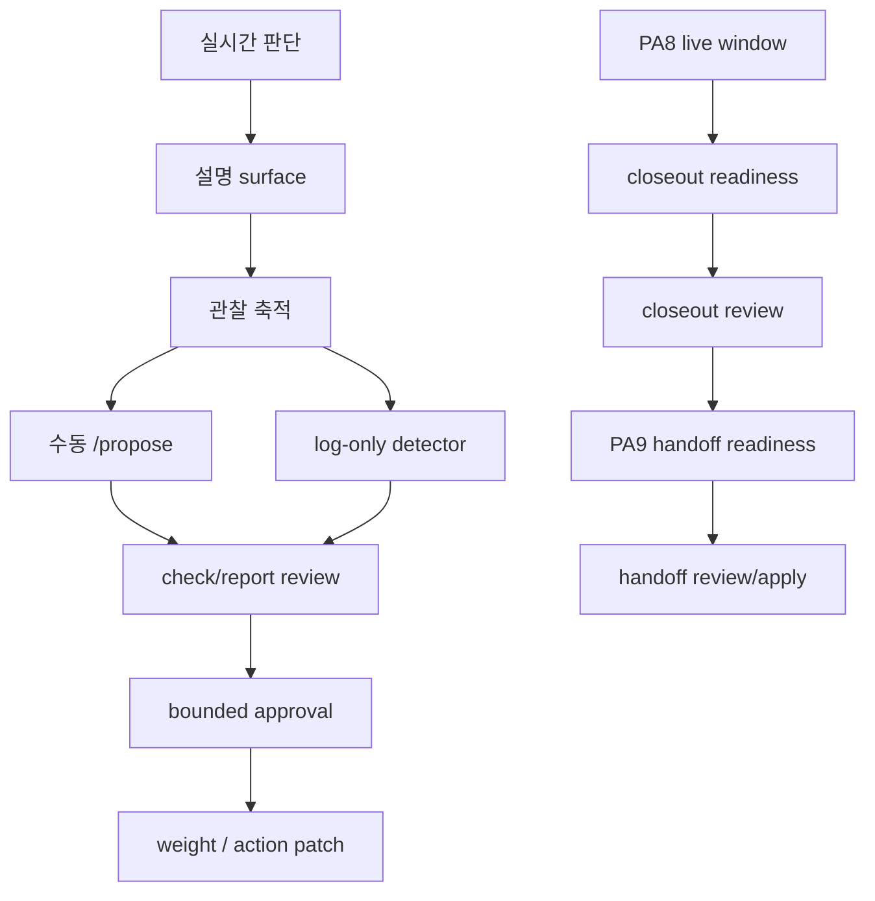

# Current Detailed Reinforcement Master Roadmap

## 목적

이 문서는 현재 CFD 프로젝트를 앞으로 어떤 순서로 보강할지, 그리고 각 단계에서 정확히 무엇을 만들고 무엇을 보류해야 하는지를 **실행 중심**으로 정리한 상세 마스터 로드맵이다.

지금 시스템은 이미 구조가 상당 부분 닫혀 있다. 따라서 이 문서의 목적은 새로운 구조를 계속 덧붙이는 것이 아니라, 아래를 분명히 하는 데 있다.

1. 지금 가장 먼저 손대야 하는 품질 축은 무엇인가
2. 지금 만들 수 있는 것과 아직 근거가 더 필요한 것은 무엇인가
3. 어떤 축은 넓게 관찰하면서 학습해야 하고, 어떤 축은 끝까지 보수적으로 유지해야 하는가
4. 각 단계에서 어떤 산출물이 나와야 다음 단계로 넘어갈 수 있는가

이 문서는 아래 문서를 상위 참고로 함께 본다.

- [current_all_in_one_system_master_playbook_ko.md](/Users/bhs33/Desktop/project/cfd/docs/current_all_in_one_system_master_playbook_ko.md)
- [current_buildable_vs_conditioned_reinforcement_roadmap_ko.md](/Users/bhs33/Desktop/project/cfd/docs/current_buildable_vs_conditioned_reinforcement_roadmap_ko.md)
- [current_advice_gap_reinforcement_execution_roadmap_ko.md](/Users/bhs33/Desktop/project/cfd/docs/current_advice_gap_reinforcement_execution_roadmap_ko.md)
- [current_checkpoint_improvement_watch_remaining_roadmap_ko.md](/Users/bhs33/Desktop/project/cfd/docs/current_checkpoint_improvement_watch_remaining_roadmap_ko.md)
- [current_checkpoint_improvement_watch_orchestration_detailed_design_ko.md](/Users/bhs33/Desktop/project/cfd/docs/current_checkpoint_improvement_watch_orchestration_detailed_design_ko.md)
- [current_telegram_control_plane_and_improvement_loop_ko.md](/Users/bhs33/Desktop/project/cfd/docs/current_telegram_control_plane_and_improvement_loop_ko.md)
- [current_telegram_alert_message_refresh_ko.md](/Users/bhs33/Desktop/project/cfd/docs/current_telegram_alert_message_refresh_ko.md)

---

## 한 줄 결론

앞으로의 로드맵은 아래 두 축을 동시에 굴리는 구조로 읽는 것이 가장 맞다.

1. **보수적 승격축**
   - `PA8 closeout -> PA9 handoff`
   - 끝까지 좁고 보수적으로 간다

2. **넓은 관찰축**
   - `설명력 -> scene 관찰 -> reverse readiness -> proposal detector`
   - 처음에는 넓게 받고, 로그와 피드백을 모은 뒤 조건을 점점 좁힌다

즉 지금은 `더 큰 구조를 추가하는 단계`가 아니라,

`설명 -> 관찰 -> 제안 -> 좁은 승인 -> 보수적 승격`

순서를 닫아가는 단계다.

---

## 현재 시스템 위치

현재 상태를 아주 짧게 요약하면 아래와 같다.

| 축 | 현재 상태 | 해석 |
|---|---|---|
| 자동 진입/대기/청산 | 동작 중 | 구조 문제보다 판단 설명력 문제가 큼 |
| checkpoint orchestrator | 거의 완료 | watch / governance / reconcile / health가 붙어 있음 |
| Telegram control plane | 거의 완료 | 승인 루프와 check/report 분리가 이미 있음 |
| PA8 canary | 활성 | live window가 아직 더 필요함 |
| PA9 handoff | scaffold 완료 | 실제 승격은 closeout 이후 |
| SA / scene | preview-only | 관찰과 설명축으로는 활용 가능 |
| state25 weight patch | review/apply 통로 존재 | detector가 비어 있음 |
| PnL 보고 | 숫자는 살아남 | 교훈 surface와 historical confidence가 더 필요함 |

즉 지금 가장 큰 부족점은 아래다.

- `왜 그렇게 판단했는지`가 약하다
- `무엇을 제안해야 하는지`를 자동으로 surface하는 detector가 약하다
- `조건부 항목`이 readiness 상태로 충분히 드러나지 않는다

---

## 설계 원칙

앞으로의 구현은 아래 원칙을 고정한다.

### 1. 승격축과 관찰축을 분리한다

- 승격축
  - `PA8 closeout`
  - `PA9 handoff`
  - 보수적으로 간다

- 관찰축
  - `scene`
  - `reverse`
  - `실패 패턴`
  - 넓게 보고 점점 좁힌다

### 2. 지금 중요한 것은 최종 판정보다 readiness surface다

지금 당장 closeout을 내리거나 detector를 자동 승인하는 것이 아니라,

- 왜 아직 아닌지
- 무엇이 부족한지
- 어떤 패턴이 반복되고 있는지

를 먼저 보이게 해야 한다.

### 3. 자동 detector는 바로 live apply로 연결하지 않는다

순서는 아래다.

1. `observe`
2. `report`
3. `review`
4. `apply`

초기에는 `1~2`, 많아도 `3`까지만 올린다.

### 4. 설명력은 UX가 아니라 학습 입력이다

설명력이 붙어야 아래가 가능하다.

- 사람이 시스템을 신뢰함
- 사람이 반복 실패를 식별함
- 제안이 한국어로 올라옴
- 승인/반영 루프가 의미를 가짐

---

## 전체 실행 흐름



---

## 로드맵 구조

이 로드맵은 아래 6개 Phase로 읽는다.

1. `P0` 기준면 만들기
2. `P1` 조건부 항목 readiness surface
3. `P2` 실시간 설명력 보강
4. `P3` 수동 proposal / PnL 교훈 / check inbox
5. `P4` 넓은 관찰축 detector
6. `P5` 보수적 승격축 닫기

### 순서 해석 보정

기본 골격은 `P1 readiness surface -> P2 설명력`이 맞다. 다만 체감 개선을 너무 늦추지 않기 위해, 실제 구현은 아래처럼 읽는 편이 가장 현실적이다.

1. `P2 quick-win thin slice`
   - DM에 `주도축 / 핵심리스크 / 강도` 3줄만 먼저 붙인다
2. `P1 readiness surface`
   - 왜 아직 아닌지, 왜 막혔는지, 왜 pending인지 상태를 먼저 보이게 만든다
3. `P2 full`
   - scene, 복기 힌트, 반전 설명까지 확장한다

즉 `P2를 P1보다 완전히 먼저`로 해석하지 않는다. **빠른 체감용 설명 3줄은 먼저 붙이고, readiness surface는 그 직후 바로 닫는다**가 더 정확한 순서다.

---

## P0. 기준면 만들기

상세 기준은 [current_p0_foundation_baseline_detailed_plan_ko.md](/Users/bhs33/Desktop/project/cfd/docs/current_p0_foundation_baseline_detailed_plan_ko.md)를 함께 본다.

### 목표

다음 단계들이 모두 같은 기준면 위에서 움직이게 만든다.

### 해야 할 일

- `체크 topic`과 `보고서 topic`의 역할을 고정
- `실시간 DM`은 실행 알림만, 승인 알림은 제외
- `proposal`은 반드시 한국어 설명형으로 생성
- `조건부 항목`은 `observe / report / review / apply` 어느 단계인지 상태를 붙인다

### 핵심 산출물

- topic 역할 표
- status enum 표
- proposal envelope 표
- readiness 상태 enum 표

### 완료 조건

- 같은 종류의 제안/준비 상태가 항상 같은 language와 state로 표현된다

### 건드릴 축

- `backend/services/telegram_notification_hub.py`
- `backend/services/telegram_approval_bridge.py`
- `backend/services/checkpoint_improvement_master_board.py`
- 문서 정합성

---

## P1. 조건부 항목 readiness surface

상세 기준은 [current_p1_readiness_surface_detailed_plan_ko.md](/Users/bhs33/Desktop/project/cfd/docs/current_p1_readiness_surface_detailed_plan_ko.md)를 함께 본다.

### 목표

아직 최종 판정을 내릴 수 없는 항목을 **보이는 상태**로 만든다.

### 대상 1. PA8 closeout readiness

보여줘야 할 것:

- symbol별 `pending / not-ready / ready`
- 왜 ready가 아닌지
- live window 부족인지
- replay 부족인지
- worsened row가 있는지

산출물:

- board 필드
- check 항목
- report 원문 템플릿

완료 조건:

- 사용자가 “왜 closeout이 아직 아닌지”를 한눈에 읽을 수 있다

### 대상 2. PA9 handoff readiness

보여줘야 할 것:

- `HOLD_PENDING_PA8_LIVE_WINDOW`
- `READY_FOR_REVIEW`
- `READY_FOR_APPLY`

산출물:

- handoff board field
- handoff report

완료 조건:

- 사용자가 “handoff가 막힌 이유”를 상태판에서 바로 읽는다

### 대상 3. reverse readiness

보여줘야 할 것:

- `reverse-ready`
- `reverse-blocked`
- `reverse-pending`

그리고 함께:

- 왜 blocked인지
- 왜 pending인지
- 즉시 뒤집지 않은 이유가 무엇인지

완료 조건:

- 반전 후보가 생겼을 때 “왜 그냥 기다렸는지”가 DM 또는 상태 surface에서 드러난다

### 대상 4. historical cost confidence

보여줘야 할 것:

- `exact`
- `recent-safe`
- `historical-limited`

완료 조건:

- 사용자가 historical PnL cost를 얼마나 믿어야 하는지 바로 안다

### readiness와 Telegram / PnL 연결

readiness가 board JSON에만 있으면 실제 운영에서 잘 안 보인다. 따라서 최소한 `1일 PnL 마감` 또는 `운영 요약` 끝에 아래 같은 요약이 같이 붙는 구조를 목표로 한다.

예:

```text
━━ 시스템 상태 ━━
PA8 closeout:
  BTCUSD: 대기 (live window 12/30봉)
  XAUUSD: 대기 (live window 8/30봉)
  NAS100: 대기 (live window 15/30봉)

PA9 handoff: PA8 완료 대기 중
reverse readiness: blocked 1 / pending 0
historical cost confidence: recent-safe
```

이건 새 시스템을 하나 더 만드는 작업이 아니라, `master board -> PnL formatter / report formatter`로 이어지는 마지막 노출면을 추가하는 작업으로 본다.

### 핵심 파일

- `backend/services/checkpoint_improvement_master_board.py`
- `backend/services/checkpoint_improvement_watch.py`
- `backend/services/checkpoint_improvement_recovery_health.py`
- `backend/app/trading_application_reverse.py`
- `backend/services/telegram_notification_hub.py`
- `backend/services/telegram_pnl_digest_formatter.py`

---

## P2. 실시간 설명력 보강

상세 기준은 아래 두 문서를 같이 본다.

- [current_p2_quick_runtime_explanation_detailed_plan_ko.md](C:\Users\bhs33\Desktop\project\cfd\docs\current_p2_quick_runtime_explanation_detailed_plan_ko.md)
- [current_p2_full_runtime_explanation_detailed_plan_ko.md](C:\Users\bhs33\Desktop\project\cfd\docs\current_p2_full_runtime_explanation_detailed_plan_ko.md)

### 목표

실시간 진입/대기/청산/반전 메시지를 사람이 즉시 이해할 수 있게 만든다.

### quick-win thin slice

가장 먼저 붙일 최소 설명은 아래 3줄이다.

- `주도축`
- `핵심리스크`
- `강도`

이 3줄만 먼저 붙여도 매일 보는 DM의 체감 품질이 바로 올라간다. 그 다음에 scene, 복기 힌트, 반전 세부 설명을 확장한다.

### 진입 포맷

- `주도축`
- `핵심리스크`
- `강도`
- `scene` 1줄 옵션

예:

- `주도축: 하단 반등 + 모멘텀 회복`
- `핵심리스크: 상단 저항 근접`
- `강도: MEDIUM`

### 주도축 / 리스크 / 강도 생성 규칙

설명력은 문장 센스로 만들지 않는다. 아래처럼 기계적으로 생성 가능해야 한다.

#### 1. 주도축

1. 진입 결정에 실제로 기여한 `reason_codes`를 모은다
2. 각 `reason_code`를 한국어 label로 매핑한다
3. 기여도 상위 2개를 뽑아 `+`로 연결한다

예:

```text
reason_codes:
- lower_rebound_confirm
- bb20_reclaim
- momentum_recovery

주도축:
- 하단 반등 확인 + BB20 되찾기
```

#### 2. 핵심리스크

우선순위는 아래다.

1. 현재 가격 기준 가장 가까운 반대 방향 핵심 레벨
2. 반대 방향의 가장 강한 counter-signal
3. 그 외 spread / volume / gate 계열 위험

예:

- `upper_resistance_near -> 상단 저항 근접`
- `volume_divergence -> 거래량 다이버전스`
- `spread_spike -> 스프레드 급등`

#### 3. 강도

처음 버전은 아래처럼 단순화한다.

- `HIGH`
  - 상위 reason 4개 이상이 정렬되거나
  - 내부 score가 최근 분포 상위 20% 안
- `MEDIUM`
  - 상위 reason 3개 수준이거나
  - 내부 score가 중간권
- `LOW`
  - 상위 reason 2개 이하이거나
  - 내부 score가 하위권

#### 4. 매핑 파일

권장 파일:

- `backend/services/reason_label_map.py`

예시 구조:

```python
REASON_LABEL_MAP = {
    "lower_rebound_confirm": "하단 반등 확인",
    "upper_reject_mixed_confirm": "상단 거부 혼합 확인",
    "bb20_reclaim": "BB20 되찾기",
    "momentum_recovery": "모멘텀 회복",
    "range_follow": "박스 추종",
    "trend_continuation": "추세 지속",
}

RISK_LABEL_MAP = {
    "upper_resistance_near": "상단 저항 근접",
    "lower_support_weak": "하단 지지 약화",
    "volume_fade": "거래량 감소",
    "spread_spike": "스프레드 급등",
}
```

### 대기 포맷

- `대기이유`
- `해제조건`
- `참고축: barrier / belief / forecast`

### 청산 포맷

- `청산사유`
- `복기힌트`

### 복기 힌트 자동 생성 규칙

복기 힌트는 무조건 만들지 않는다. 아래 조건이 있을 때만 채운다.

1. `MFE 대비 실현 비율 < 40%`
   - `MFE {mfe}에서 partial 미실행. 포착률 {capture}%`
2. `보유 시간이 자산별 기준의 2배 이상`이고 `실현 수익 < 0.5R`
   - `보유 {time} 대비 수익 미미. time_decay 가능성`
3. `진입 시 gate가 caution / no-trade 계열`
   - `진입 시 gate: {gate_name}. gate 준수 재검토`
4. `scene 전환이 있었는데 action 전환이 지연됨`
   - `scene {from} -> {to} 전환 후 {bars}봉 지연`
5. 위 조건이 모두 아니면
   - 복기 힌트는 비운다

원칙:

- 억지로 매번 쓰지 않는다
- 진짜 복기할 이유가 있을 때만 힌트를 붙인다

### 반전 포맷

- `반전상태`
- `급변근거`
- `강도`

### 완료 조건

- raw score 나열형 메시지가 사라진다
- 같은 type 메시지가 항상 같은 설명형 포맷을 쓴다
- DM만 보고 1차 납득이 가능하다

### 핵심 파일

- `backend/integrations/notifier.py`
- `backend/app/trading_application.py`
- `backend/app/trading_application_runner.py`
- `backend/services/entry_try_open_entry.py`
- `backend/services/exit_service.py`
- `backend/app/trading_application_reverse.py`

---

## P3. 수동 proposal / PnL 교훈 / inbox UX

### 목표

실패 패턴을 사람이 읽고 제안할 수 있게 만든다.

### 작업 1. `/propose` 수동 트리거

입력:

- 최근 N건 closed trade
- reason
- scene
- 시간대
- MFE 포착률
- partial missed
- reverse missed

출력:

- `체크 topic`: 짧은 항목
- `보고서 topic`: 원문 보고서

완료 조건:

- `/propose` 한 번으로 문제 패턴 3~5개가 한국어로 올라온다

### `/propose` 문제 판별 기준

가장 나쁜 3개를 무조건 뽑는 방식은 쓰지 않는다. `문제 없음`도 정상 결과로 인정한다.

#### Level 1. 확실한 문제

- 같은 reason으로 3건 이상 연속 손실
- 승률 30% 미만, 최소 표본 5건 이상
- MFE 포착률 평균 25% 미만

처리:

- 자동 surface 가능
- `/propose` 보고서의 최상단으로 올린다

#### Level 2. 주의 필요

- 같은 reason으로 2건 연속 손실
- 승률 30~45%, 최소 표본 5건 이상
- MFE 포착률 평균 25~40%
- 특정 시간대 승률이 전체 대비 15%p 이상 낮음

처리:

- surface는 하되 `주의 필요`로 표시
- 바로 patch 권고가 아니라 검토 우선

#### Level 3. 관찰 중

- 승률 45~50%
- 표본 5건 미만
- 최근 추세가 나빠지지만 아직 확정적이지 않음

처리:

- log-only
- `/propose`의 기본 surface 대상은 아님

#### 기본 규칙

- Level 1/2가 없으면 `문제 패턴 없음`을 정상 결과로 보여준다
- 단순 “상대적 꼴찌”를 문제로 부르지 않는다

### 작업 2. PnL 교훈 코멘트

예:

- `오늘은 상단 거부 계열 연속 손실이 많았습니다.`
- `MFE 대비 수익 포착이 약했습니다.`
- `partial timing이 늦었습니다.`

원칙:

- patch 제안이 아니라 관찰 코멘트
- sample이 약하면 “참고 수준”

완료 조건:

- `1일 / 1주 / 1달` 보고에 코멘트가 붙는다

### 작업 3. check inbox UX

구조:

- `보고서 topic`: 원문 1회
- `체크 topic`: 누적 inbox

원칙:

- 같은 scope는 갱신
- 오래된 항목은 `대체됨`
- 긴급한 것만 별도 푸시

완료 조건:

- check topic만 봐도 backlog를 이해할 수 있다

### 핵심 파일

- `backend/services/state25_weight_patch_review.py`
- `backend/services/checkpoint_improvement_telegram_runtime.py`
- `backend/services/telegram_approval_bridge.py`
- `backend/services/telegram_notification_hub.py`
- `backend/services/telegram_pnl_digest_formatter.py`
- `backend/services/telegram_ops_service.py`

---

## P4. 넓은 관찰축 detector

상세 기준은 [current_p4_log_only_detector_detailed_plan_ko.md](C:\Users\bhs33\Desktop\project\cfd\docs\current_p4_log_only_detector_detailed_plan_ko.md)를 함께 보고,
입력선 확장 메모는 [current_p4_detector_input_broadening_ko.md](C:\Users\bhs33\Desktop\project\cfd\docs\current_p4_detector_input_broadening_ko.md),
피드백 lane은 [current_p4_2_detector_feedback_lane_detailed_plan_ko.md](C:\Users\bhs33\Desktop\project\cfd\docs\current_p4_2_detector_feedback_lane_detailed_plan_ko.md),
confusion/narrowing은 [current_p4_3_detector_confusion_and_feedback_narrowing_ko.md](C:\Users\bhs33\Desktop\project\cfd\docs\current_p4_3_detector_confusion_and_feedback_narrowing_ko.md)에서 확인한다.

### 목표

실패 패턴을 넓게 받아들여 기록하고, 나중에 점점 좁힐 수 있게 만든다.

### detector 1. scene-aware detector

초기 상태:

- log-only
- preview-only
- live adoption 금지

보여줘야 할 것:

- `scene disagreement 증가`
- `scene gate: caution`
- `scene-aware proposal candidate`

### detector 2. candle/weight detector

후보:

- `상단/하단 힘 해석 왜곡`
- `윗꼬리 과대반영`
- `아랫꼬리 과대반영`
- `몸통 과대반영`
- `조기 진입 역행 과다`

원칙:

- raw 변수명 금지
- 한국어 label 사용
- 처음에는 log-only

### detector 3. reverse pattern detector

후보:

- `reverse-ready를 늦게 인식`
- `reverse-blocked 상태 반복`
- `강한 반전인데 pending에서 끝남`

원칙:

- 바로 강제 반전으로 연결하지 않는다
- missed/late 패턴을 먼저 기록한다

### detector 4. feedback lane

가능하면 나중에 붙일 것:

- `맞았음`
- `과민했음`
- `놓쳤음`
- `애매함`

이 4개 피드백을 쌓아 confusion board를 만든다.

### detector false positive 비용 상한

log-only detector라도 과도하게 surface되면 운영 피로가 생긴다. 따라서 detector별 `하루 최대 surface 건수`와 `최소 표본 기준`을 둔다.

권장값:

- `scene-aware detector`
  - 하루 최대 3건
  - 동일 scene 실패 3회 이상일 때만 surface
- `candle / weight detector`
  - 하루 최대 5건
  - 동일 특성 실패 5회 이상일 때만 surface
- `reverse pattern detector`
  - 하루 최대 2건
  - 동일 missed/late 패턴 3회 이상일 때만 surface
- `전체 detector 총합`
  - 하루 최대 10건

원칙:

- 상한을 넘으면 severity가 높은 것만 남기고 나머지는 log-only로 내린다
- detector는 관찰기이지 판단기가 아니다

### 완료 조건

- detector가 live patch를 직접 만들지 않는다
- detector는 proposal candidate 또는 log-only report만 만든다
- 반복된 패턴만 다음 단계 승격 후보가 된다

### 핵심 파일

- `backend/services/teacher_pattern_active_candidate_runtime.py`
- `backend/services/teacher_pattern_labeler.py`
- `backend/services/state25_weight_patch_review.py`
- `backend/services/path_checkpoint_scene_disagreement_audit.py`
- `backend/services/path_checkpoint_scene_bias_preview.py`
- `backend/app/trading_application_reverse.py`

---

## P5. 보수적 승격축 닫기

### 목표

관찰축은 넓게 가더라도, 실제 승격은 계속 좁고 보수적으로 닫는다.

### 단계 1. PA8 closeout 1건

집중 관찰 기준과 현재 구현 상태는 [current_p5_1_pa8_closeout_concentrated_observation_detailed_plan_ko.md](C:\Users\bhs33\Desktop\project\cfd\docs\current_p5_1_pa8_closeout_concentrated_observation_detailed_plan_ko.md)를 함께 본다.
closeout review/apply 정밀화는 [current_p5_2_pa8_closeout_review_apply_precision_detailed_plan_ko.md](C:\Users\bhs33\Desktop\project\cfd\docs\current_p5_2_pa8_closeout_review_apply_precision_detailed_plan_ko.md)를 함께 본다.
first symbol / PA7 narrow review lane은 [current_p5_4_first_symbol_closeout_handoff_and_pa7_narrow_review_lane_ko.md](C:\Users\bhs33\Desktop\project\cfd\docs\current_p5_4_first_symbol_closeout_handoff_and_pa7_narrow_review_lane_ko.md)를 함께 본다.
전이 알림 강화는 [current_p5_5_first_symbol_closeout_handoff_transition_alerting_ko.md](C:\Users\bhs33\Desktop\project\cfd\docs\current_p5_5_first_symbol_closeout_handoff_transition_alerting_ko.md)를 함께 본다.

조건:

- live first-window 충분
- rollback false positive 없음
- closeout reason 설명 가능

완료 조건:

- 최소 1개 symbol closeout 완료

### 단계 2. PA9 handoff 1건

조건:

- closeout 결과가 좁고 안정적
- action-only 기준에서 설명 가능

완료 조건:

- handoff review/apply를 실제로 통과

### 원칙

- 억지로 당기지 않는다
- scene을 섞지 않는다
- multi-symbol wide rollout으로 바로 안 간다

### PA8 closeout 촉진 조건

자연 대기가 기본이지만, 아래 조건 중 하나라도 해당되면 `집중 관찰` 대상으로 올릴 수 있다.

- 특정 symbol의 live window가 목표의 80% 이상
- 최근 10건 canary action이 모두 정상
- rollback trigger가 한 번도 발동하지 않음

이때 허용되는 촉진은 아래까지다.

- 해당 symbol readiness check를 더 자주 본다
- governance_cycle에서 closeout readiness 재평가 빈도를 높인다
- 보고서와 check inbox에 우선 surface한다
- `WATCHLIST -> CONCENTRATED -> READY_*` 전이를 check/report topic으로 좁게 알린다

절대 하지 말아야 할 것:

- live window 기준 완화
- rollback 기준 완화
- 여러 symbol 동시 촉진

### 핵심 파일

- `backend/services/checkpoint_improvement_watch.py`
- `backend/services/checkpoint_improvement_pa9_handoff_runtime.py`
- `backend/services/checkpoint_improvement_pa9_handoff_review_packet.py`
- `backend/services/checkpoint_improvement_pa9_handoff_apply_packet.py`
- `backend/services/checkpoint_improvement_master_board.py`

---

## 하지 말아야 할 것

### 1. SA live adoption

이유:

- 아직 preview/log-only 단계다

### 2. detector 자동 승인

이유:

- false positive가 곧 live 오염이다

### 3. wide rollout

이유:

- 작은 패턴을 전체 전략으로 과대확장할 위험이 크다

### 4. 무제한 즉시 강제 반전

이유:

- 체결 꼬임과 중복 진입 위험이 너무 크다

### 5. PnL 교훈에서 곧바로 patch 적용

이유:

- sample 부족 시 우연을 규칙으로 굳힐 수 있다

---

## 지금 당장 추천하는 시작 순서

### Step 1

- `P2-quick` DM 3줄 설명
  - `주도축`
  - `핵심리스크`
  - `강도`
- `P1-1` PA8 closeout readiness surface
- `P1-3` reverse-ready / reverse-blocked surface

### Step 2

- `P1-2` PA9 handoff readiness surface
- `P2-1` 진입/대기/청산/반전 설명 포맷 고정
- `P2-2` scene 1줄 참고축 추가
- `P2-3` 복기 힌트 자동 생성 규칙 반영

### Step 3

- `P3-1` `/propose` 수동 트리거
- `P3-2` PnL 교훈 코멘트
- `P3-3` check inbox 고정 메시지화
- `P3-4` readiness 요약을 1일 PnL 마감에 연결

### Step 4

- `P4-1` scene-aware detector log-only
- `P4-2` candle/weight detector log-only
- `P4-3` reverse pattern detector log-only

### Step 4B

- `P4-6` 구조형 오판 관찰 확장 완료 후
- 중앙 학습 변수 레지스트리 direct binding 착수
- 상세 기준: [current_learning_registry_direct_binding_field_contract_ko.md](C:/Users/bhs33/Desktop/project/cfd/docs/current_learning_registry_direct_binding_field_contract_ko.md)
- 실행 순서: [current_learning_registry_direct_binding_execution_roadmap_ko.md](C:/Users/bhs33/Desktop/project/cfd/docs/current_learning_registry_direct_binding_execution_roadmap_ko.md)

### Step 5

- `P5-1` PA8 closeout 1건
- `P5-2` PA9 handoff 1건

---

## 문제 발생 시 보는 순서

### 실시간 판단이 이상하다

1. `backend/app/trading_application.py`
2. `backend/services/entry_try_open_entry.py`
3. `backend/services/exit_service.py`
4. `backend/app/trading_application_reverse.py`
5. `data/runtime_status.json`

### proposal이 안 올라온다

1. `backend/services/state25_weight_patch_review.py`
2. `backend/services/checkpoint_improvement_telegram_runtime.py`
3. `backend/services/telegram_approval_bridge.py`
4. `backend/services/telegram_notification_hub.py`

### readiness가 안 보인다

1. `backend/services/checkpoint_improvement_master_board.py`
2. `backend/services/checkpoint_improvement_watch.py`
3. `backend/services/checkpoint_improvement_recovery_health.py`

### PnL 숫자/코멘트가 이상하다

1. `backend/services/telegram_pnl_digest_formatter.py`
2. `backend/services/telegram_ops_service.py`
3. `backend/trading/trade_logger_close_ops.py`
4. `data/trades/trade_closed_history.csv`

---

## 최종 정리

지금 시스템은 이미 `자동매매 엔진`, `개선 오케스트레이터`, `Telegram control plane`, `학습 반영 통로`, `PnL 보고 체계`가 대부분 붙어 있다.

그래서 이제 중요한 것은 아래 순서다.

1. 빠른 설명 3줄로 체감을 올린다
2. 조건부 항목을 readiness surface로 보이게 만든다
3. full 설명과 복기 힌트를 붙인다
4. 실패를 proposal로 surface한다
5. detector를 넓게 관찰하며 점점 좁힌다
6. detector/proposal/report가 같은 `registry_key`와 같은 한국어로 읽히게 정리한다
7. 승격은 끝까지 보수적으로 닫는다

즉 지금은

`구조 추가`

보다

`설명 -> 관찰 -> 제안 -> 좁은 승인 -> 보수적 승격`

을 완성하는 것이 맞다.
