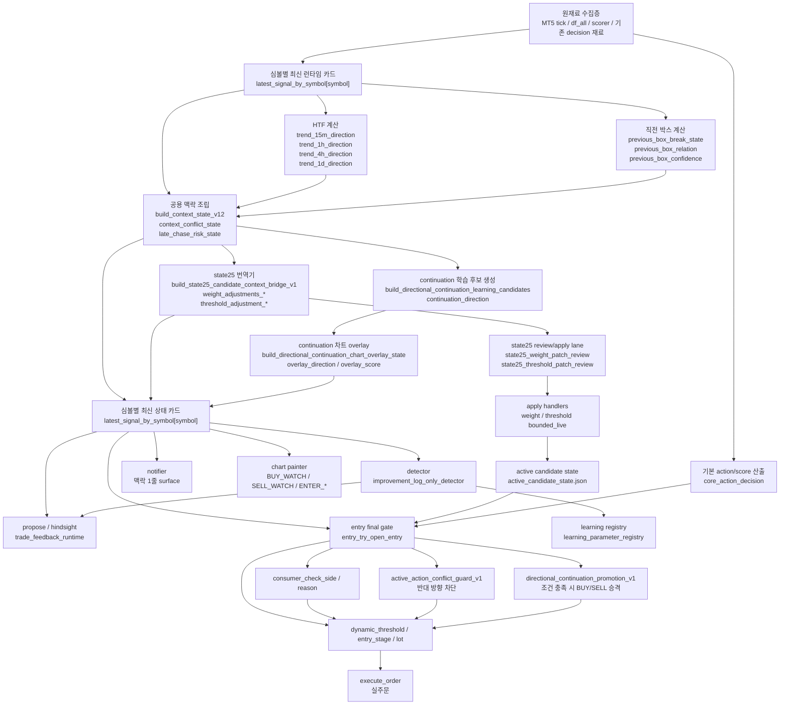
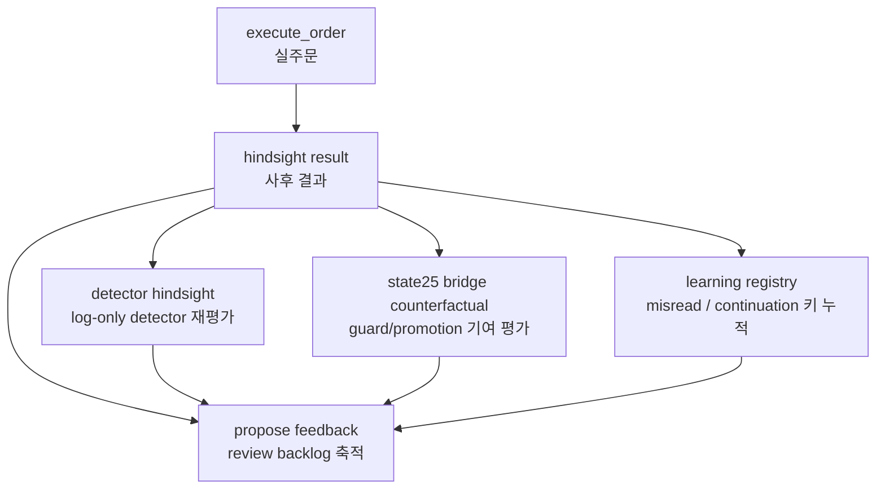

# 현재 시스템 유기 연결 흐름도 및 상태표

## 1. 이 문서의 목적

이 문서는 현재 시스템이

- 어떤 재료를 어디서 가져오고
- 어떤 변수명으로 상태를 만들고
- detector / propose / chart / state25 / execution 으로 어떻게 흘러가며
- 지금 실제로 어디까지 live에서 확인되었는지

를 한 번에 보기 위한 운영형 정리 문서다.

핵심 목적은 두 가지다.

1. `차트 재료 -> 해석 -> 학습 -> state25 -> 실행`이 정말 한 줄로 이어져 있는지 확인한다.
2. 지금 아직 안 닫힌 연결이 무엇인지 명확히 남긴다.

주의:

- 최근 `runtime_status.detail.json`은 사이클 타이밍에 따라 심볼별 row가 비어 보일 수 있다.
- 그래서 이 문서의 현재 상태표는
  - 최근 실제 체크방 `/detect`, `/propose` 실관측
  - `active_candidate_state.json`
  - 현재 코드/테스트 상태
  를 함께 기준으로 정리한다.

---

## 2. 가장 중요한 한 줄

현재 시스템의 중심은 `latest_signal_by_symbol`이다.

즉 재료를 여기저기 따로 들고 다니는 구조가 아니라,

- HTF
- 직전 박스
- 맥락 충돌
- continuation
- state25 bridge
- execution guard / promotion

을 모두 **심볼별 최신 상태 카드**에 덧씌운 뒤,
그 같은 카드를 detector / propose / chart / entry가 읽는 구조다.

---

## 3. 전체 흐름도



---

## 4. 중심 런타임 카드

### 4-1. 핵심 변수

- `latest_signal_by_symbol`
  - 한국어 의미: 심볼별 최신 런타임 카드
  - 역할: 지금 이 심볼을 시스템이 어떻게 보고 있는지 한 줄로 모아둔 공용 상태

### 4-2. 이 카드가 중요한 이유

이 카드에 들어간 값은 같은 값이

- detector에서 관찰 후보를 만들고
- `/propose`에서 review 후보를 만들고
- chart에서 화살표/라벨을 만들고
- entry 실행 직전 가드와 승격 판단에까지 쓰인다.

즉 현재 구조는

`재료 따로`가 아니라 `공용 상태 카드 공유`

구조다.

---

## 5. 입력 재료층

| 층 | 변수/함수명 | 한국어 의미 | 주요 파일 |
| --- | --- | --- | --- |
| 원재료 | `tick`, `df_all`, scorer 입력 | 브로커/캔들/점수 재료 | `backend/app/trading_application.py` |
| 기본 판단 | `core_action_decision` | 기존 action/score 산출 결과 | `backend/app/trading_application.py` |
| 기존 진입 해석 | `consumer_check_side`, `consumer_check_reason` | 기존 엔진이 지금 매수/매도/대기 중 무엇으로 읽는지 | `backend/services/consumer_check_state.py`, `backend/services/entry_try_open_entry.py` |

---

## 6. state-first 맥락층

### 6-1. HTF 계산

| 변수/함수명 | 한국어 의미 | 주요 파일 |
| --- | --- | --- |
| `trend_15m_direction` | 15분 기준 방향 | `backend/services/htf_trend_cache.py` |
| `trend_1h_direction` | 1시간 기준 방향 | `backend/services/htf_trend_cache.py` |
| `trend_4h_direction` | 4시간 기준 방향 | `backend/services/htf_trend_cache.py` |
| `trend_1d_direction` | 일봉 기준 방향 | `backend/services/htf_trend_cache.py` |
| `htf_alignment_state` | 상위 추세 정렬 상태 | `backend/services/context_state_builder.py` |
| `htf_against_severity` | 상위 추세 역행 강도 | `backend/services/context_state_builder.py` |

### 6-2. 직전 박스 계산

| 변수/함수명 | 한국어 의미 | 주요 파일 |
| --- | --- | --- |
| `previous_box_break_state` | 직전 박스 돌파/유지/실패 상태 | `backend/services/previous_box_calculator.py` |
| `previous_box_relation` | 현재가가 직전 박스 위/안/아래 어디인지 | `backend/services/previous_box_calculator.py` |
| `previous_box_confidence` | 직전 박스 해석 신뢰도 | `backend/services/previous_box_calculator.py` |
| `previous_box_lifecycle` | 박스 형성/재테스트/무효화 단계 | `backend/services/previous_box_calculator.py` |

### 6-3. 공용 맥락 해석

| 변수/함수명 | 한국어 의미 | 주요 파일 |
| --- | --- | --- |
| `build_context_state_v12(...)` | HTF + 박스 + 위험 상태를 하나의 계약으로 묶는 함수 | `backend/services/context_state_builder.py` |
| `context_conflict_state` | 현재 판단과 큰 그림이 충돌하는지의 1차 요약 | `backend/services/context_state_builder.py` |
| `context_conflict_intensity` | 충돌 강도 | `backend/services/context_state_builder.py` |
| `late_chase_risk_state` | 너무 늦은 추격인지 | `backend/services/context_state_builder.py` |

---

## 7. continuation 학습/overlay층

### 7-1. continuation 학습 후보

| 변수/함수명 | 한국어 의미 | 주요 파일 |
| --- | --- | --- |
| `build_directional_continuation_learning_candidates(...)` | 상승 지속/하락 지속 누락 후보를 만드는 함수 | `backend/services/directional_continuation_learning_candidate.py` |
| `continuation_direction` | `UP` 또는 `DOWN` | `backend/services/directional_continuation_learning_candidate.py` |
| `candidate_key` | 동일 장면을 묶는 키 | `backend/services/directional_continuation_learning_candidate.py` |
| `source_kind` | semantic cluster / market-family audit 등 출처 | `backend/services/directional_continuation_learning_candidate.py` |

### 7-2. continuation 차트 overlay

| 변수/함수명 | 한국어 의미 | 주요 파일 |
| --- | --- | --- |
| `build_directional_continuation_chart_overlay_state(...)` | continuation을 차트 표식용 상태로 번역 | `backend/services/directional_continuation_chart_overlay.py` |
| `directional_continuation_overlay_v1` | continuation 차트 카드 전체 payload | `backend/services/directional_continuation_chart_overlay.py` |
| `directional_continuation_overlay_direction` | 차트가 보고 있는 continuation 방향 | `backend/services/directional_continuation_chart_overlay.py` |
| `directional_continuation_overlay_event_kind_hint` | `BUY_WATCH`, `SELL_WATCH` 같은 힌트 | `backend/services/directional_continuation_chart_overlay.py` |
| `directional_continuation_overlay_score` | overlay 강도 점수 | `backend/services/directional_continuation_chart_overlay.py` |

### 7-3. detector / propose / registry 연결

| 변수/함수명 | 한국어 의미 | 주요 파일 |
| --- | --- | --- |
| `_build_directional_continuation_detector_rows()` | detector용 continuation 관찰 행 생성 | `backend/services/improvement_log_only_detector.py` |
| `directional_continuation_candidate_count` | `/propose`에 모인 continuation 후보 수 | `backend/services/trade_feedback_runtime.py` |
| `misread:directional_up_continuation_conflict` | 상승 지속 누락 학습 키 | `backend/services/learning_parameter_registry.py` |
| `misread:directional_down_continuation_conflict` | 하락 지속 누락 학습 키 | `backend/services/learning_parameter_registry.py` |

---

## 8. state25 bridge / review / apply층

### 8-1. state25 번역기

| 변수/함수명 | 한국어 의미 | 주요 파일 |
| --- | --- | --- |
| `build_state25_candidate_context_bridge_v1(...)` | 큰 그림을 state25가 알아듣는 손잡이 값으로 번역 | `backend/services/state25_context_bridge.py` |
| `state25_candidate_context_bridge_v1` | state25 bridge payload 전체 | `backend/services/state25_context_bridge.py` |
| `weight_adjustments_requested/effective` | weight 조정 후보 / 실제 반영값 | `backend/services/state25_context_bridge.py` |
| `threshold_adjustment_requested/effective` | threshold harden 후보 / 실제 반영값 | `backend/services/state25_context_bridge.py` |

### 8-2. state25 review lane

| 변수/함수명 | 한국어 의미 | 주요 파일 |
| --- | --- | --- |
| `state25_context_bridge_weight_review_count` | `/propose`에 올라온 weight review 수 | `backend/services/trade_feedback_runtime.py` |
| `state25_context_bridge_threshold_review_count` | `/propose`에 올라온 threshold review 수 | `backend/services/trade_feedback_runtime.py` |
| `state25_weight_patch_review` | weight patch review 후보 생성 | `backend/services/state25_weight_patch_review.py` |
| `state25_threshold_patch_review` | threshold patch review 후보 생성 | `backend/services/state25_threshold_patch_review.py` |

### 8-3. state25 apply 경로

| 변수/함수명 | 한국어 의미 | 주요 파일 |
| --- | --- | --- |
| `state25_weight_patch_apply_handlers` | weight bounded live 적용 핸들러 | `backend/services/state25_weight_patch_apply_handlers.py` |
| `state25_threshold_patch_apply_handlers` | threshold bounded live 적용 핸들러 | `backend/services/state25_threshold_patch_apply_handlers.py` |
| `active_candidate_state.json` | 현재 active candidate 상태 | `models/teacher_pattern_state25_candidates/active_candidate_state.json` |
| `current_rollout_phase` | 현재 rollout 단계 | `active_candidate_state.json` |
| `current_binding_mode` | 현재 binding 모드 | `active_candidate_state.json` |

---

## 9. detector / propose / notifier / chart 층

| 영역 | 변수/함수명 | 한국어 의미 | 주요 파일 |
| --- | --- | --- | --- |
| detector | `context_bundle_summary_ko` | HTF/박스/위험을 한 줄로 요약한 문장 | `backend/services/improvement_log_only_detector.py` |
| detector | `scene-aware`, `candle/weight`, `reverse pattern` | 관찰 축 3종 | `backend/services/improvement_log_only_detector.py` |
| propose | `build_manual_trade_proposal_snapshot(...)` | `/propose` 전체 스냅샷 생성 | `backend/services/trade_feedback_runtime.py` |
| notifier | `맥락: <HTF> | <직전 박스> | <늦은 추격>` | 텔레그램 맥락 1줄 | `backend/integrations/notifier.py` |
| chart | `_resolve_directional_continuation_overlay_event_kind(...)` | continuation overlay를 차트 표식으로 바꿈 | `backend/trading/chart_painter.py` |

---

## 10. 실행층

### 10-1. 최종 승부처

현재 시스템에서 최종 실행 우선순위가 실제로 부딪히는 곳은

`backend/services/entry_try_open_entry.py`

이다.

여기서 최종적으로 아래 재료가 만난다.

- 기존 `consumer_check_*`
- state25 threshold / weight
- continuation overlay
- wrong-side action guard
- continuation promotion
- dynamic threshold / entry stage / lot

### 10-2. 실행 직전 핵심 변수

| 변수/함수명 | 한국어 의미 | 주요 파일 |
| --- | --- | --- |
| `active_action_conflict_guard_v1` | 큰 그림과 반대인 진입을 차단하는 가드 | `backend/services/entry_try_open_entry.py` |
| `directional_continuation_promotion_v1` | continuation이 충분히 강하면 BUY/SELL로 승격 | `backend/services/entry_try_open_entry.py` |
| `dynamic_threshold` | 실제 진입 문턱 | `backend/services/entry_try_open_entry.py` |
| `entry_stage` | aggressive / balanced / conservative 같은 진입 성격 | `backend/services/entry_try_open_entry.py` |
| `lot` | 실제 주문 수량 | `backend/services/entry_try_open_entry.py` |

### 10-3. 현재 실행층 해석

현재는 단순히 “이 장면을 관찰한다”를 넘어서,

- wrong-side SELL/BUY를 가드로 막고
- continuation이 충분히 강하면
- BUY 또는 SELL로 bounded promotion

까지 갈 수 있도록 코드가 연결되어 있다.

다만 이 부분은 **코드/테스트는 완료**, **라이브 확인은 재시작 타이밍에 따라 추가 검증이 필요한 상태**다.

---

## 11. 현재 상태표

### 11-1. 큰 축 상태표

| 축 | 현재 상태 | live 확인 | 설명 |
| --- | --- | --- | --- |
| state-first 맥락축 | 거의 완료 | 확인됨 | HTF / previous box / context conflict / late chase가 runtime -> detect -> propose까지 연결됨 |
| continuation 학습축 | 완료 | 확인됨 | 상승 지속 누락 / 하락 지속 누락이 detector와 propose에 실제 surface됨 |
| continuation 차트 overlay | 연결 완료 | 부분 확인 | overlay payload와 painter 연결은 완료. 차트 표식 UX는 계속 실관측 보강 필요 |
| state25 bridge log-only | 완료 | 확인됨 | weight / threshold review 후보가 `/propose`에 실제 뜸 |
| state25 bounded live 인프라 | 완료 | 코드 기준 완료 | 계약/핸들러/readiness는 있음 |
| state25 bounded live 실제 활성화 | 미완료 | 미확인 | `active_candidate_state.json`은 아직 `log_only` |
| execution wrong-side guard | 코드 완료 | 라이브 재확인 필요 | continuation overlay를 읽어 반대 방향 진입을 막는 가드 추가됨 |
| execution continuation promotion | 코드 완료 | 라이브 재확인 필요 | 충분하면 BUY/SELL 승격까지 가능하도록 연결됨 |

### 11-2. 현재 운영 모드 상태표

기준 파일:

- `models/teacher_pattern_state25_candidates/active_candidate_state.json`

현재 값:

| 항목 | 현재값 | 의미 |
| --- | --- | --- |
| `current_rollout_phase` | `log_only` | 아직 state25 bounded live를 실제 적용 단계로 올리지 않음 |
| `current_binding_mode` | `log_only` | review / trace 중심 운영 |

### 11-3. 최근 실관측 기준 detector / propose 표

기준:

- 최근 체크방 `/detect`, `/propose` 실관측 로그

| 항목 | 최근 값 | 의미 |
| --- | --- | --- |
| `/detect` surface 총합 | `7건` | detector가 continuation과 state25 threshold review를 실제 띄우는 중 |
| scene-aware | `3건` | continuation 방향 관찰 포함 |
| candle/weight | `2건` | state25 threshold review 후보 포함 |
| reverse | `2건` | missed reverse / shock 관찰 |
| `/propose` continuation 후보 | `5건` | 상승/하락 지속 학습 후보가 실제 누적됨 |
| `/propose` semantic cluster | `2건` | semantic cluster 관찰 계속 살아 있음 |
| `/propose` semantic gate | `5건` | semantic gate review 축 유지 |
| `/propose` state25 weight | `0건` | 최근 샘플 기준 weight 후보는 없었음 |
| `/propose` state25 threshold | `2건` | threshold harden review 후보가 실제 surface됨 |

### 11-4. 최근 심볼별 continuation 실관측 표

이 표는 최근 실제 로그에서 읽힌 continuation 방향만 추린 것이다.

| 심볼 | 최근 continuation 방향 | 최근 live 의미 |
| --- | --- | --- |
| `NAS100` | `UP` | 계속 올라가는 형태를 continuation 후보와 detector가 읽고 있음 |
| `BTCUSD` | `UP` 또는 `DOWN` 장면 구분 중 | 장면에 따라 상승 지속/하락 지속 둘 다 후보화되며, 최근 wrong-side SELL 문제를 continuation 축이 잡기 시작함 |
| `XAUUSD` | 장면별 `UP` / `DOWN` 구분 중 | 상단 재테스트 후 하락 지속, 또는 상방 continuation을 각각 별도 이름으로 후보화함 |

주의:

- continuation은 이제 “혼조”로 뭉개지지 않고 `UP`, `DOWN`으로 이름을 갖기 시작했다는 점이 중요하다.
- 다만 “항상 맞게 본다”까지는 아직 튜닝이 남아 있다.

---

## 12. 지금 정말로 유기적으로 연결된 부분

### 이미 한 줄로 연결된 것

1. `HTF / previous box / conflict / late chase`
   - 같은 runtime 카드에 들어간다.
2. continuation 후보
   - detector / propose / learning registry / chart overlay로 간다.
3. state25 bridge
   - weight / threshold review 후보로 `/propose`에 간다.
4. execution gate
   - continuation overlay와 conflict를 읽어서 반대 방향 진입을 막거나 승격할 수 있다.

### 아직 덜 닫힌 것

1. `state25 bounded live 실제 apply`
   - 인프라는 있으나 active state는 아직 `log_only`
2. continuation 방향 판정의 장기 안정화
   - 같은 장면을 반복해서 보며 정말 위/아래를 안정적으로 읽는지 더 봐야 함
3. chart 표식의 최종 체감 UX
   - 내부 판단은 맞는데 표식이 약하면 오해가 생김
   - 그래서 painter 강도와 라벨도 계속 보정 중

---

## 13. 지금 남은 핵심 과제

### 13-1. 짧은 버전

- 학습 후보 생성: 됨
- detect/propose surface: 됨
- chart overlay 연결: 됨
- state25 review lane: 됨
- state25 bounded live 인프라: 됨
- state25 bounded live 실제 승격: 아직
- execution 승격 live 검증: 아직 추가 확인 필요

### 13-2. 운영 순서로 쓰면

1. continuation이 반복적으로 맞게 surface되는지 계속 관찰
2. wrong-side SELL/BUY 가드가 실제 라이브에서 줄어드는지 확인
3. continuation promotion이 BUY/SELL 승격까지 자연스럽게 이어지는지 확인
4. 그 다음 `state25 bounded live`를 symbol/stage 범위 좁게 실제 활성화

---

## 14. 이 문서의 결론

현재 시스템은 이미

`차트 재료 -> 공용 상태 카드 -> 학습/관찰 -> chart overlay -> state25 review -> 실행 가드/승격`

으로 상당 부분 유기적으로 연결되어 있다.

지금의 핵심 병목은 더 이상 “재료가 없어서 못 본다”가 아니라,

- 그 판단을 실행층이 얼마나 일관되게 따르게 만들지
- 그리고 state25 bounded live를 언제 실제로 켤지

쪽에 가깝다.

즉 현재 단계의 핵심은

**보는 능력은 이미 많이 붙었고, 이제 그걸 실제 행동으로 얼마나 안전하게 연결할지 마감하는 단계**

라고 보면 된다.

---

## 15. 추가 보강: hindsight feedback 루프

기존 mermaid는 주 흐름은 잘 보여주지만, 실행 결과가 다시 학습과 review로 돌아가는 루프를 명시적으로 보여주진 않는다.

현재 운영 관점에서 실제로 더 맞는 루프는 아래와 같다.



핵심:

- 실행 결과는 끝이 아니라 다시 detector / propose / bridge / registry로 돌아간다.
- 그래서 이 시스템은 정적 rule 묶음이 아니라 **실행 후 다시 학습하는 루프형 구조**로 봐야 한다.

---

## 16. 추가 보강: wrong-side guard / continuation promotion 라이브 검증 기준

이 섹션은 상태표의 `라이브 재확인 필요`를 실제로 닫기 위한 기준이다.

### 16-1. wrong-side guard

| 항목 | 기준 | 해석 |
| --- | --- | --- |
| 표본 | 최근 `50건` 진입 시도 | 너무 적으면 우연일 수 있음 |
| guard 발동 빈도 | `1~5건`이면 보수적 정상 가능성 | `0건`이면 장면 부족 또는 조건 과보수 가능성 |
| 과민 신호 | `10건 이상` | guard가 너무 자주 개입할 가능성 |
| hindsight 적중률 | guard가 막은 건 중 `70% 이상`이 “막은 게 맞음” | 검증 통과 |
| 재검토 기준 | 적중률 `50% 미만` | guard 기준 완화/재설계 필요 |

### 16-2. continuation promotion

| 항목 | 기준 | 해석 |
| --- | --- | --- |
| 표본 | 최근 `50건` 진입 시도 | 승격이 우연이 아닌지 보기 위한 최소 단위 |
| promotion 발동 빈도 | `1~3건`이면 보수적 정상 가능성 | `10건 이상`이면 과승격 의심 |
| 승격 승률 | `60% 이상` | promotion 가치 있음 |
| 재검토 기준 | 승률 `40% 미만` | promotion 기준 재검토 필요 |

주의:

- 발동 빈도와 적중률은 같이 봐야 한다.
- `0건`은 무조건 실패가 아니라, 장면 부족 또는 조건 과보수일 수 있다.

---

## 17. 추가 보강: continuation accuracy tracking 기준

이 섹션은 continuation이 “보인다”를 넘어서 “맞는다”를 증명하기 위한 기준이다.

| 항목 | 기준 | 의미 |
| --- | --- | --- |
| 평가 단위 | `continuation_direction` 후보 1건 | detector/propose에 실제 surface된 continuation 후보 |
| 기본 평가 구간 | `20봉` | 5분봉 기준 약 1.5시간 |
| 보조 평가 구간 | `10봉`, `30봉` | horizon 민감도 비교용 |
| 정답 조건 | 후보 방향과 이후 실제 followthrough 방향 일치 | `UP`이면 상승, `DOWN`이면 하락 지속 |
| 안정적 | 정확도 `65% 이상` | 다음 단계 진행 가능 |
| 관찰 유지 | 정확도 `55~65%` | 계속 누적 관찰 |
| 재검토 | 정확도 `55% 미만` | continuation 기준 재검토 |

권장 저장 필드:

- `continuation_direction`
- `evaluation_window_bars`
- `actual_followthrough_direction`
- `continuation_correct`
- `continuation_false_alarm`
- `continuation_mfe_gain`

---

## 18. 추가 보강: execution diff 기준

실행층은 최종 결과만 보면 부족하다. “원래 하려던 행동과 최종 행동의 차이”가 남아야 한다.

권장 필드:

| 필드 | 의미 |
| --- | --- |
| `original_action_side` | guard/promotion 전 baseline action |
| `guarded_action_side` | wrong-side guard 적용 직후 action |
| `promoted_action_side` | continuation promotion 적용 직후 action |
| `final_action_side` | 주문 직전 최종 action |
| `action_change_reason_keys` | action 변경 이유 키 |

예시:

```json
{
  "original_action_side": "SELL",
  "guarded_action_side": "SKIP",
  "promoted_action_side": "BUY",
  "final_action_side": "BUY",
  "action_change_reason_keys": [
    "WRONG_SIDE_CONFLICT",
    "UP_CONTINUATION_PROMOTION"
  ]
}
```

이게 있어야

- “guard가 막았는가”
- “promotion이 승격했는가”
- “최종적으로 왜 BUY/SELL/WAIT가 됐는가”

를 운영에서 바로 복기할 수 있다.

---

## 19. 추가 보강: bounded live activation / rollback 기준

이 섹션은 `언제 bounded live를 켤 것인가`를 감으로 결정하지 않기 위한 기준이다.

### 19-1. activation 조건

| 항목 | 기준 |
| --- | --- |
| log-only 표본 | 최소 `100건` |
| bridge counterfactual helpful rate | `60% 이상` |
| continuation accuracy | `65% 이상` |
| wrong-side guard 검증 | 최근 `50건` 기준 통과 |
| continuation promotion 검증 | 최근 `50건` 기준 통과 |
| 시스템 안정성 | 최근 `1주` 무계획 장애 없음 |

권장 전환 순서:

1. `1 symbol`
2. `1 entry_stage`
3. `weight only`
4. 짧은 canary

### 19-2. rollback trigger

| 항목 | rollback 기준 |
| --- | --- |
| bounded live 후 bridge 기여 hindsight 적중률 | 첫 `50건`에서 `40% 미만` |
| wrong-side 감소 | 유의미한 감소 없음 |
| false promotion | 허용 범위 이상 증가 |
| 시스템 안정성 | 오류/재시작 증가 |
| 사용자 체감 혼란 | chart / detector / execution 방향 불일치 증가 |
