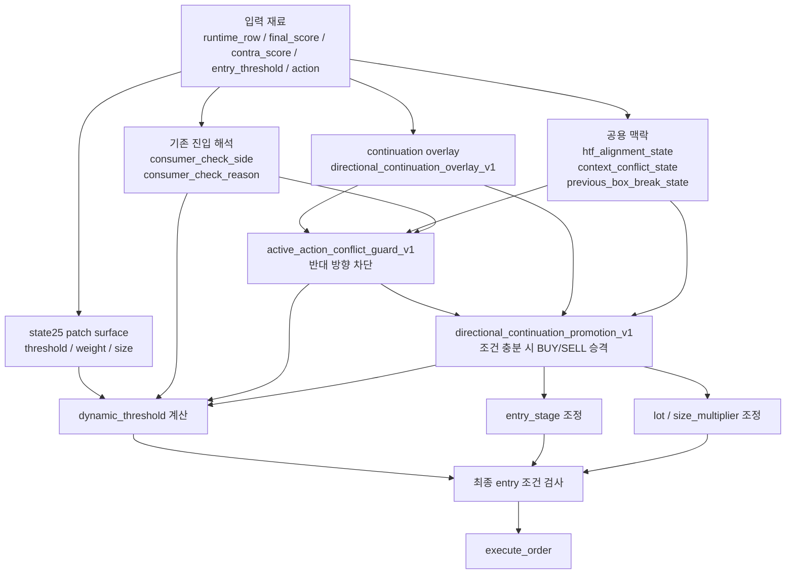

# 실행층 확대도: `entry_try_open_entry.py` 중심 흐름도

## 1. 이 문서의 목적

이 문서는 전체 시스템 중에서도

`backend/services/entry_try_open_entry.py`

만 따로 확대해서,

- 어떤 재료가 이 함수로 들어오고
- 어떤 순서로 가드/승격/threshold/lot 조정이 일어나며
- 실제 주문 직전 어디서 판단이 갈리는지

를 보기 위한 실행층 지도다.

---

## 2. 가장 중요한 한 줄

현재 시스템의 최종 승부처는 `entry_try_open_entry.py`다.

왜냐하면 여기서

- 기존 `consumer_check`
- state25 bridge
- continuation overlay
- execution guard
- continuation promotion
- dynamic threshold
- lot

이 전부 한 번에 만나기 때문이다.

즉 지금 시스템에서 “왜 BUY가 안 됐지?”, “왜 SELL이 들어갔지?”를 보려면
마지막엔 결국 이 파일을 봐야 한다.

---

## 3. 실행층 전체 흐름도

---

## 4. 실행층 핵심 함수/변수 지도

| 변수/함수명 | 한국어 의미 | 대략 위치 |
| --- | --- | --- |
| `_build_directional_continuation_promotion_v1(...)` | continuation이 충분히 강하면 BUY/SELL로 승격 | `entry_try_open_entry.py:461` |
| `_build_active_action_conflict_guard_v1(...)` | 현재 action이 continuation/맥락과 반대면 차단 | `entry_try_open_entry.py:2102` |
| `active_action_conflict_guard_v1` | 반대 방향 차단 결과 payload | 여러 위치에서 사용 |
| `directional_continuation_promotion_v1` | continuation 승격 결과 payload | 여러 위치에서 사용 |
| `dynamic_threshold` | 최종 진입 문턱 | `entry_try_open_entry.py:6000` 부근 |
| `ticket = self.runtime.execute_order(...)` | 실제 주문 실행 | `entry_try_open_entry.py:7224` |

---

## 5. 입력 재료가 어떻게 들어오는가

### 5-1. 기존 진입 재료

| 변수명 | 한국어 의미 |
| --- | --- |
| `action` | 기존 엔진이 내려준 현재 기본 행동 |
| `final_entry_score` | 최종 진입 점수 |
| `contra_score` | 반대 방향 점수 |
| `entry_threshold` | 기본 진입 문턱 |
| `consumer_check_side` | 기존 엔진의 side 해석 |
| `consumer_check_reason` | 기존 엔진의 side 이유 |

### 5-2. 새로 붙은 큰 그림 재료

| 변수명 | 한국어 의미 |
| --- | --- |
| `htf_alignment_state` | 상위 추세와 현재 판단이 정렬/역행인지 |
| `context_conflict_state` | 큰 그림과 현재 판단 충돌 상태 |
| `previous_box_break_state` | 직전 박스 유지/실패/재테스트 상태 |
| `directional_continuation_overlay_direction` | continuation 방향 |
| `directional_continuation_overlay_score` | continuation 강도 |
| `directional_continuation_overlay_event_kind_hint` | BUY_WATCH/SELL_WATCH 힌트 |

### 5-3. state25 재료

| 변수명 | 한국어 의미 |
| --- | --- |
| `state25_context_bridge_stage` | bridge 단계 |
| `state25_context_bridge_translator_state` | bridge 번역 상태 |
| `state25_context_bridge_weight_requested_count` | weight 후보 개수 |
| `state25_context_bridge_threshold_requested_points` | threshold harden 요청값 |

---

## 6. 실행층 단계별 순서

### 단계 1. baseline action을 읽는다

가장 먼저 기존 엔진의 action과 consumer check 해석이 들어온다.

예:

- `action = SELL`
- `consumer_check_side = SELL`
- `consumer_check_reason = upper_break_fail_confirm`

이 단계에서는 아직 continuation이 action을 이기지 못한다.

---

### 단계 2. `active_action_conflict_guard_v1`가 반대 방향인지 검사한다

핵심 함수:

- `_build_active_action_conflict_guard_v1(...)`

이 함수가 보는 재료:

- `directional_continuation_overlay_v1`
- `htf_alignment_state`
- `context_conflict_state`
- `context_conflict_score`
- 현재 baseline action

이 단계의 목적:

- “지금 이 SELL/BUY는 continuation과 정면으로 충돌하는가?”

예:

- continuation은 `UP`
- HTF는 `WITH_HTF`
- 현재 action은 `SELL`

이면 **wrong-side SELL**로 보고 guard를 켠다.

결과 payload 예시:

- `guard_applied`
- `baseline_action`
- `downgraded_observe_reason`
- `failure_label`
- `failure_code`

즉 이 단계는 **반대 방향 진입 차단기**다.

---

### 단계 3. `directional_continuation_promotion_v1`가 승격 가능한지 본다

핵심 함수:

- `_build_directional_continuation_promotion_v1(...)`

이 함수가 보는 재료:

- overlay 방향과 점수
- HTF 정렬
- context conflict
- multi-TF alignment 수
- breakout 관련 강도
- 방금 만들어진 `active_action_conflict_guard_v1`

이 단계의 목적:

- “막기만 할까?”
- “아니면 continuation 쪽으로 실제 승격할까?”

예:

- `SELL`을 막았고
- continuation `UP`이 충분히 강하고
- HTF도 받쳐주고
- context도 BUY 쪽에 힘을 싣는다면

`BUY`로 승격할 수 있다.

결과 payload 예시:

- `active`
- `promoted_action`
- `promotion_reason`
- `recommended_entry_stage`
- `size_multiplier`

즉 이 단계는 **반대 방향 차단 이후 continuation 방향으로 승격하는 장치**다.

---

### 단계 4. `dynamic_threshold`를 계산한다

핵심 구간:

- `entry_try_open_entry.py:6000` 부근부터

이 단계에서 합쳐지는 것:

- 기본 `entry_threshold`
- stage multiplier
- context adjustment
- state25 threshold patch
- semantic live guard
- 같은 방향 포지션 수

즉 단순 고정 threshold가 아니라,
현재 장면과 운영 상태를 반영한 **실제 진입 문턱**이 만들어진다.

이 단계가 중요한 이유:

- continuation promotion이 켜져도 threshold가 너무 높으면 못 들어간다
- 반대로 wrong-side guard가 있어도 threshold가 너무 느슨하면 다시 오염될 수 있다

---

### 단계 5. `entry_stage`와 `lot`를 조정한다

`directional_continuation_promotion_v1`이 켜지면

- 무조건 큰 진입이 아니라
- 더 보수적인 `entry_stage`
- 더 작은 `size_multiplier`

로 들어가게 설계돼 있다.

즉 현재 promotion은 공격적인 full reversal이 아니라
**bounded promotion**
철학을 따른다.

---

### 단계 6. 최종 조건을 통과하면 주문한다

최종적으로

- `final_entry_score`
- `dynamic_threshold`
- active conflict guard
- continuation promotion
- 기타 live guard

를 통과하면 마지막에

- `self.runtime.execute_order(symbol, action, lot)`

로 주문이 나간다.

즉 주문 직전 최종 판단은

**action 그 자체가 아니라 guard / promotion / threshold / size가 다 반영된 결과**

다.

---

## 7. 실행층에서 지금 이미 된 것

| 항목 | 현재 상태 | 의미 |
| --- | --- | --- |
| wrong-side SELL/BUY 차단 | 코드 완료 | continuation과 정면 충돌하면 가드 발동 |
| continuation 방향 BUY/SELL 승격 | 코드 완료 | 충분한 경우 bounded promotion 가능 |
| promotion 시 conservative size 적용 | 코드 완료 | 승격되어도 작은 크기로 시작 |
| runtime row에 promotion trace 기록 | 코드 완료 | `directional_continuation_promotion_*` 필드 기록 |

---

## 8. 실행층에서 아직 덜 닫힌 것

| 항목 | 현재 상태 | 남은 이유 |
| --- | --- | --- |
| live 장면 전반에서 guard가 계속 잘 먹는지 | 미완료 | 코드와 테스트는 있으나 실전 누적 검증 더 필요 |
| promotion이 과승격하지 않는지 | 미완료 | BUY/SELL 승격은 조심스럽게 누적 관찰 필요 |
| continuation 방향과 chart 표식이 항상 같은 톤으로 보이는지 | 부분 완료 | 내부 판단이 맞아도 표식 표현 차이로 오해 가능 |
| state25 bounded live와 execution이 완전히 합쳐졌는지 | 미완료 | active candidate는 아직 `log_only` |

---

## 9. 실행층에서 앞으로 해야 할 일

### 9-1. 짧은 버전

1. wrong-side guard 실전 사례 누적
2. promotion 성공/실패 사례 누적
3. state25 bounded live와 execution 승격 결합
4. 차트 표식과 execution 판단 체감 일치 마감

### 9-2. 우선순위로 쓰면

#### 1순위

- continuation promotion이 실제 라이브에서
  - wrong-side SELL을 줄이는지
  - BUY 승격이 과하지 않은지
  를 확인

#### 2순위

- state25 bounded live를 켠 뒤에도
  - `dynamic_threshold`
  - `promotion`
  - `lot`
  이 충돌하지 않게 조정

#### 3순위

- chart painter와 notifier가 execution 방향을 더 분명히 보여주게 UX 마감

---

## 10. 결론

`entry_try_open_entry.py`는 현재 시스템의 최종 실행 관문이다.

지금까지의 작업으로 이 파일은 더 이상 단순히 기존 action을 실행하는 곳이 아니라,

- 큰 그림 continuation을 읽고
- wrong-side를 막고
- 충분하면 continuation 쪽으로 승격하고
- threshold와 lot까지 다시 조정하는

**실질적인 실행 오케스트레이터**

가 되었다.

즉 앞으로 남은 작업은

이 실행 오케스트레이터가 실전에서
얼마나 안정적으로 continuation 판단을 따라가게 만들지

를 마감하는 쪽이다.
