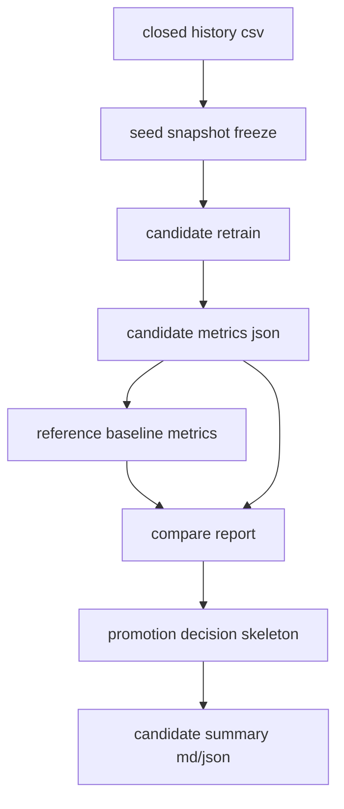

# State25 Retrain Compare Promote Design

## 목적

이 문서는 `AI3 retrain / compare / promote`를 실제로 어떻게 굴릴지 정리한다.

핵심 질문은 이렇다.

- 새 state25 seed가 쌓였을 때 후보 모델을 어떻게 다시 만들 것인가
- 새 후보가 현재 기준보다 나은지 무엇으로 비교할 것인가
- 아직 AI4 gate가 완성되기 전에는 어떤 수준까지 자동화할 것인가

## 지금 왜 AI3로 넘어갈 수 있나

현재 전제는 이미 갖춰졌다.

- `state25` seed/baseline이 이미 돌아간다
- `wait_quality` auxiliary 연결이 있다
- `economic_target_integration`도 seed/report/baseline에 붙었다

즉 이제는 `새 후보를 다시 만드는 루프`를 만들 수 있는 상태다.

## 이번 AI3의 범위

이번 구현은 아래까지다.

1. `candidate retrain`
2. `reference vs candidate compare`
3. `promote decision skeleton`
4. `candidate bundle / manifest / md summary`

중요한 점:

- 이번 단계는 `실제 live promote`가 아니다
- `AI4` 이전이므로 결과는 `promote_review_ready` 또는 `hold` 수준까지만 낸다

## 기본 흐름

## 입력

### 1. training source

- `data/trades/trade_closed_history.csv`

### 2. current reference baseline

- `models/teacher_pattern_state25_pilot/teacher_pattern_pilot_baseline_metrics.json`

### 3. current training contract

- `teacher_pattern_pilot_baseline.py`
- group / pattern / wait_quality / economic_total task

## 출력

후보 1회 실행 결과는 아래 형태로 남긴다.

- `models/teacher_pattern_state25_candidates/<candidate_id>/teacher_pattern_pilot_baseline.joblib`
- `models/teacher_pattern_state25_candidates/<candidate_id>/teacher_pattern_pilot_baseline_metrics.json`
- `models/teacher_pattern_state25_candidates/<candidate_id>/teacher_pattern_candidate_compare_report.json`
- `models/teacher_pattern_state25_candidates/<candidate_id>/teacher_pattern_candidate_promotion_decision.json`
- `models/teacher_pattern_state25_candidates/<candidate_id>/teacher_pattern_candidate_summary.md`
- `models/teacher_pattern_state25_candidates/<candidate_id>/teacher_pattern_candidate_run_manifest.json`
- `models/teacher_pattern_state25_candidates/latest_candidate_run.json`

## compare에서 보는 핵심 task

### primary task

- `group_task`
- `pattern_task`
- `economic_total_task`

이 3개는 promote 판단의 주축이다.

### secondary task

- `wait_quality_task`

이건 아직 표본이 적어서 보조 경고 축으로만 본다.

## compare에서 보는 핵심 metric

기본은 test split 기준이다.

- `macro_f1`
- `balanced_accuracy`
- `accuracy`
- `weighted_f1`

그중 실제 1차 promote 판단의 메인은 `macro_f1`이다.

## promotion skeleton 규칙

이번 단계는 실제 배포가 아니라 `review-ready 여부`까지만 본다.

### hold_regression

아래가 있으면 보류다.

- candidate baseline 자체가 ready 아님
- `group_task`가 reference 대비 크게 악화
- `pattern_task`가 reference 대비 크게 악화
- `economic_total_task`가 reference 대비 크게 악화

### promote_review_ready

아래가 있으면 review-ready다.

- primary task 중 하나 이상이 유의미하게 개선
- 또는 이전엔 없던 task가 새로 ready
- 그리고 큰 regression blocker는 없음

### hold_no_material_gain

- regression은 없는데
- 유의미한 개선도 없음

### shadow_only_first_candidate

- reference baseline이 없어서 비교 자체가 안 되는 첫 실행

## 왜 아직 실제 promote를 안 하나

이건 `AI4`의 영역이다.

AI3 단계에서는 아직 없다.

- shadow/log-only rollout gate
- canary gate
- rollback
- live utility drift guard

따라서 AI3는 후보 생성과 정량 비교까지만 한다.

## 이번 단계에서 중요한 안전 원칙

1. candidate는 항상 별도 디렉터리에 저장
2. current baseline을 덮어쓰지 않음
3. decision은 `review-ready`까지만
4. live runtime은 이 후보를 아직 자동 사용하지 않음

## 다음 단계 연결

AI3가 끝나면 AI4는 자연스럽게 이렇게 이어진다.

1. candidate compare 결과 읽기
2. promote gate 적용
3. shadow / canary
4. degrade 시 rollback

## 한 줄 요약

AI3는 `새 후보를 자동으로 만들고, 현재 기준과 비교하고, 올려볼 가치가 있는지 판단 자료를 남기는 단계`다.
