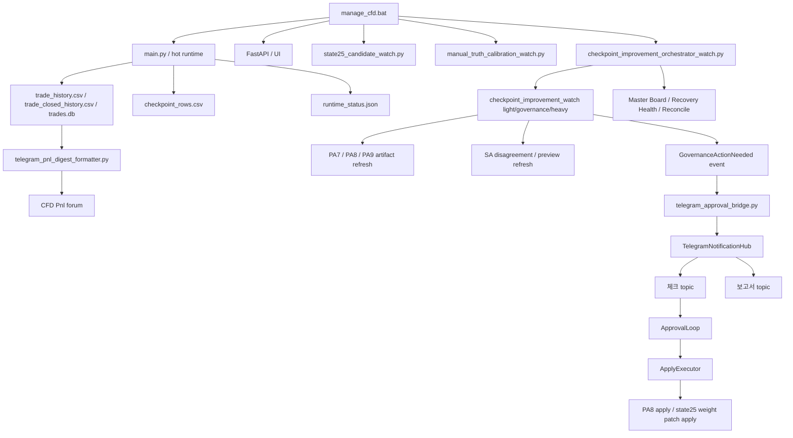

# Current System Reconfirmation And Reinforcement Framework

## 목적

이 문서는 2026-04-12 기준 CFD 프로젝트의 실제 코드와 운영 artifact를 다시 맞춰 보고,

- 지금 시스템이 전체적으로 어떻게 구성되어 있는지
- 어떤 흐름으로 자동 진입 / 자동 대기 / 자동 청산 / 자동 개선 / 텔레그램 승인 루프가 이어지는지
- 이미 구축된 것과 앞으로 보강해야 할 것을 어떤 틀로 읽어야 하는지

를 한 장에서 다시 잡기 위한 `통합 재확인 문서`다.

핵심 목적은 하나다.

`문서가 많아서 길을 잃지 않도록, 현재 코드 기준의 전체 지도와 세부 틀을 다시 하나로 묶는다.`

`한 장짜리 올인원 문서`가 필요할 때는 아래 문서를 먼저 본다.

- [current_all_in_one_system_master_playbook_ko.md](/Users/bhs33/Desktop/project/cfd/docs/current_all_in_one_system_master_playbook_ko.md)
- [current_buildable_vs_conditioned_reinforcement_roadmap_ko.md](/Users/bhs33/Desktop/project/cfd/docs/current_buildable_vs_conditioned_reinforcement_roadmap_ko.md)

---

## 한 줄 결론

현재 시스템은 이미 아래 5축이 거의 연결된 상태다.

1. `자동 진입 / 자동 대기 / 자동 청산` 실시간 런타임
2. `checkpoint -> review -> canary -> closeout` 자동 개선 루프
3. `Telegram check/report/control plane` 승인 인터페이스
4. `state25 / teacher / weight patch` 학습 결과 반영 통로
5. `PnL / 상태판 / orchestrator board` 운영 관찰 통로

즉 지금은 `새 기능을 아무 방향으로 더 붙이는 단계`가 아니라,

`어느 층을 보강해야 전체 자동매매 품질이 올라가는지 순서를 다시 정리하는 단계`

로 보는 것이 맞다.

---

## 현재 전체 구조

---

## 레이어별 틀

### L0. 런처 / 운영 진입점

- `manage_cfd.bat`
- 역할
  - 메인 런타임, API, UI, state25 candidate watch, manual truth calibration watch, checkpoint improvement orchestrator watch를 묶어 실행
  - guarded restart / status / verify / smoke / precheck 진입점 제공

이 레이어의 질문:

- 시스템이 지금 무엇을 띄우고 있는가
- 안전 재시작이 가능한가
- orchestrator watch가 실제로 살아 있는가

### L1. 실시간 매매 런타임

- `main.py`
- `backend/app/trading_application.py`
- `backend/app/trading_application_runner.py`
- `backend/app/trading_application_reverse.py`
- `backend/services/entry_try_open_entry.py`
- `backend/services/exit_service.py`

역할:

- 실시간 수집
- 자동 진입
- 자동 대기
- 자동 청산
- 반전 후보 감지
- shock / plus-to-minus / opposite-score-spike 관찰

현재 운영 원칙:

- 실시간 매매 자체는 자동
- 텔레그램은 실시간 진입/청산 승인용이 아님
- 반전은 완전 자유 반전이 아니라 `pending reverse + flat wait + retry` 형태의 보수적 반전

### L2. 거래 기록 / 집계 레이어

- `backend/trading/trade_logger.py`
- `backend/trading/trade_logger_close_ops.py`
- `backend/services/trade_sqlite_store.py`
- `backend/services/trade_csv_schema.py`
- `data/trades/trade_history.csv`
- `data/trades/trade_closed_history.csv`
- `data/trades/trades.db`

역할:

- 열린 거래 기록
- 닫힌 거래 기록
- gross / net / cost / lot / reason / shock / wait / teacher metadata 저장
- PnL digest와 learning/replay의 원천 데이터 제공

현재 보강 상태:

- 최근 PnL 보고에서 `순손익 / 승패 / 총 랏`이 다시 살아나도록 formatter fallback 보강 완료
- 앞으로 닫히는 거래는 `gross_pnl / cost_total / net_pnl_after_cost` 저장 보강 완료
- 과거 historical row는 비용 컬럼이 0인 행이 남아 있을 수 있으므로, 과거 구간의 `총 비용`은 제한적으로만 신뢰 가능

### L3. checkpoint 자동 개선 레이어

- `backend/services/checkpoint_improvement_watch.py`
- `backend/services/checkpoint_improvement_orchestrator.py`
- `backend/services/checkpoint_improvement_master_board.py`
- `backend/services/checkpoint_improvement_reconcile.py`
- `backend/services/checkpoint_improvement_recovery_health.py`

역할:

- `light_cycle`
  - fast refresh
  - action eval
  - live runner watch
  - canary refresh board
- `governance_cycle`
  - activation / rollback / closeout review candidate 생성
- `heavy_cycle`
  - PA7 / PA78 / scene disagreement / scene preview
- `reconcile_cycle`
  - stale actionable / same-scope conflict / late callback invalidation 정리
- orchestrator tick
  - board -> reconcile -> health를 한 tick으로 묶음

현재 운영 상태:

- orchestrator는 실제로 `RUNNING`
- current blocker는 `pa8_live_window_pending`
- approval backlog / apply backlog는 현재 0

### L4. Telegram control plane 레이어

- `backend/services/checkpoint_improvement_telegram_runtime.py`
- `backend/services/telegram_state_store.py`
- `backend/services/event_bus.py`
- `backend/services/approval_loop.py`
- `backend/services/apply_executor.py`
- `backend/services/telegram_approval_bridge.py`
- `backend/services/telegram_notification_hub.py`
- `backend/services/telegram_update_poller.py`

역할:

- approval queue 저장
- check/report 메시지 렌더
- 승인 / 보류 / 거부 처리
- 승인된 bounded change만 실제 apply

현재 운영 경계:

- `실시간 entry / wait / exit`는 승인 대상 아님
- 승인 대상은
  - PA8 activation / rollback / closeout
  - PA9 handoff
  - state25 weight patch proposal
- check/report는 현재 `CFD 체크방` 안의 topic으로 분리됨

### L5. 학습 / 제안 생성 레이어

- `backend/services/teacher_pattern_active_candidate_runtime.py`
- `backend/services/teacher_pattern_labeler.py`
- `backend/services/forecast_state25_runtime_bridge.py`
- `backend/services/state25_weight_patch_review.py`
- `backend/services/state25_weight_patch_apply_handlers.py`

역할:

- state25 active candidate runtime surface 유지
- teacher pattern labeling
- runtime snapshot -> learning bridge
- `weight patch proposal` 생성
- 승인 시 `log-only bounded patch` 반영

현재 중요한 상태:

- `proposal payload -> 한국어 번역 -> Telegram 보고서/체크 -> 승인 -> apply` 통로는 이미 준비됨
- 아직 부족한 건
  - 어떤 watcher가 자동으로 `proposal event`를 생성할지
  - 예: `상단/하단 힘 해석 왜곡`, `윗꼬리 과대반영`, `캔들 몸통 비중 과대` 같은 실제 학습 감지기

### L6. 보고 / 관찰 레이어

- `backend/services/telegram_pnl_digest_formatter.py`
- `backend/services/telegram_ops_service.py`
- `data/analysis/shadow_auto/checkpoint_improvement_master_board_latest.json`
- `data/analysis/shadow_auto/checkpoint_improvement_recovery_health_latest.json`
- `data/analysis/shadow_auto/checkpoint_improvement_pa9_action_baseline_handoff_packet_latest.json`

역할:

- `15분 / 1시간 / 4시간 / 1일 / 1주 / 1달` 손익 보고
- 실시간 진입 / 대기 / 청산 / 반전 DM
- 개선안 check/report topic 운영
- 운영 상태판 제공

---

## 현재 진행률 추정

아래 퍼센트는 `문서 존재 여부`가 아니라 `코드 + artifact + 실제 운영 wiring` 기준의 체감치다.

| 트랙 | 진행도 | 현재 상태 |
|---|---:|---|
| 실시간 자동매매 런타임 | 84% | 자동 진입/대기/청산은 동작, 반전/충격 표현과 timing refinement가 추가 필요 |
| 거래 기록 / 집계 | 78% | 닫힌 거래 기록과 PnL 집계는 동작, 과거 비용 컬럼 품질은 제한적 |
| checkpoint orchestrator | 97% | watch / governance / heavy / reconcile / health / runner 거의 완료 |
| Telegram control plane | 92% | check/report/poll/apply 루프 연결 완료 |
| PA8 action-only canary | 94% | activation/rollback/closeout 통로 완료, live window 대기 |
| PA9 handoff | 60% | scaffold / review / apply packet 준비 완료, 실제 handoff는 closeout 이후 |
| SA preview/log-only | 60% | disagreement / preview는 있음, live adoption은 아직 아님 |
| state25 weight-patch proposal infra | 82% | 한국어 제안/승인/apply 통로 완료, 자동 proposal detector는 미완성 |
| PnL / 보고 체계 | 80% | 창별 합계 복구 완료, 오래된 cost 역사 데이터는 한계 있음 |

---

## 지금 실제 운영에서 막혀 있는 것

현재 artifact 기준 핵심 blocker는 아래다.

1. `PA8 live window`
   - closeout-ready symbol이 아직 충분히 쌓이지 않음
   - 그래서 `PA9 handoff`는 scaffold 상태에서 대기

2. `state25 / teacher / candle weight proposal`
   - proposal을 보낼 통로는 완성
   - 하지만 `어떤 학습 watcher가 proposal을 자동 생성할지`는 아직 비어 있음

3. `실시간 실행 의미 해석`
   - 사용자는 `왜 여기서 하단/상단/반전으로 읽었는지`가 바로 드러나는 설명을 원함
   - 현재는 알림 템플릿은 좋아졌지만, 학습 제안 감지기가 그 수준까지 아직 자동화되지 않음

4. `과거 비용 데이터`
   - 최근부터는 저장 보강 완료
   - 하지만 기존 closed history의 cost가 0인 행은 재구성 한계가 있음

---

## 보강 우선순위

### R1. 실시간 판단 설명력 보강

목표:

- 왜 `하단 우세`, `상단 우세`, `반전 준비`, `대기`로 읽었는지 사람이 즉시 이해하게 만들기

보강 후보:

- 실시간 DM에 `결정 주도축` 1줄 추가
  - 예: `상단 힘 우세 / 반전 신호 강화 / 기존 숏 유지 보수`
- 반전 알림에 `shock / plus-to-minus / opposite spike`를 구조적으로 표기
- `wait` 알림에 barrier / belief / forecast를 너무 길지 않게 표준화

### R2. 학습 기반 제안 생성기 구축

목표:

- `학습 -> 제안 -> 승인 -> bounded 반영`이 실제로 자동으로 돈다

보강 후보:

- `상단/하단 왜곡 감지 -> STATE25_WEIGHT_PATCH_REVIEW`
- `윗꼬리 과대 / 아랫꼬리 과대 / 몸통 과대 / doji 과대`
- `range 하단인데 실제 상방 추진력이 더 강했던 케이스`
- `조기 숏 진입 역행 과다 -> SELL WAIT 제안`

핵심:

- raw 변수명을 보내지 말고 한국어 label로 보고서 생성
- 같은 scope는 check 인박스 항목 갱신
- 보고서 원문은 1회 발송

### R3. PA8 -> PA9 운영 closeout

목표:

- 최소 1개 symbol에서 `PA8 closeout` 실제 완료
- 그 결과로 `PA9 handoff` 실제 승격

보강 후보:

- live window 충족 시 closeout trigger 신뢰도 재확인
- closeout 보고서 문구 더 운영형으로 다듬기
- handoff ready 이후 check/report UX 정리

### R4. PnL / 운영 보고 정밀화

목표:

- 사용자가 보고서만 보고도 `얼마 벌었는지 / 몇 번 진입했는지 / 랏이 얼마인지 / 어떤 이유가 많았는지`를 바로 읽게 만들기

보강 후보:

- 현재 formatter는 합계 복구 완료
- 다음 단계는
  - historical cost 보정 전략
  - reason alias 정리
  - window별 anomaly note
  - runtime DM와 PnL report 사이 용어 통일

### R5. SA는 계속 preview-only 유지

목표:

- SA를 억지로 앞으로 당기지 않는다

현재 판단:

- disagreement / preview는 계속 관찰
- live adoption은 아직 아님

---

## 문제가 생겼을 때 어디를 먼저 볼 것인가

### 1. 실시간 진입/대기/청산이 이상하다

먼저 볼 파일:

- `backend/app/trading_application.py`
- `backend/app/trading_application_runner.py`
- `backend/services/entry_try_open_entry.py`
- `backend/services/exit_service.py`
- `backend/app/trading_application_reverse.py`

같이 볼 artifact:

- `data/runtime_status.json`
- `data/trades/entry_decisions.csv`
- `data/trades/trade_closed_history.csv`

### 2. 개선안이 안 올라온다

먼저 볼 파일:

- `backend/services/checkpoint_improvement_watch.py`
- `backend/services/checkpoint_improvement_orchestrator.py`
- `backend/services/telegram_approval_bridge.py`
- `backend/services/telegram_notification_hub.py`

같이 볼 artifact:

- `data/analysis/shadow_auto/checkpoint_improvement_master_board_latest.json`
- `data/analysis/shadow_auto/checkpoint_improvement_orchestrator_watch_latest.json`
- `data/analysis/shadow_auto/checkpoint_improvement_reconcile_latest.json`

### 3. 학습 결과를 텔레그램 제안으로 못 올린다

먼저 볼 파일:

- `backend/services/state25_weight_patch_review.py`
- `backend/services/teacher_pattern_active_candidate_runtime.py`
- `backend/services/teacher_pattern_labeler.py`
- `backend/services/state25_weight_patch_apply_handlers.py`

핵심 체크:

- proposal candidate를 누가 생성하는가
- report/check envelope가 한국어로 렌더되는가
- 승인 시 실제 `active_candidate_state.json`에 patch가 반영되는가

### 4. PnL 보고 숫자가 이상하다

먼저 볼 파일:

- `backend/services/telegram_pnl_digest_formatter.py`
- `backend/services/telegram_ops_service.py`
- `backend/trading/trade_logger_close_ops.py`
- `backend/services/trade_csv_schema.py`

같이 볼 데이터:

- `data/trades/trade_closed_history.csv`
- `data/trades/trades.db`

---

## 지금 가장 추천하는 다음 구축 순서

1. `실시간 판단 설명력` 보강
   - entry / wait / exit / reverse 설명축 표준화
2. `학습 기반 proposal detector` 구축
   - 상단/하단 해석 왜곡
   - 캔들/윗꼬리/아랫꼬리 비중 과대
   - 조기 진입 역행 과다
3. `PA8 closeout 실제 1건` 확보
4. `PA9 handoff` 실제 승격
5. `historical PnL cost integrity`는 별도 정리 과제로 분리

이 순서가 좋은 이유:

- 사용자가 실제로 체감하는 품질은 `왜 이런 판단을 했는가`에서 가장 크게 올라가고,
- 그 다음이 `학습 결과가 제안으로 올라오는가`,
- 그 다음이 `closeout -> handoff` 운영 완성도이기 때문이다.

---

## 이 문서를 읽은 뒤 이어서 보면 좋은 문서

- `current_checkpoint_improvement_watch_remaining_roadmap_ko.md`
- `current_checkpoint_improvement_watch_orchestration_detailed_design_ko.md`
- `current_telegram_control_plane_and_improvement_loop_ko.md`
- `current_telegram_dual_room_inbox_pattern_ko.md`
- `current_telegram_alert_message_refresh_ko.md`
- `current_pa8_closeout_autotrigger_pa9_handoff_restart_guard_ko.md`

---

## 최종 정리

지금 시스템은 이미 `자동매매 엔진`, `개선 오케스트레이터`, `텔레그램 control plane`, `학습 제안 통로`, `PnL 보고 체계`가 대부분 붙어 있다.

그래서 이제 정말 중요한 질문은

`무엇을 더 만들까`

보다

`어느 층의 설명력과 제안 생성기를 먼저 보강해야 실제 체감 성능이 오를까`

다.

현재 기준으로는 아래 순서가 가장 맞다.

1. 실시간 판단 설명력
2. 학습 기반 weight/action proposal detector
3. PA8 closeout 1건 확보
4. PA9 handoff 실제 승격
5. SA는 계속 preview-only 유지
