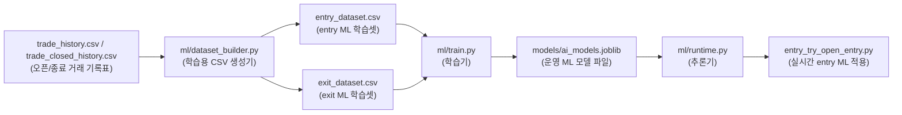
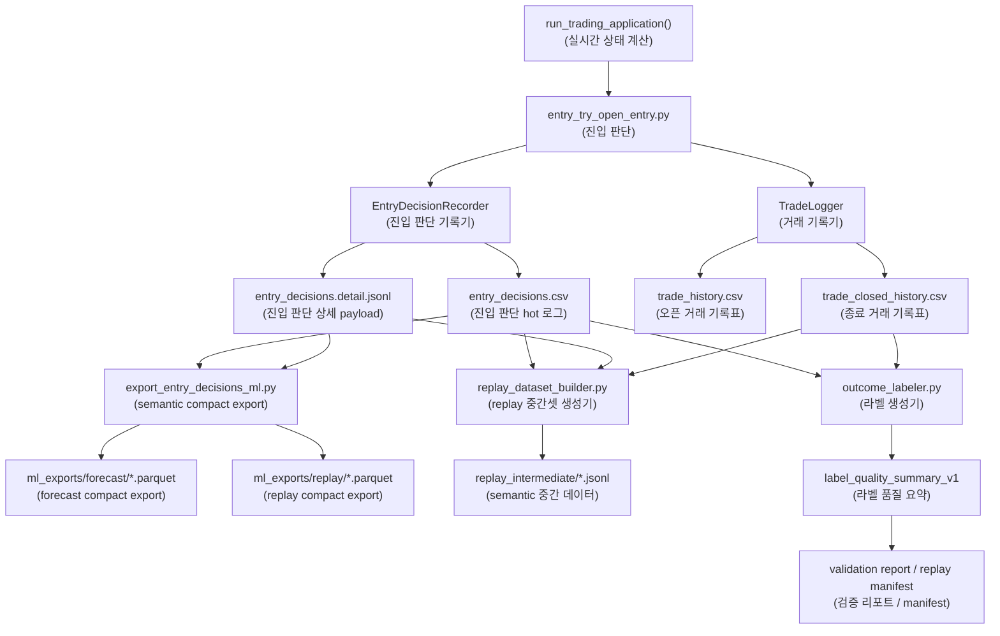

# ML 적용 지점과 CSV 구축 맵

## 1. 한눈에 보기

이 프로젝트는 지금 기준으로 ML이 한 군데만 붙어 있는 구조가 아니다.
실제로는 아래 3개 층이 같이 존재한다.

1. 현재 운영 중인 live tabular ML
2. shadow predictor와 semantic decision layer
3. 차세대 semantic or forecast ML을 위한 offline dataset 준비 경로

핵심은 아래처럼 보는 것이다.

- `trade_history.csv`, `trade_closed_history.csv`
  - 현재 운영 ML의 직접 학습 원천
- `entry_decisions.csv`
  - live semantic 의사결정 원천 로그
  - compact export, replay, outcome labeling의 출발점
- `runtime_status.json`
  - 최신 상태를 보는 slim view
  - 학습 데이터 본체는 아님

---

## 1-1. 자주 나오는 파일 이름 번역표

아래처럼 읽으면 파일 이름이 훨씬 덜 낯설다.

| 파일 이름 | 한국어로 보면 |
| --- | --- |
| `entry_decisions.csv` | 진입 판단 원천 로그 |
| `entry_decisions.detail.jsonl` | 진입 판단 상세 payload 보관 파일 |
| `trade_history.csv` | 오픈 거래 기록표 |
| `trade_closed_history.csv` | 종료 거래 기록표 |
| `trades.db` | 거래 조회용 SQLite 미러 DB |
| `runtime_status.json` | 최신 상태 slim 요약 파일 |
| `runtime_status.detail.json` | 최신 상태 full 상세 파일 |
| `entry_dataset.csv` | 현재 entry ML 학습용 CSV |
| `exit_dataset.csv` | 현재 exit ML 학습용 CSV |
| `ai_models.joblib` | 현재 운영 ML 모델 묶음 파일 |
| `ml_exports/forecast/*.parquet` | semantic forecast compact export |
| `ml_exports/replay/*.parquet` | semantic replay compact export |
| `replay_intermediate/*.jsonl` | 차세대 semantic ML 중간 데이터 |
| `outcome_label_validation_report_*.json` | 라벨 품질 검증 리포트 |

## 1-2. 자주 나오는 변수 이름 번역표

핵심 변수는 아래처럼 보면 된다.

| 변수 이름 | 한국어로 보면 |
| --- | --- |
| `decision_row_key` | 진입 판단 row 고유키 |
| `runtime_snapshot_key` | 런타임 스냅샷 고유키 |
| `trade_link_key` | 거래 row 연결키 |
| `replay_row_key` | replay용 row 연결키 |
| `signal_age_sec` | 신호가 만들어지고 지난 시간(초) |
| `bar_age_sec` | 기준 봉이 지난 시간(초) |
| `decision_latency_ms` | 판단 계산 지연 시간(밀리초) |
| `order_submit_latency_ms` | 주문 전송 지연 시간(밀리초) |
| `missing_feature_count` | 빠진 feature 개수 |
| `data_completeness_ratio` | 데이터 완성도 비율 |
| `used_fallback_count` | fallback 사용 횟수 |
| `compatibility_mode` | 호환 모드 여부 |
| `detail_blob_bytes` | detail payload 크기(bytes) |
| `snapshot_payload_bytes` | snapshot payload 크기(bytes) |
| `row_payload_bytes` | hot row payload 크기(bytes) |

## 1-3. Semantic 계약 기준선

Phase 1부터는 semantic ML이 먹는 입력 and 절대 안 먹는 입력을 계약으로 먼저 고정한다.
기준 파일은 아래 2개다.

| 파일 | 역할 |
| --- | --- |
| `ml/semantic_v1/feature_packs.py` | semantic feature pack 묶음 정의 |
| `ml/semantic_v1/contracts.py` | target family, rule owner, model owner 기준 정의 |

### semantic input pack (의미 입력 묶음)

| pack | 설명 | 예시 컬럼 |
| --- | --- | --- |
| `position pack (위치 묶음)` | 가격의 상대 위치 and 위치 해석 and 위치 에너지 | `position_x_box`, `position_alignment_label`, `position_conflict_score` |
| `response pack (반응 묶음)` | 하단 and 중단 and 상단에서의 반응 | `response_lower_hold_up`, `response_mid_reclaim_up`, `response_upper_reject_down` |
| `state pack (상태 묶음)` | 정렬 gain, 반전 gain, noise and penalty 상태 | `state_alignment_gain`, `state_range_reversal_gain`, `state_noise_damp` |
| `evidence pack (증거 묶음)` | 매수 and 매도 증거 강도 | `evidence_buy_total`, `evidence_buy_reversal`, `evidence_sell_total` |
| `forecast summary pack (예측 요약 묶음)` | forecast에서 직접 학습 가능한 요약 컨텍스트 | `forecast_position_primary_label`, `forecast_middle_neutrality`, `forecast_management_horizon_bars` |
| `trace and quality pack (추적 and 품질 묶음)` | provenance, freshness, latency, completeness, payload health | `decision_row_key`, `signal_age_sec`, `data_completeness_ratio`, `row_payload_bytes` |

### model target family (모델 목표 계열)

| target family | 한국어로 보면 |
| --- | --- |
| `timing_now_vs_wait` | 지금 진입할지 잠시 더 기다릴지 |
| `entry_quality` | 현재 semantic setup의 진입 품질 |
| `exit_management` | 보유 and 청산 and giveback 관리 품질 |

### rule owner vs model owner

| 구분 | 항목 | 뜻 |
| --- | --- | --- |
| `rule owner (규칙 엔진 소유)` | `side` | 매수 or 매도 방향은 계속 규칙 엔진이 결정 |
| `rule owner (규칙 엔진 소유)` | `entry_setup_id` | setup identity는 semantic 엔진이 고정 |
| `rule owner (규칙 엔진 소유)` | `management_profile_id` | 관리 프로필 선택은 모델이 직접 바꾸지 않음 |
| `rule owner (규칙 엔진 소유)` | `invalidation_id` | 무효화 기준은 규칙 엔진이 유지 |
| `rule owner (규칙 엔진 소유)` | `hard guard`, `kill-switch` | 안전장치는 모델 바깥에서 유지 |
| `model owner (모델 소유)` | `timing_now_vs_wait` | 진입 시점 보정 |
| `model owner (모델 소유)` | `entry_quality` | 진입 품질 보정 |
| `model owner (모델 소유)` | `exit_management` | 청산 and hold 품질 보정 |
| `model owner (모델 소유)` | `meta calibration` | 심볼 and regime and session 보정 |

---

## 2. ML 적용 지점 표

| 구간 | 성격 | 실제 적용 여부 | 입력 | 출력 | 핵심 파일 |
| --- | --- | --- | --- | --- | --- |
| 현재 운영 entry ML | tabular classification | live 반영 중 | `trade_history.csv (오픈 거래 기록표)`, `trade_closed_history.csv (종료 거래 기록표)`에서 만든 `entry_dataset.csv (entry ML 학습셋)` | `ai_models.joblib (운영 ML 모델 파일)`의 `entry_model` | `ml/dataset_builder.py`, `ml/train.py`, `ml/runtime.py`, `backend/services/entry_try_open_entry.py` |
| 현재 운영 exit ML | tabular classification | live 반영 준비 or 일부 런타임 참조 구조 | `trade_history.csv (오픈 거래 기록표)`, `trade_closed_history.csv (종료 거래 기록표)`에서 만든 `exit_dataset.csv (exit ML 학습셋)` | `ai_models.joblib (운영 ML 모델 파일)`의 `exit_model` | `ml/dataset_builder.py`, `ml/train.py`, `ml/runtime.py` |
| shadow entry predictor | heuristic predictor | live decision 보조 | semantic context, setup, wait state, raw/core score | `p_win`, 기대치, decision hint | `backend/services/predictors/entry_predictor.py` |
| shadow wait predictor | heuristic predictor | live decision 보조 | entry/exit context, wait state | `expected_improvement`, `expected_miss_cost` | `backend/services/predictors/wait_predictor.py` |
| shadow exit predictor | heuristic predictor | live decision 보조 | exit context, wait state, score gap, adverse risk | `p_giveback`, `p_reverse_valid` | `backend/services/predictors/exit_predictor.py` |
| semantic compact export | ML-friendly export | offline 준비 완료 | `entry_decisions.csv (진입 판단 원천 로그)` hot/detail | `ml_exports/forecast/*.parquet`, `ml_exports/replay/*.parquet` | `scripts/export_entry_decisions_ml.py` |
| replay dataset builder | 차세대 semantic ML 준비 | offline 준비 완료 | `entry_decisions.csv (진입 판단 원천 로그)`, detail sidecar, `trade_closed_history.csv (종료 거래 기록표)`, future bars | `replay_intermediate/*.jsonl (semantic 중간 데이터)` | `backend/trading/engine/offline/replay_dataset_builder.py`, `scripts/build_replay_dataset.py` |
| outcome labeler | label quality and validation | offline 준비 완료 | decision row, future bars, closed trade rows | `label_quality_summary_v1`, validation reports | `backend/trading/engine/offline/outcome_labeler.py`, `backend/trading/engine/offline/outcome_label_validation_report.py` |
| semantic v1 dataset builder | compact training dataset builder | offline 준비 완료 | `ml_exports/replay/*.parquet (semantic compact export)`, `replay_intermediate/*.jsonl (semantic 중간 데이터)` | `timing_dataset.parquet`, `entry_quality_dataset.parquet`, `exit_management_dataset.parquet` | `ml/semantic_v1/dataset_builder.py`, `ml/semantic_v1/dataset_splits.py` |

---

## 3. 현재 운영 ML 요약

| 항목 | 현재 상태 |
| --- | --- |
| 모델 파일 | `models/ai_models.joblib` |
| 로딩 위치 | `backend/app/trading_application.py` |
| entry 추론 위치 | `backend/services/entry_try_open_entry.py`의 `ai_runtime.predict_entry(...)` |
| 학습 파이프라인 | `ml/dataset_builder.py -> ml/train.py -> ml/retrain_and_deploy.py` |
| 모델 타입 | `scikit-learn Pipeline + LogisticRegression` |
| feature pack 버전 | `live_ml_step4_v1` |
| 현재 feature 수 | entry `41`, exit `41` |
| feature 정의 위치 | `ml/feature_schema.py` |

### entry feature pack 예시

- 기본 score and regime
  - `entry_score`
  - `contra_score_at_entry`
  - `regime_name`
  - `regime_volume_ratio`
  - `regime_volatility_ratio`
- indicator
  - `ind_rsi`
  - `ind_adx`
  - `ind_disparity`
  - `ind_bb_20_up`
  - `ind_bb_20_dn`
- Step 4 승격 필드
  - `entry_stage`
  - `entry_setup_id`
  - `management_profile_id`
  - `invalidation_id`
  - `regime_at_entry`
  - `entry_h1_context_score`
  - `entry_m1_trigger_score`
  - `entry_topdown_align_count`
  - `entry_session_name`
  - `entry_atr_ratio`

### exit feature pack 예시

- 기본 exit EV and cost
  - `exit_score`
  - `roundtrip_cost`
  - `spread_cost_mult`
  - `ev_exit`
  - `ev_hold`
  - `ev_delta`
- Step 4 승격 필드
  - `entry_quality`
  - `entry_model_confidence`
  - `decision_winner`
  - `exit_policy_stage`
  - `exit_confidence`
  - `peak_profit_at_exit`
  - `giveback_usd`
  - `shock_score`

---

## 4. CSV와 데이터 산출물 표

| 파일 or 산출물 | 누가 만드나 | 무엇으로 만드나 | 용도 | 주 소비자 | 계층 |
| --- | --- | --- | --- | --- | --- |
| `data/trades/entry_decisions.csv (진입 판단 원천 로그)` | `EntryDecisionRecorder` | live decision row | semantic 의사결정 hot 로그 | compact export, replay builder, labeler, forensic 분석 | hot |
| `data/trades/entry_decisions.detail.jsonl (진입 판단 상세 payload)` | `EntryDecisionRecorder` | raw semantic/detail payload | hot row에 안 담는 detail 보관 | replay builder, offline 분석 | warm |
| `data/runtime_status.json (최신 상태 slim 파일)` | `TradingApplication._write_runtime_status` | `latest_signal_by_symbol` slim payload | 최신 상태 조회 | UI, 운영 체크 | hot |
| `data/runtime_status.detail.json (최신 상태 detail 파일)` | `TradingApplication._write_runtime_status` | full payload | 상세 상태 보관 | 운영 디버깅 | warm |
| `data/trades/trade_history.csv (오픈 거래 기록표)` | `TradeLogger.log_entry` and updates | 실제 체결/오픈 포지션 row | 현재 운영 ML 원천, 거래 조회 | dataset builder, runtime 조회, SQLite mirror | hot |
| `data/trades/trade_closed_history.csv (종료 거래 기록표)` | `TradeLogger` | 종료된 거래 row | 현재 운영 ML 원천, replay join | dataset builder, replay builder, validation | hot |
| `data/trades/trades.db (거래 조회용 DB)` | SQLite mirror | trade CSV mirror | 빠른 조회 | runtime and service queries | hot |
| `data/datasets/entry_dataset.csv (현재 entry ML 학습셋)` | `ml/dataset_builder.py` | trade history 계열 | 현재 entry ML 학습셋 | `ml/train.py` | ml |
| `data/datasets/exit_dataset.csv (현재 exit ML 학습셋)` | `ml/dataset_builder.py` | trade history 계열 | 현재 exit ML 학습셋 | `ml/train.py` | ml |
| `data/datasets/ml_exports/forecast/*.parquet (semantic forecast export)` | `export_entry_decisions_ml.py` | `entry_decisions.csv (진입 판단 원천 로그)` | semantic compact export | offline forecast ML, analysis | ml |
| `data/datasets/ml_exports/replay/*.parquet (semantic replay export)` | `export_entry_decisions_ml.py` | `entry_decisions.csv (진입 판단 원천 로그)` | replay-friendly compact export | offline training and analysis | ml |
| `data/datasets/replay_intermediate/*.jsonl (semantic 중간 데이터)` | `replay_dataset_builder.py` | decision row + detail + closed trades + labels | 차세대 semantic ML 중간셋 | future training/validation | warm |
| `data/datasets/semantic_v1/timing_dataset.parquet (semantic timing 학습셋)` | `ml/semantic_v1/dataset_builder.py` | replay compact export + replay label summary | timing model 학습셋 | future semantic timing model | ml |
| `data/datasets/semantic_v1/entry_quality_dataset.parquet (semantic entry 품질 학습셋)` | `ml/semantic_v1/dataset_builder.py` | replay compact export + replay label summary | entry quality model 학습셋 | future semantic entry model | ml |
| `data/datasets/semantic_v1/exit_management_dataset.parquet (semantic exit 관리 학습셋)` | `ml/semantic_v1/dataset_builder.py` | replay compact export + replay label summary | exit management model 학습셋 | future semantic exit model | ml |
| `data/analysis/outcome_label_validation_report_*.json (라벨 검증 리포트)` | validation report | replay and label summaries | label 품질 검증 | 개발자/운영자 | warm |

---

## 5. 지금 CSV가 구축되는 방식

### 5-1. 현재 운영 ML용 CSV

### 5-2. semantic and replay용 원천 CSV

---

## 6. 어디까지가 진짜 live 영향인지

| 경로 | live 영향 | 설명 |
| --- | --- | --- |
| `trade_history.csv -> entry_dataset/exit_dataset -> train -> ai_models.joblib -> predict_entry` | 큼 | 지금 실제 운영 ML 경로다. |
| `entry_decisions.csv -> export_entry_decisions_ml.py -> parquet` | 없음 | live 판단이 아니라 offline 분석/학습 준비다. |
| `entry_decisions.csv -> replay_dataset_builder.py` | 없음 | 차세대 semantic ML 준비용이다. |
| `entry_decisions.csv -> outcome_labeler.py` | 없음 | label quality와 validation용이다. |
| `ShadowEntryPredictor / ShadowWaitPredictor / ShadowExitPredictor` | 중간 | 이름은 predictor지만 현재는 heuristic shadow layer에 가깝다. |

---

## 7. 이해할 때 헷갈리지 않는 기준

### A. 지금 당장 운영에 직접 영향 주는 ML

- `ml/dataset_builder.py`
- `ml/train.py`
- `ml/runtime.py`
- `ml/retrain_and_deploy.py`
- `backend/services/entry_try_open_entry.py`
- `models/ai_models.joblib`

### B. 지금은 준비물 or offline 자산인 경로

- `scripts/export_entry_decisions_ml.py`
- `backend/trading/engine/offline/replay_dataset_builder.py`
- `backend/trading/engine/offline/outcome_labeler.py`
- `backend/trading/engine/offline/outcome_label_validation_report.py`

### C. CSV를 읽을 때의 해석법

- `trade_history.csv (오픈 거래 기록표)`
  - "현재 운영 ML이 실제로 학습에 쓰는 거래 테이블"
- `entry_decisions.csv (진입 판단 원천 로그)`
  - "semantic 판단 원천 로그"
- `entry_dataset.csv`, `exit_dataset.csv` `(현재 live ML 학습셋)`
  - "현재 live tabular ML용 학습셋"
- `ml_exports/*.parquet (semantic compact export 묶음)`
  - "semantic compact export"
- `replay_intermediate/*.jsonl (semantic 중간 데이터)`
  - "차세대 semantic ML 중간셋"

---

## 8. 지금 이 문서를 보고 바로 판단하는 법

만약 질문이 아래와 같다면 보는 파일이 다르다.

- "지금 live ML은 어디서 돈다?"
  - `ml/runtime.py (추론기)`, `entry_try_open_entry.py (실시간 적용기)`, `models/ai_models.joblib (운영 모델 파일)`
- "현재 학습용 CSV는 어디서 만들어지나?"
  - `ml/dataset_builder.py (학습용 CSV 생성기)`, `entry_dataset.csv (entry 학습셋)`, `exit_dataset.csv (exit 학습셋)`
- "왜 entry_decisions.csv가 이렇게 크나?"
  - `entry_engines.py (진입 판단 기록 로직)`, `entry_decisions.csv (진입 판단 hot 로그)`, `entry_decisions.detail.jsonl (상세 payload)`
- "차세대 semantic ML은 어디까지 왔나?"
  - `export_entry_decisions_ml.py (compact export)`, `replay_dataset_builder.py (replay 중간셋 생성기)`, `outcome_labeler.py (라벨 생성기)`
