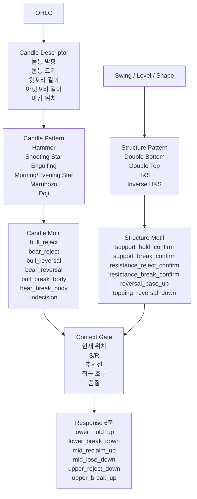

# Motif 기반 Response 구조 정리

## 목적

이 문서는 아래 질문에 답하기 위한 문서다.

- `Hammer` 같은 캔들형태는 어디에 속하나?
- `Double Bottom`, `Head and Shoulders` 같은 구조형 패턴은 어디에 속하나?
- `candle motif`와 `structure motif`는 어떻게 다른가?
- 이 둘이 `context gate`를 지나서 어떻게 `Response 6축`으로 들어가나?

즉 이 문서는

- `캔들 raw`
- `패턴 이름`
- `motif`
- `context`
- `Response 6축`

을 한 번에 연결해서 보는 설계 기준서다.

---

## 핵심 결론

한 줄로 먼저 정리하면:

```text
캔들형태와 구조형 패턴은 바로 Response 6축으로 가지 않는다.

먼저
1) descriptor
2) pattern
3) motif
4) context gate

를 거친 뒤에야
Response 6축 기여점수로 들어간다.
```

그리고 중요한 구분은 이거다.

- `Hammer`, `Engulfing`, `Morning Star` 같은 것은 `candle pattern`
- `Double Bottom`, `Double Top`, `H&S`, `Inverse H&S` 같은 것은 `structure pattern`
- 이 둘을 더 낮은 차원 의미로 묶은 것이 `motif`

즉

- `candle motif`
- `structure motif`

는 둘 다 존재할 수 있지만,
성격은 다르다.

---

## 전체 흐름



---

## 1. OHLC

가장 아래 원재료다.

- `open`
- `high`
- `low`
- `close`

이 단계에서는 아직 아무 의미도 붙이지 않는다.

즉:

- 상승 반전
- 하단 지지
- 상단 거절

같은 말은 아직 금지다.

---

## 2. Candle Descriptor

이 단계는 `캔들이 어떻게 생겼는지`를 중립적으로 기술한다.

여기서는 패턴 이름이 아니라
형태 성분만 뽑는다.

### 대표 descriptor 예시

- `body_signed_energy`
- `body_shape_energy`
- `upper_wick_energy`
- `lower_wick_energy`
- `close_location_energy`
- `wick_balance_energy`
- `range_size_energy`
- `body_size_energy`

### 의미

- 몸통이 양봉 쪽인가 음봉 쪽인가
- 몸통이 큰가 작은가
- 위꼬리가 긴가
- 아래꼬리가 긴가
- 고가 부근에서 마감했는가
- 전체적으로 어떤 모양인가

즉 이 단계는:

```text
Hammer처럼 보인다
```

가 아니라

```text
아래꼬리가 길고
몸통은 위쪽에 있고
마감은 고가 쪽에 가깝다
```

라고 기술하는 단계다.

---

## 3. Candle Pattern

이 단계에서야 비로소 이름이 붙는다.

즉 descriptor를 보고 아래 같은 패턴 점수를 만든다.

### 단일봉 패턴

- `hammer_score`
- `inverted_hammer_score`
- `shooting_star_score`
- `hanging_man_score`
- `dragonfly_doji_score`
- `gravestone_doji_score`
- `bull_marubozu_score`
- `bear_marubozu_score`
- `doji_score`
- `spinning_top_score`

### 2봉 패턴

- `bullish_engulfing_score`
- `bearish_engulfing_score`
- `harami_score`
- `harami_cross_score`
- `tweezer_top_score`
- `tweezer_bottom_score`

### 3봉 패턴

- `morning_star_score`
- `evening_star_score`
- `three_white_soldiers_score`
- `three_black_crows_score`

### 역할

이 단계는

```text
이 패턴이 얼마나 Hammer 같은가
이 패턴이 얼마나 Engulfing 같은가
```

를 `0~1`로 표현하는 단계다.

즉 아직도

- `BUY`
- `SELL`
- `lower_hold_up`

로 바로 가지 않는다.

---

## 4. Candle Motif

이 단계는 패턴 이름을 더 낮은 차원의 의미 묶음으로 압축한다.

즉 20개 이상의 패턴명을 그대로 들고 다니지 않고,
`힘의 종류`로 줄여서 본다.

### Candle Motif 예시

| motif | 뜻 | 들어오기 쉬운 패턴 |
|---|---|---|
| `bull_reject` | 아래에서 받아 올리는 힘 | Hammer, Dragonfly, Tweezer Bottom |
| `bear_reject` | 위에서 밀어내는 힘 | Shooting Star, Gravestone, Tweezer Top |
| `bull_reversal_2bar` | 2봉 기반 상승 반전 | Bullish Engulfing |
| `bear_reversal_2bar` | 2봉 기반 하락 반전 | Bearish Engulfing |
| `bull_reversal_3bar` | 3봉 기반 상승 반전 | Morning Star |
| `bear_reversal_3bar` | 3봉 기반 하락 반전 | Evening Star |
| `bull_break_body` | 강한 양봉 몸통 지속/돌파 | Bullish Marubozu, Three White Soldiers |
| `bear_break_body` | 강한 음봉 몸통 붕괴/지속 | Bearish Marubozu, Three Black Crows |
| `indecision` | 애매함, 힘 균형 | Doji, Spinning Top, Harami |
| `climax` | 과도한 피크성 폭발 | 과대 확장 Marubozu, 과열 추세 봉 |

### 왜 motif가 필요한가

이유는 간단하다.

- 패턴 이름은 많아진다
- 패턴 이름을 그대로 raw 필드로 늘리면 관리가 어렵다
- 같은 의미를 가진 패턴끼리 묶는 편이 오래 간다

즉:

```text
Hammer, Dragonfly, Tweezer Bottom
```

은 이름은 다르지만
실전적으로는 모두

```text
bull_reject
```

에 가깝다.

---

## 5. Structure Pattern

이 단계는 캔들 모양이 아니라
`스윙과 구조`에서 나오는 패턴 이름이다.

즉 여러 봉이 모여 만든 구조다.

### 대표 예시

- `double_bottom_score`
- `double_top_score`
- `head_shoulders_score`
- `inverse_head_shoulders_score`

추후 확장 예시:

- `rounded_bottom_score`
- `rounded_top_score`
- `ascending_triangle_break_score`
- `descending_triangle_break_score`

### 중요한 점

이 패턴들은 `candle pattern`이 아니다.

즉:

- `Hammer`
- `Engulfing`

같은 건 봉 패턴이고,

- `Double Bottom`
- `Head and Shoulders`

같은 건 구조 패턴이다.

이 둘을 섞어 부르면 헷갈린다.

---

## 6. Structure Motif

이 단계는 구조 패턴을 낮은 차원의 의미로 압축하는 단계다.

즉 구조 패턴도 결국은
`무슨 힘을 말하는가`
로 줄여야 한다.

### Structure Motif 예시

| motif | 뜻 | 들어오기 쉬운 패턴 |
|---|---|---|
| `support_hold_confirm` | 지지가 실제로 버티고 있음을 확인 | Double Bottom, Inverse H&S |
| `support_break_confirm` | 지지가 무너졌음을 확인 | neckline fail, support breakdown 계열 |
| `resistance_reject_confirm` | 저항에서 밀렸음을 확인 | Double Top, H&S |
| `resistance_break_confirm` | 저항을 실제로 돌파했음을 확인 | base breakout, neckline reclaim 계열 |
| `reversal_base_up` | 바닥이 만들어지고 위로 뒤집히는 구조 | Double Bottom, Inverse H&S |
| `topping_reversal_down` | 꼭대기가 형성되고 아래로 전환되는 구조 | Double Top, H&S |

### 가장 중요한 답

질문:

```text
candle motif에 헤드앤숄더, 더블바텀 같은 게 들어가나?
```

정답:

- `motif 레이어`에는 들어갈 수 있다
- 하지만 `candle motif`가 아니라 `structure motif`로 두는 것이 더 정확하다

즉:

- Hammer -> `candle motif`
- Double Bottom -> `structure motif`

라고 보는 게 좋다.

---

## 7. Context Gate

이 단계가 매우 중요하다.

같은 motif라도
어디서 나왔는지에 따라 의미가 완전히 달라지기 때문이다.

### 예시

#### Hammer

- 하단 zone
- 지지선 근처
- 하락 후

에서 나온 Hammer는 의미가 크다.

하지만

- 박스 중간
- 애매한 횡보
- 저항 바로 아래

에서 나온 Hammer는 약하다.

#### Head and Shoulders

- 상단 근처
- 저항대
- 상승 피로 구간

에서 나온 H&S는 강하다.

하지만

- 하단 근처
- 중간 구조 깨짐 없는 곳

에서 나온 H&S 유사 형태는 신뢰가 약하다.

### Context Gate가 보는 것

- 현재 위치가 `lower / middle / upper` 중 어디인가
- S/R와 얼마나 가까운가
- 추세선과 어떤 관계인가
- 최근 흐름이 상승 후인지 하락 후인지
- 변동성이 너무 작거나 너무 크지 않은가
- 품질이 낮아 패턴을 믿기 어려운가

### 역할

context gate는
패턴을 새로 만들지 않는다.

대신:

- 살릴 것은 살리고
- 죽일 것은 죽이고
- 강한 것은 더 밀고
- 애매한 것은 약하게 만든다

즉:

```text
motif score * context gain
```

형태로 보는 것이 좋다.

---

## 8. Response 6축

모든 것이 마지막에는 여기로 들어간다.

### 축 목록

- `lower_hold_up`
- `lower_break_down`
- `mid_reclaim_up`
- `mid_lose_down`
- `upper_reject_down`
- `upper_break_up`

### 연결 원칙

이 축들은 `최종 motif 저장소`가 아니라
`현재 반응 방향성`을 정리한 결과다.

즉:

- Candle Motif
- Structure Motif
- Context Gate

를 거친 뒤의 결과만 들어간다.

---

## 9. Candle Motif -> Response 6축 연결

| candle motif | 주로 가는 축 | 보조 축 |
|---|---|---|
| `bull_reject` | `lower_hold_up` | `mid_reclaim_up` |
| `bear_reject` | `upper_reject_down` | `mid_lose_down` |
| `bull_reversal_2bar` | `lower_hold_up` | `mid_reclaim_up` |
| `bear_reversal_2bar` | `upper_reject_down` | `mid_lose_down` |
| `bull_reversal_3bar` | `lower_hold_up` | `mid_reclaim_up` |
| `bear_reversal_3bar` | `upper_reject_down` | `mid_lose_down` |
| `bull_break_body` | `upper_break_up` | `mid_reclaim_up` |
| `bear_break_body` | `lower_break_down` | `mid_lose_down` |
| `indecision` | 직접 가산보다 감산/보류 | `Barrier` 또는 quality 감점 |
| `climax` | continuation 또는 exhaustion 보정 | context에 따라 다름 |

---

## 10. Structure Motif -> Response 6축 연결

| structure motif | 주로 가는 축 | 보조 축 |
|---|---|---|
| `support_hold_confirm` | `lower_hold_up` | `mid_reclaim_up` |
| `support_break_confirm` | `lower_break_down` | `mid_lose_down` |
| `resistance_reject_confirm` | `upper_reject_down` | `mid_lose_down` |
| `resistance_break_confirm` | `upper_break_up` | `mid_reclaim_up` |
| `reversal_base_up` | `lower_hold_up` | `mid_reclaim_up` |
| `topping_reversal_down` | `upper_reject_down` | `mid_lose_down` |

---

## 11. 실제 예시로 보면

### 예시 1

```text
OHLC -> Hammer
Hammer -> bull_reject
lower zone + support + 하락 후 -> context strong
=> lower_hold_up 강하게 기여
```

### 예시 2

```text
OHLC sequence -> Bullish Engulfing
Bullish Engulfing -> bull_reversal_2bar
middle reclaim 상황 -> context가 mid 쪽으로 살림
=> mid_reclaim_up 중심 기여
```

### 예시 3

```text
Swing structure -> Double Bottom
Double Bottom -> support_hold_confirm + reversal_base_up
lower zone + support 인접 -> context strong
=> lower_hold_up, mid_reclaim_up 기여
```

### 예시 4

```text
Swing structure -> Head and Shoulders
H&S -> resistance_reject_confirm + topping_reversal_down
upper zone + resistance 인접 -> context strong
=> upper_reject_down, mid_lose_down 기여
```

---

## 12. 왜 이 구조가 좋은가

이 구조의 장점은 분명하다.

### 1) 패턴 이름을 무한정 늘리지 않아도 된다

`ResponseRawSnapshot`에

- Hammer
- Shooting Star
- Bullish Engulfing
- Morning Star
- Double Bottom
- Head and Shoulders

를 전부 raw로 추가하면 금방 비대해진다.

반면 motif 구조를 두면,
패턴은 늘어나도
밖으로 내보내는 의미 축은 적게 유지할 수 있다.

### 2) 같은 의미를 여러 번 세는 문제를 줄인다

예를 들어:

- Hammer
- Dragonfly
- Tweezer Bottom

은 전부 하단 반응 계열이다.

이걸 그대로 다 더하면 중복 집계가 쉬워진다.

motif로 묶으면 중복을 줄이기 쉽다.

### 3) context를 먼저 걸 수 있다

패턴 이름만으로 축에 넣지 않고,
현재 위치와 품질을 먼저 보게 할 수 있다.

### 4) 설명 가능성이 좋아진다

나중에 로그를 볼 때도:

```text
Hammer가 떠서 BUY
```

보다

```text
bull_reject motif가 lower zone context에서 살아나
lower_hold_up를 올렸다
```

가 훨씬 구조적으로 설명이 된다.

---

## 13. 현재 코드와 비교하면

현재 구현은 아직 이 문서의 완전한 형태는 아니다.

### 현재 있는 것

- [candle_response.py](/Users/bhs33/Desktop/project/cfd/backend/trading/engine/response/candle_response.py)
  - `candle_lower_reject`
  - `candle_upper_reject`
- [pattern_response.py](/Users/bhs33/Desktop/project/cfd/backend/trading/engine/response/pattern_response.py)
  - `pattern_double_bottom`
  - `pattern_inverse_head_shoulders`
  - `pattern_double_top`
  - `pattern_head_shoulders`

즉 현재는

- 일부 `candle pattern`은 매우 단순하게 reject만 있고
- 일부 `structure pattern`은 이미 이름 raw로 들어와 있다

하지만 아직:

- `descriptor -> pattern -> motif -> context gate -> 6축`

이 완전한 계층은 아니다.

### 앞으로의 이상적인 방향

```text
OHLC
-> candle descriptor
-> candle pattern
-> candle motif

swing/shape
-> structure pattern
-> structure motif

motif + context gate
-> Response 6축
```

---

## 14. 최종 정리

정리하면:

- `Hammer`, `Engulfing`, `Morning Star`는 `candle pattern`
- `Double Bottom`, `Double Top`, `H&S`, `Inverse H&S`는 `structure pattern`
- `bull_reject`, `bear_reject`, `reversal_base_up`, `topping_reversal_down` 같은 것이 `motif`
- `motif`는 context를 거친 뒤에 `Response 6축`으로 들어간다

그리고 질문에 대한 가장 짧은 답은 이거다.

```text
더블탑/더블바텀/H&S도 motif 레이어에 들어갈 수 있다.
다만 candle motif가 아니라 structure motif로 두는 게 더 정확하다.
```
