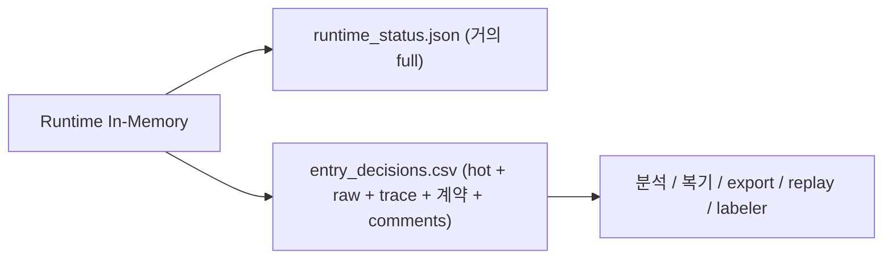
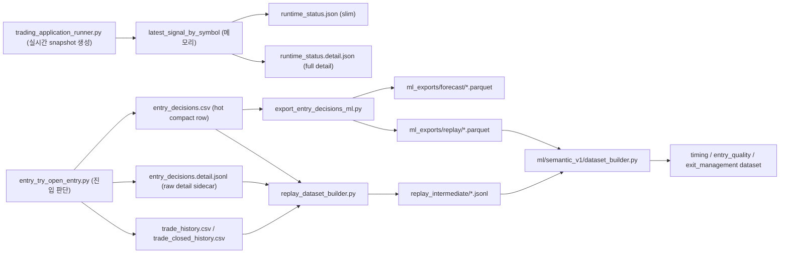

# 저장 구조 변경 후 데이터 흐름 상세 Handoff

## 목적

이 문서는 `데이터 용량 축소를 위한 hot/detail 분리` 이후,
`실시간 판단 -> 기록 -> compact export -> replay -> semantic ML` 흐름이 어디서 생성되고 어디서 소비되는지,
그리고 지금 어디서 끊길 수 있는지를 다른 스레드가 바로 따라갈 수 있게 정리한 handoff 문서다.

이 문서의 목표는 3가지다.

- 왜 저장 구조를 바꿨는지 설명한다.
- 바뀐 뒤에 어떤 파일이 source of truth인지 고정한다.
- 지금 실제로 의심되는 끊김 지점과 디버깅 순서를 한 번에 넘긴다.

## 1. 왜 이 구조로 바꿨는가

원래는 아래 문제가 있었다.

- `data/trades/entry_decisions.csv` 하나가 너무 커졌다.
- 이 한 파일이 `live forensic`, `semantic trace`, `offline export`, `replay source` 역할을 동시에 떠안고 있었다.
- `runtime_status.json`에도 nested payload가 계속 쌓여 latest 확인 파일이 무거워졌다.
- `legacy_*`, `tail_*`, debug log, observability log가 retention 없이 계속 쌓였다.

그래서 저장 전략을 아래처럼 바꿨다.

- `hot`: 빠르게 읽고 최신 판단을 보는 파일
- `detail`: raw payload와 계약/마이그레이션/주석 등을 보관하는 sidecar
- `ml`: compact export와 학습셋
- `warm`: replay 중간 산출물, 상세 상태, 보관 파일
- `cold`: archive / checkpoint / 장기 보관

핵심 원칙은 이것이다.

- 필드를 버리기보다 `역할에 따라 분리`한다.
- live에서 자주 읽는 파일은 작게 유지한다.
- raw giant payload는 detail sidecar로 내린다.
- ML과 replay는 raw giant csv가 아니라 `compact export`와 `replay intermediate`를 본다.

## 2. 변경 전과 변경 후의 전체 흐름

### 변경 전



문제는 `B`, `C` 둘 다 너무 많은 역할을 한 번에 맡았다는 점이다.

### 변경 후



핵심은 이거다.

- 최신 화면/상태 확인은 `runtime_status.json`
- full 상태 확인은 `runtime_status.detail.json`
- live 판단 로그는 `entry_decisions.csv`
- raw detail은 `entry_decisions.detail.jsonl`
- semantic 학습용 입력은 `ml_exports/*.parquet`
- semantic label/replay용 입력은 `replay_intermediate/*.jsonl`

## 3. 파일별 역할표

| 파일 | 한글 설명 | 생성자 | 주 용도 | 잘못 보면 생기는 오해 |
| --- | --- | --- | --- | --- |
| `data/runtime_status.json` | 최신 상태 slim 파일 | `TradingApplication._write_runtime_status` | 최신 상태, 현재 설정, slim signal view | full payload가 다 있다고 착각하기 쉽다 |
| `data/runtime_status.detail.json` | 최신 상태 full detail 파일 | `TradingApplication._write_runtime_status` | nested detail, full `latest_signal_by_symbol` | 이 파일을 안 보고 slim만 보면 “필드가 사라졌다”고 느낄 수 있다 |
| `data/trades/entry_decisions.csv` | 진입 판단 hot 로그 | `EntryDecisionRecorder` | 빠른 복기, compact semantic trace, export source | raw contract/comment/shadow detail까지 다 들어있다고 착각하기 쉽다 |
| `data/trades/entry_decisions.detail.jsonl` | 진입 판단 상세 payload sidecar | `EntryDecisionRecorder` | hot에서 뺀 raw payload 전체 보관 | 이 파일을 안 보면 “저장 안 됐다”고 오해하기 쉽다 |
| `data/trades/trade_history.csv` | 오픈 거래 기록표 | `TradeLogger` | 현재 운영 ML, 거래 추적 | entry decision과 자동으로 1:1 매칭된다고 생각하면 안 된다 |
| `data/trades/trade_closed_history.csv` | 종료 거래 기록표 | `TradeLogger` | exit ML, replay label 후보 | 진입 로그만으로 exit 라벨이 완성된다고 착각하기 쉽다 |
| `data/datasets/ml_exports/forecast/*.parquet` | semantic forecast compact export | `scripts/export_entry_decisions_ml.py` | forecast/offline 분석 | raw detail sidecar를 직접 읽는 경로가 아니다 |
| `data/datasets/ml_exports/replay/*.parquet` | semantic replay compact export | `scripts/export_entry_decisions_ml.py` | semantic 학습 feature source | `entry_decisions.csv`를 직접 읽는 학습 경로로 착각하기 쉽다 |
| `data/datasets/replay_intermediate/*.jsonl` | semantic replay 중간셋 | `replay_dataset_builder.py` | label summary, replay provenance | detail sidecar 없으면 일부 필드가 비어도 이상하지 않다 |
| `data/datasets/semantic_v1/*.parquet` | semantic ML 학습셋 | `ml/semantic_v1/dataset_builder.py` | timing / entry / exit 학습 | raw giant log를 직접 읽는 게 아니다 |
| `data/manifests/rollout/semantic_live_rollout_latest.json` | semantic rollout 최신 상태 | `TradingApplication._write_runtime_status` | live rollout 모드와 recent 이벤트 확인 | semantic model이 실제로 live owner라고 오해하기 쉽다 |

## 4. 핵심 join key 4개

이 4개는 지금 구조에서 가장 중요하다.

| 키 | 뜻 | 주 생성 위치 | 주 소비 위치 | 끊기면 생기는 문제 |
| --- | --- | --- | --- | --- |
| `decision_row_key` | 진입 판단 row 고유키 | `entry_engines.py`, `storage_compaction.py` | hot row, detail row, trade logger, replay | decision row를 다른 산출물과 못 잇는다 |
| `runtime_snapshot_key` | 당시 latest runtime snapshot 키 | `trading_application_runner.py` | decision row, trade logger, semantic runtime | runtime 상태와 판단 row를 약하게만 연결하게 된다 |
| `trade_link_key` | 진입 후 실제 trade 쪽 연결키 | `entry_try_open_entry.py`, `storage_compaction.py` | trade history, replay, 사후 분석 | 진입 판단과 실제 체결/종료를 연결하기 어려워진다 |
| `replay_row_key` | replay/semantic dataset join 우선키 | `entry_engines.py`, `replay_dataset_builder.py` | replay intermediate, semantic dataset builder | compact export와 replay summary 조인이 0 row가 될 수 있다 |

### 키 생성 규칙

- `decision_row_key`
  - source: `resolve_entry_decision_row_key(...)`
  - 형식: `replay_dataset_row_v1|symbol=...|anchor_field=...|anchor_value=...|action=...|setup_id=...|ticket=...`
- `runtime_snapshot_key`
  - source: `resolve_runtime_signal_row_key(...)`
  - 형식: `runtime_signal_row_v1|symbol=...|anchor_field=...|anchor_value=...|hint=...`
- `trade_link_key`
  - source: `resolve_trade_link_key(...)`
  - 형식: `trade_link_v1|ticket=...|symbol=...|direction=...|open_ts=...`

## 5. hot에 남은 것과 detail로 내려간 것

### 5-1. `entry_decisions.csv` hot에 남은 것

hot에는 아래가 남는다.

- scalar decision field
  - `action`, `outcome`, `blocked_by`, `entry_score_raw`, `effective_entry_threshold`
- trace / quality field
  - `signal_age_sec`, `bar_age_sec`, `decision_latency_ms`
  - `missing_feature_count`, `data_completeness_ratio`, `used_fallback_count`, `compatibility_mode`
  - `detail_blob_bytes`, `snapshot_payload_bytes`, `row_payload_bytes`
- compact semantic trace
  - `position_snapshot_v2`
  - `response_vector_v2`
  - `state_vector_v2`
  - `evidence_vector_v1`
  - `belief_state_v1`
  - `barrier_state_v1`
  - `forecast_features_v1`
  - `transition_forecast_v1`
  - `trade_management_forecast_v1`
  - `observe_confirm_v1`
  - `observe_confirm_v2`
- 사람이 바로 봐야 하는 compact helper trace
  - `forecast_assist_v1`
  - `entry_default_side_gate_v1`
  - `entry_probe_plan_v1`
  - `edge_pair_law_v1`
  - `probe_candidate_v1`
  - `entry_decision_context_v1`
  - `entry_decision_result_v1`
- semantic shadow/live rollout trace
  - `semantic_shadow_*`
  - `semantic_live_*`
- sidecar 연결 포인터
  - `detail_schema_version`
  - `detail_row_key`

즉 `hot`에는 “빠르게 복기하고 compact export할 만큼의 요약”은 남아 있다.

### 5-2. `entry_decisions.detail.jsonl` detail로 내려간 것

detail에는 아래 성격의 값이 남는다.

- raw payload 전체
- contract / migration / compatibility trace
- raw shadow trace / comments / legacy compatibility detail
- hot에는 필요 없는 긴 metadata

대표 예시는 아래다.

- `prediction_bundle`
- `prs_canonical_*`
- `energy_*contract*`
- `observe_confirm_*contract*`
- `layer_mode_*`
- `shadow_state_v1`, `shadow_action_v1`, `shadow_reason_v1`
- `last_order_comment`

중요한 점은 이것이다.

- “사라진 것”이 아니라 `detail sidecar`로 내려간 것이다.
- 그러므로 `entry_decisions.csv`만 보고 “필드가 없어졌다”고 판단하면 안 된다.

### 5-3. `runtime_status.json` slim에 남은 것

- 전역 상태
- policy / ai / semantic 설정 요약
- `latest_signal_by_symbol`의 compact view
- `semantic_rollout_state`

### 5-4. `runtime_status.detail.json`에 남은 것

- full `latest_signal_by_symbol`
- nested `current_entry_context_v1`
- full `position/response/state/evidence/belief/barrier/forecast`
- full entry/exit decision context/result

즉 runtime도 마찬가지로 “사라진 것”이 아니라 slim/detail로 분리된 것이다.

## 6. 실제 생성 순서

### Step A. runner가 symbol별 runtime snapshot을 만든다

파일:

- [`backend/app/trading_application_runner.py`](C:/Users/bhs33/Desktop/project/cfd/backend/app/trading_application_runner.py)

핵심:

- `latest_signal_by_symbol[symbol]`에 full snapshot을 쌓는다.
- `position_snapshot_v2`, `response_vector_v2`, `state_vector_v2`, `evidence_vector_v1`, `forecast_features_v1`, `observe_confirm_v1/v2`를 넣는다.
- `summarize_trace_quality(...)`로 아래를 계산한다.
  - `signal_age_sec`
  - `bar_age_sec`
  - `decision_latency_ms`
  - `missing_feature_count`
  - `data_completeness_ratio`
  - `used_fallback_count`
  - `compatibility_mode`
- `runtime_snapshot_key`를 생성한다.

### Step B. trading application이 runtime status slim/detail을 쓴다

파일:

- [`backend/app/trading_application.py`](C:/Users/bhs33/Desktop/project/cfd/backend/app/trading_application.py)

핵심:

- `runtime_status.detail.json`에는 full payload를 쓴다.
- `runtime_status.json`에는 `compact_runtime_signal_row(...)`로 slim view를 쓴다.
- semantic live rollout 상태는 `data/manifests/rollout/semantic_live_rollout_latest.json`에도 따로 남긴다.

### Step C. entry 판단 시 semantic shadow와 semantic live guard가 끼어든다

파일:

- [`backend/services/entry_try_open_entry.py`](C:/Users/bhs33/Desktop/project/cfd/backend/services/entry_try_open_entry.py)
- [`ml/semantic_v1/runtime_adapter.py`](C:/Users/bhs33/Desktop/project/cfd/ml/semantic_v1/runtime_adapter.py)
- [`ml/semantic_v1/promotion_guard.py`](C:/Users/bhs33/Desktop/project/cfd/ml/semantic_v1/promotion_guard.py)

핵심:

- 현재 runtime snapshot을 가져온다.
- semantic shadow feature row를 만든다.
- semantic model이 있으면 `timing / entry_quality / exit_management` 예측을 만든다.
- 그 결과를 runtime snapshot과 decision payload에 같이 넣는다.
- semantic live rollout mode가 켜져 있으면 `threshold_only` 범위에서만 threshold를 보정한다.
- 이때도 `side`, `setup_id`, `management_profile_id`는 계속 rule owner다.

### Step D. entry decision recorder가 hot/detail을 동시에 쓴다

파일:

- [`backend/services/entry_engines.py`](C:/Users/bhs33/Desktop/project/cfd/backend/services/entry_engines.py)
- [`backend/services/storage_compaction.py`](C:/Users/bhs33/Desktop/project/cfd/backend/services/storage_compaction.py)

핵심:

- `build_entry_decision_detail_record(...)`가 full payload를 `entry_decisions.detail.jsonl`에 쓴다.
- `build_entry_decision_hot_payload(...)`가 compact payload를 `entry_decisions.csv`에 쓴다.
- 여기서 `detail_row_key`가 hot row와 detail row를 잇는다.
- 여기서 `decision_row_key`, `runtime_snapshot_key`, `trade_link_key`, `replay_row_key`도 고정된다.

### Step E. trade logger가 체결 결과에 key를 이어준다

파일:

- [`backend/services/entry_try_open_entry.py`](C:/Users/bhs33/Desktop/project/cfd/backend/services/entry_try_open_entry.py)
- [`backend/trading/trade_logger.py`](C:/Users/bhs33/Desktop/project/cfd/backend/trading/trade_logger.py)

핵심:

- 진입이 실제로 체결되면 `trade_link_key`를 만든다.
- `trade_history.csv`에 `decision_row_key`, `runtime_snapshot_key`, `trade_link_key`, `replay_row_key`를 같이 남긴다.

### Step F. compact export는 hot csv에서 semantic scalar를 뽑는다

파일:

- [`scripts/export_entry_decisions_ml.py`](C:/Users/bhs33/Desktop/project/cfd/scripts/export_entry_decisions_ml.py)

핵심:

- `entry_decisions.csv`를 읽는다.
- raw giant payload를 그대로 싣지 않는다.
- semantic scalar만 뽑는다.
  - `position_*`
  - `response_*`
  - `state_*`
  - `evidence_*`
  - `forecast_*`
  - trace / quality / key columns
- `ml_exports/forecast/*.parquet` 또는 `ml_exports/replay/*.parquet`를 만든다.
- manifest와 missingness report를 같이 쓴다.

### Step G. replay builder는 hot row와 detail sidecar를 다시 합친다

파일:

- [`backend/trading/engine/offline/replay_dataset_builder.py`](C:/Users/bhs33/Desktop/project/cfd/backend/trading/engine/offline/replay_dataset_builder.py)

핵심:

- `entry_decisions.csv`를 순회한다.
- `entry_decisions.detail.jsonl`을 `row_key -> payload` index로 읽는다.
- `detail_row_key` 또는 `resolve_replay_dataset_row_key(...)`로 detail payload를 다시 붙인다.
- `trade_closed_history.csv`, future bars, label bundle을 합쳐 `replay_intermediate/*.jsonl`을 만든다.
- replay row에는 top-level flat key가 남는다.
  - `decision_row_key`
  - `runtime_snapshot_key`
  - `trade_link_key`
  - `replay_row_key`

### Step H. outcome labeler는 compact label summary를 만든다

파일:

- [`backend/trading/engine/offline/outcome_labeler.py`](C:/Users/bhs33/Desktop/project/cfd/backend/trading/engine/offline/outcome_labeler.py)

핵심:

- label bundle에서 nested outcome metadata를 compact summary로 줄인다.
- 요약 필드:
  - `transition_label_status`
  - `management_label_status`
  - `label_positive_count`
  - `label_negative_count`
  - `label_unknown_count`
  - `label_is_ambiguous`
  - `label_source_descriptor`
  - `is_censored`
  - `row_key`

### Step I. semantic dataset builder는 compact export와 replay summary를 join한다

파일:

- [`ml/semantic_v1/dataset_builder.py`](C:/Users/bhs33/Desktop/project/cfd/ml/semantic_v1/dataset_builder.py)

핵심:

- feature source는 `ml_exports/replay/*.parquet`
- label source는 `replay_intermediate/*.jsonl`
- join 우선순위는 `replay_row_key -> decision_row_key`
- 여기서 join row가 0이면 semantic 학습은 시작할 수 없다.

## 7. 지금 반드시 봐야 할 핵심 필드

다른 스레드가 판단 흐름을 이해하려면 최소 아래를 봐야 한다.

### 7-1. wait / block / lower-edge 판단용

- `forecast_assist_v1`  
  의미: forecast가 지금 진입을 도와주는지, 아직 observe를 더 밀어붙이는지
- `entry_default_side_gate_v1`  
  의미: 현재 기본 side가 BUY인지 SELL인지, winner side가 누구인지
- `entry_probe_plan_v1`  
  의미: 실제 probe 진입 계획이 활성화됐는지
- `edge_pair_law_v1`  
  의미: lower/upper edge 경쟁에서 어느 쪽이 winner인지
- `probe_candidate_v1`  
  의미: 지금 edge probe 후보가 실제로 활성화됐는지
- `entry_decision_context_v1`  
  의미: 당시 시장/점수/threshold/metadata 묶음
- `entry_decision_result_v1`  
  의미: 최종 결과, blocked_by, reason
- `observe_confirm_v2`  
  의미: 최종 observe/confirm/action router의 실제 출력

### 7-2. 연결용

- `decision_row_key`  
  의미: 이 decision row 자체의 고유키
- `detail_row_key`  
  의미: hot row가 어떤 detail row를 가리키는지
- `runtime_snapshot_key`  
  의미: 당시 runtime snapshot row와 이어지는 키
- `trade_link_key`  
  의미: 체결 trade 쪽과 이어지는 키
- `replay_row_key`  
  의미: replay/semantic dataset 조인용 키

### 7-3. 품질용

- `signal_age_sec`
- `bar_age_sec`
- `decision_latency_ms`
- `missing_feature_count`
- `data_completeness_ratio`
- `used_fallback_count`
- `compatibility_mode`

### 7-4. semantic shadow/live rollout용

- `semantic_shadow_available`
- `semantic_shadow_trace_quality`
- `semantic_shadow_timing_probability`
- `semantic_shadow_entry_quality_probability`
- `semantic_shadow_compare_label`
- `semantic_shadow_reason`
- `semantic_live_rollout_mode`
- `semantic_live_fallback_reason`
- `semantic_live_threshold_before`
- `semantic_live_threshold_after`
- `semantic_live_threshold_applied`
- `semantic_live_reason`

## 8. 지금 흐름이 끊길 수 있는 지점

이 섹션이 가장 중요하다.

### 8-1. `runtime_status.json`만 보고 full 상태라고 오해하는 경우

증상:

- 어떤 nested field가 “사라진 것처럼” 보인다.
- `latest_signal_by_symbol`에서 deep semantic trace가 보이지 않는다.

원인:

- full payload는 `runtime_status.detail.json`에 있고,
- `runtime_status.json`은 slim view만 남기기 때문이다.

정답:

- full 상태를 볼 때는 `data/runtime_status.detail.json`을 봐야 한다.

### 8-2. `entry_decisions.csv`만 보고 raw payload가 사라졌다고 오해하는 경우

증상:

- contract/migration/comment/shadow raw trace가 없다.
- replay에 필요한 일부 detail이 보이지 않는다.

원인:

- raw payload 전체는 `entry_decisions.detail.jsonl`로 내려갔다.

정답:

- hot row의 `detail_row_key`로 sidecar row를 찾아야 한다.

### 8-3. `detail_row_key`나 `replay_row_key`를 안 따라가서 join이 끊기는 경우

증상:

- replay builder나 semantic dataset builder에서 row가 줄거나 0이 된다.
- 같은 판단인데 서로 다른 파일에서 못 찾는다.

원인:

- hot/detail/replay/compact export는 같은 물건을 다른 포맷으로 나눠 둔 것이고,
- 이때 조인은 키를 따라가야 한다.

정답:

- `detail_row_key`
- `replay_row_key`
- `decision_row_key`
- `trade_link_key`

순서대로 확인한다.

### 8-4. `runtime_snapshot_key`가 약하게 생성되는 현재 의심 지점

이건 지금 실제 코드 기준으로 가장 중요한 의심 포인트다.

코드상 `resolve_runtime_signal_row_key(...)`는 아래를 쓴다.

- `symbol`
- `signal_bar_ts` 또는 `time`
- `next_action_hint`

그런데 현재 [`backend/app/trading_application_runner.py`](C:/Users/bhs33/Desktop/project/cfd/backend/app/trading_application_runner.py)에서 `latest_signal_by_symbol[symbol]` row를 만들 때,
해당 row 안에 `symbol` 필드를 직접 넣지 않고 있다.

그러다 보니 현재 실제 `entry_decisions.csv` 샘플에는 이런 형태가 보인다.

- `runtime_snapshot_key=runtime_signal_row_v1|symbol=|anchor_field=|anchor_value=None|hint=BOTH`

이 말은 곧:

- runtime snapshot key가 충분히 구체적이지 않고
- runtime row와 decision row를 이어주는 키의 품질이 약할 수 있다는 뜻이다.

이건 다른 스레드가 가장 먼저 의심해야 하는 연결 끊김 후보다.

### 8-5. semantic shadow가 아직 실제로 unavailable인 경우

현재 실제 runtime evidence는 이렇다.

- `runtime_status.json`에 `semantic_shadow_loaded=false`
- `semantic_shadow_config.available_targets=[]`

즉 지금은 semantic shadow runtime 코드가 붙어 있어도,
실제 모델 파일이 없거나 로드되지 않아 `semantic_shadow_*` 필드가 `unavailable`로 찍힐 수 있다.

이 경우 “flow가 끊긴 것”이 아니라 “모델이 아직 없는 상태”일 수 있다.

### 8-6. hot는 작아졌지만 detail sidecar가 다시 커지는 경우

현재 실제 파일 snapshot은 아래다.

- `data/runtime_status.json`: `77,688 bytes`
- `data/runtime_status.detail.json`: `16,146,305 bytes`
- `data/trades/entry_decisions.csv`: `3,557,162 bytes`
- `data/trades/entry_decisions.detail.jsonl`: `11,534,840,426 bytes`

즉 지금은 `hot csv`를 줄이는 데는 성공했지만,
detail sidecar가 다시 매우 커질 수 있다.

이건 “저장이 안 된다”가 아니라 “저장 위치가 옮겨졌고 거기서 다시 비대해진다”는 뜻이다.

## 9. 현재 실제 증거 snapshot

기준 시각:

- `2026-03-21 02:07 KST`

### runtime 상태 증거

파일:

- [`data/runtime_status.json`](C:/Users/bhs33/Desktop/project/cfd/data/runtime_status.json)
- [`data/runtime_status.detail.json`](C:/Users/bhs33/Desktop/project/cfd/data/runtime_status.detail.json)
- [`data/manifests/rollout/semantic_live_rollout_latest.json`](C:/Users/bhs33/Desktop/project/cfd/data/manifests/rollout/semantic_live_rollout_latest.json)

확인된 사실:

- `semantic_shadow_loaded=false`
- `semantic_live_config.mode=threshold_only`
- `symbol_allowlist=["BTCUSD"]`
- `entry_stage_allowlist=["aggressive"]`
- `semantic_rollout_state.entry.events_total=0`

즉 rollout 설정은 들어가 있지만, 아직 semantic shadow/live 실적 row가 충분히 쌓이지 않은 상태다.

### entry decision 샘플 증거

파일:

- [`data/trades/entry_decisions.csv`](C:/Users/bhs33/Desktop/project/cfd/data/trades/entry_decisions.csv)
- [`data/trades/entry_decisions.detail.jsonl`](C:/Users/bhs33/Desktop/project/cfd/data/trades/entry_decisions.detail.jsonl)

현재 샘플 XAU row에서 확인되는 값:

- `blocked_by=outer_band_reversal_support_required_observe`
- `forecast_assist_v1.active=true`
- `entry_default_side_gate_v1.winner_side=BUY`
- `probe_candidate_v1.active=true`
- `entry_probe_plan_v1.active=false`
- `semantic_shadow_available=0`
- `semantic_shadow_reason=semantic_runtime_unavailable`
- `runtime_snapshot_key=runtime_signal_row_v1|symbol=|anchor_field=|anchor_value=None|hint=BOTH`

즉 이 샘플은 “연결이 완전히 사라진 것”이 아니라 아래 상태를 보여준다.

- lower-edge BUY 쪽 trace는 살아 있다.
- final guard가 `outer_band_reversal_support_required_observe`로 막고 있다.
- semantic shadow는 아직 모델이 없어 unavailable이다.
- runtime snapshot key는 현재 약하게 찍히고 있다.

## 10. 다른 스레드가 디버깅할 때의 순서

다른 스레드에서는 아래 순서로 보면 가장 빠르다.

### 10-1. runtime slim과 detail이 둘 다 있는지 먼저 본다

```powershell
Get-Content data\runtime_status.json -TotalCount 120
Get-Content data\runtime_status.detail.json -TotalCount 80
```

확인 포인트:

- `detail_payload_path`
- `semantic_shadow_loaded`
- `semantic_live_config`
- `latest_signal_by_symbol`

### 10-2. 최신 hot decision row를 본다

```powershell
$lines = Get-Content data\trades\entry_decisions.csv -Tail 2
$row = ($lines | ConvertFrom-Csv | Select-Object -Last 1)
$row | Format-List symbol,action,outcome,blocked_by,decision_row_key,runtime_snapshot_key,trade_link_key,replay_row_key,detail_row_key
```

확인 포인트:

- `decision_row_key`
- `runtime_snapshot_key`
- `detail_row_key`
- `blocked_by`

### 10-3. hot row의 compact trace를 본다

```powershell
$row | Format-List forecast_assist_v1,entry_default_side_gate_v1,entry_probe_plan_v1,edge_pair_law_v1,probe_candidate_v1,entry_decision_context_v1,entry_decision_result_v1
```

확인 포인트:

- `winner_side`
- `probe_candidate.active`
- `entry_probe_plan.active`
- `entry_decision_result_v1.blocked_by`

### 10-4. 같은 row의 detail sidecar를 찾는다

```powershell
$key = [regex]::Escape($row.detail_row_key)
Select-String -Path data\trades\entry_decisions.detail.jsonl -Pattern $key
```

주의:

- 파일이 크기 때문에 search가 오래 걸릴 수 있다.
- 그래도 “정말 저장이 안 됐는지”를 확인하려면 sidecar를 반드시 봐야 한다.

### 10-5. semantic shadow/live rollout 필드를 본다

```powershell
$row | Format-List semantic_shadow_available,semantic_shadow_trace_quality,semantic_shadow_timing_probability,semantic_shadow_entry_quality_probability,semantic_shadow_compare_label,semantic_shadow_reason,semantic_live_rollout_mode,semantic_live_fallback_reason,semantic_live_threshold_before,semantic_live_threshold_after,semantic_live_threshold_applied,semantic_live_reason
```

확인 포인트:

- 모델이 없어서 unavailable인지
- 품질 조건 때문에 fallback인지
- 실제 threshold 조정이 적용됐는지

### 10-6. replay 쪽으로 이어지는지 본다

```powershell
Get-Content data\datasets\replay_intermediate\*.jsonl -TotalCount 3
```

확인 포인트:

- `row_key`
- `decision_row_key`
- `runtime_snapshot_key`
- `trade_link_key`
- `replay_row_key`
- `label_quality_summary_v1`

### 10-7. compact export가 살아 있는지 본다

파일:

- [`scripts/export_entry_decisions_ml.py`](C:/Users/bhs33/Desktop/project/cfd/scripts/export_entry_decisions_ml.py)
- [`data/manifests/export`](C:/Users/bhs33/Desktop/project/cfd/data/manifests/export)

확인 포인트:

- manifest 존재 여부
- `export_kind`
- `selected_columns`
- missingness report 존재 여부

## 11. 다른 스레드에 넘길 때 반드시 포함할 것

아래 10개는 빼면 안 된다.

- 변경 목적 한 줄
- hot/detail 분리 여부
- 실제 source file 경로
- 현재 문제 심볼과 시각
- hot row의 `decision_row_key`
- hot row의 `detail_row_key`
- `runtime_snapshot_key`
- `blocked_by`
- `forecast_assist_v1`, `entry_default_side_gate_v1`, `probe_candidate_v1`, `entry_decision_result_v1`
- 기대 동작 한 줄

## 12. 복붙용 확장 handoff 템플릿

```md
변경 목적:
- entry_decisions/runtime_status가 너무 커져서 hot/detail split을 적용했다.
- 현재는 저장이 안 되는 게 아니라, 저장 위치와 소비 위치가 갈라져 흐름이 끊겨 보이는 상태를 점검 중이다.

핵심 변경 파일:
- [storage_compaction.py](C:/Users/bhs33/Desktop/project/cfd/backend/services/storage_compaction.py)
- [entry_engines.py](C:/Users/bhs33/Desktop/project/cfd/backend/services/entry_engines.py)
- [entry_try_open_entry.py](C:/Users/bhs33/Desktop/project/cfd/backend/services/entry_try_open_entry.py)
- [trading_application.py](C:/Users/bhs33/Desktop/project/cfd/backend/app/trading_application.py)
- [trading_application_runner.py](C:/Users/bhs33/Desktop/project/cfd/backend/app/trading_application_runner.py)
- [export_entry_decisions_ml.py](C:/Users/bhs33/Desktop/project/cfd/scripts/export_entry_decisions_ml.py)
- [replay_dataset_builder.py](C:/Users/bhs33/Desktop/project/cfd/backend/trading/engine/offline/replay_dataset_builder.py)

저장 구조:
- slim latest: [runtime_status.json](C:/Users/bhs33/Desktop/project/cfd/data/runtime_status.json)
- full latest: [runtime_status.detail.json](C:/Users/bhs33/Desktop/project/cfd/data/runtime_status.detail.json)
- hot decision log: [entry_decisions.csv](C:/Users/bhs33/Desktop/project/cfd/data/trades/entry_decisions.csv)
- detail sidecar: [entry_decisions.detail.jsonl](C:/Users/bhs33/Desktop/project/cfd/data/trades/entry_decisions.detail.jsonl)
- replay intermediate: [replay_intermediate](C:/Users/bhs33/Desktop/project/cfd/data/datasets/replay_intermediate)
- compact export: [ml_exports](C:/Users/bhs33/Desktop/project/cfd/data/datasets/ml_exports)

현재 source of truth:
- 최신 full runtime은 `runtime_status.detail.json`
- 최신 decision raw detail은 `entry_decisions.detail.jsonl`
- 학습 feature source는 `ml_exports/replay/*.parquet`
- replay/label source는 `replay_intermediate/*.jsonl`

핵심 join key:
- `decision_row_key` (진입 판단 row 고유키)
- `runtime_snapshot_key` (당시 runtime snapshot 키)
- `trade_link_key` (실제 trade 연결키)
- `replay_row_key` (replay/semantic dataset 조인키)
- `detail_row_key` (hot -> detail sidecar 연결키)

반드시 봐야 할 필드:
- `blocked_by` (최종 block 이유)
- `forecast_assist_v1` (forecast 보조 trace)
- `entry_default_side_gate_v1` (기본 side gate trace)
- `entry_probe_plan_v1` (probe 계획 활성화 여부)
- `edge_pair_law_v1` (edge winner trace)
- `probe_candidate_v1` (probe 후보 활성화 여부)
- `entry_decision_context_v1` (당시 의사결정 문맥)
- `entry_decision_result_v1` (최종 결과 요약)
- `semantic_shadow_*` (새 semantic model shadow 결과)
- `semantic_live_*` (bounded rollout 결과)

현재 문제:
- 저장이 없는 게 아니라, hot/detail 분리 이후 소비자가 어느 파일을 봐야 하는지 어긋난다.
- 특히 `runtime_status.json`만 보면 full context가 빠져 보일 수 있다.
- 특히 `entry_decisions.csv`만 보면 raw payload가 없는 것처럼 보일 수 있다.
- 현재는 `runtime_snapshot_key`가 약하게 생성되는 의심도 있다.

재현 사례:
- symbol:
- approximate time:
- hot file row key:
- detail row key:
- runtime snapshot key:
- blocked_by:

실제 확인 결과:
- `forecast_assist_v1.active=`
- `entry_default_side_gate_v1.winner_side=`
- `probe_candidate_v1.active=`
- `entry_probe_plan_v1.active=`
- `semantic_shadow_available=`
- `semantic_live_threshold_applied=`

기대 동작:
- lower-edge BUY 후보면 최소한 hot row에서 winner side, probe candidate, blocked reason이 명확히 보여야 한다.
- raw 계약/주석/세부 trace가 필요하면 detail sidecar에서 같은 row_key로 이어져야 한다.
- runtime snapshot과 decision row도 `runtime_snapshot_key`로 충분히 이어져야 한다.
```

## 13. 지금 다른 스레드가 가장 먼저 의심해야 할 것

우선순위는 이 순서가 좋다.

1. `runtime_status.json` 대신 `runtime_status.detail.json`을 봐야 하는데 slim만 보고 있지 않은가
2. `entry_decisions.csv`만 보고 raw detail이 없다고 생각하고 있지 않은가
3. `detail_row_key`를 안 따라가고 있지 않은가
4. `runtime_snapshot_key`가 약하게 찍혀 join 품질이 떨어지고 있지 않은가
5. semantic shadow 모델 자체가 아직 없어 `semantic_shadow_available=0`인 상태를 “끊김”으로 오해하고 있지 않은가
6. replay/semantic dataset build가 `replay_row_key` 겹침 없이 돌아가고 있지 않은가

## 14. 한 줄 결론

현재 구조는 “저장이 안 되는 구조”라기보다,
`hot/detail/source-of-truth가 분리된 구조`다.

그래서 끊김을 잡으려면 먼저 이 순서를 따라야 한다.

- `runtime_status.json`이 아니라 `runtime_status.detail.json`
- `entry_decisions.csv`만이 아니라 `entry_decisions.detail.jsonl`
- `decision_row_key / detail_row_key / runtime_snapshot_key / trade_link_key / replay_row_key`

그리고 현재 실제 의심 1순위는 `runtime_snapshot_key`가 충분히 구체적이지 않게 생성되는 부분이다.

## 15. 2026-03-21 reconnect update

이 섹션은 위 handoff 초안 이후 실제 코드/런타임 기준으로 다시 확인한 결과다.

### 15-1. 실제로 복구된 연결

다음 필드는 이제 hot runtime과 hot entry log에 다시 남는다.

- `forecast_assist_v1`
- `entry_default_side_gate_v1`
- `entry_probe_plan_v1`
- `edge_pair_law_v1`
- `probe_candidate_v1`
- `entry_decision_context_v1`
- `entry_decision_result_v1`

즉 “semantic은 살아 있는데 저장물에서는 연결이 안 보인다”는 문제는 이 필드들 기준으로는 복구됐다.

복구 지점:

- [`backend/services/storage_compaction.py`](C:/Users/bhs33/Desktop/project/cfd/backend/services/storage_compaction.py)
- [`backend/services/entry_service.py`](C:/Users/bhs33/Desktop/project/cfd/backend/services/entry_service.py)
- [`backend/services/entry_try_open_entry.py`](C:/Users/bhs33/Desktop/project/cfd/backend/services/entry_try_open_entry.py)
- [`backend/services/entry_engines.py`](C:/Users/bhs33/Desktop/project/cfd/backend/services/entry_engines.py)

### 15-2. `runtime_snapshot_key` 약한 생성 문제는 수정됨

초안 시점에는 아래처럼 약한 key가 실제로 찍혔다.

- `runtime_signal_row_v1|symbol=|anchor_field=|anchor_value=None|hint=BOTH`

현재는 runtime row 생성 시 top-level에 아래를 직접 싣는다.

- `symbol`
- `time`
- `timestamp`
- `observe_action`
- `observe_side`
- `observe_reason`

그래서 현재 실제 latest runtime row는 아래처럼 찍힌다.

- `runtime_signal_row_v1|symbol=XAUUSD|anchor_field=time|anchor_value=...|hint=BOTH`
- `runtime_signal_row_v1|symbol=BTCUSD|anchor_field=time|anchor_value=...|hint=BOTH`

수정 지점:

- [`backend/app/trading_application_runner.py`](C:/Users/bhs33/Desktop/project/cfd/backend/app/trading_application_runner.py)
- [`backend/services/storage_compaction.py`](C:/Users/bhs33/Desktop/project/cfd/backend/services/storage_compaction.py)

### 15-3. hot runtime 가독성도 보강됨

이제 [`data/runtime_status.json`](C:/Users/bhs33/Desktop/project/cfd/data/runtime_status.json)만 봐도 아래를 바로 확인할 수 있다.

- `timestamp`
- `observe_action`
- `observe_side`
- `observe_reason`
- `probe_candidate_v1`
- `entry_probe_plan_v1`
- `blocked_by`

즉 slim view에서도 “왜 지금 wait인지 / probe인지 / block인지”를 전보다 훨씬 빨리 읽을 수 있다.

### 15-4. 2026-03-21 최신 live 기준 실제 남은 병목

현재 latest `XAUUSD`, `BTCUSD` runtime row를 보면 공통적으로 아래 상태다.

- `edge_pair_law_v1.winner_side=BUY`
- `probe_candidate_v1.active=true`
- `observe_reason=lower_rebound_probe_observe`
- `entry_probe_plan_v1.active=false`
- 최종 `blocked_by=lower_rebound_probe_observe`

즉 지금은 “연결이 끊겨서 안 보이는 문제”보다,
`lower-edge BUY 후보는 읽는데 probe plan을 실제 entry-ready로 못 올리는 문제`
가 남아 있다.

이건 저장 분리 이슈가 아니라 execution/guard tuning 이슈다.

### 15-5. 지금 이 문서를 읽는 다른 스레드가 가장 먼저 해야 할 일

지금 시점 기준 우선순위는 아래처럼 바뀐다.

1. `runtime_status.json` / `runtime_status.detail.json` 양쪽에서 `probe_candidate_v1`, `entry_probe_plan_v1`, `entry_decision_result_v1`를 같이 본다.
2. `entry_decisions.csv`에서 같은 symbol latest row의 `blocked_by`, `probe_candidate_v1`, `entry_probe_plan_v1`를 본다.
3. `runtime_snapshot_key` 품질 문제를 다시 의심하지 말고, 이제는 `observe -> probe -> entry` 전환 조건을 본다.
4. 특히 `lower_rebound_probe_observe`가 `entry_probe_plan.active=true`로 언제 올라가야 하는지 확인한다.

### 15-6. 현재 한 줄 진단

2026-03-21 현재 기준으로 저장 구조/trace 연결은 대부분 복구되었다.

지금 남은 핵심 병목은
`storage disconnect`가 아니라
`probe candidate를 실제 entry probe plan으로 승격하는 guard/threshold` 쪽이다.
