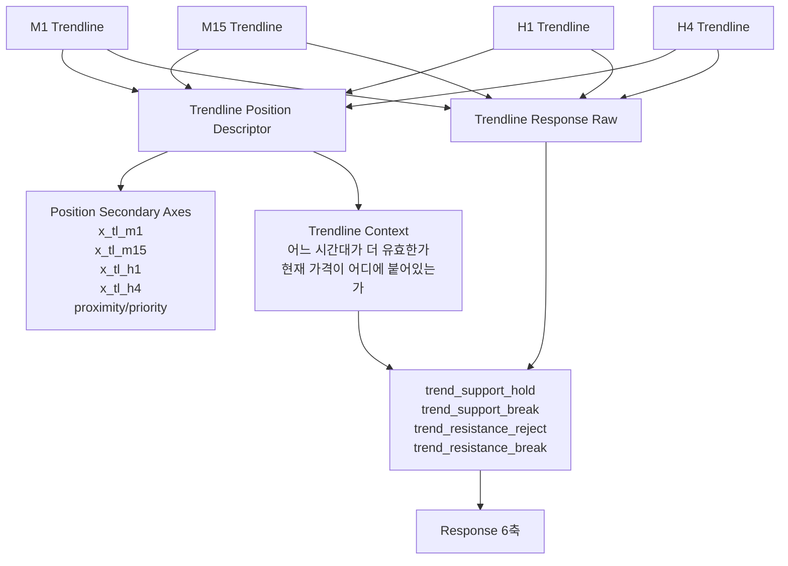

# 멀티 타임프레임 추세선 Position / Response 설계안

## 목적

이 문서는 아래 질문에 답하기 위한 문서다.

- 1분봉, 15분봉, 1시간봉, 4시간봉 추세선을 각각 어떻게 표현할 것인가
- 추세선은 `Position`에 두는 것이 맞는가
- 아니면 `Response`에 두는 것이 맞는가
- 핵심인 `추세선에 얼마나 가까운가`는 어떤 수치로 표현하는 것이 좋은가

---

## 먼저 결론

한 줄로 먼저 정리하면:

```text
추세선 자체는 Position에 일부 두고,
추세선에서 일어난 반응은 Response로 넘기는 것이 가장 자연스럽다.
```

즉 추세선은 둘로 나눠서 봐야 한다.

### Position에 둘 것

- 추세선 값 그 자체
- 현재 가격이 추세선 위/아래 어디에 있는지
- 현재 가격이 추세선에 얼마나 가까운지
- 어떤 시간대 추세선이 더 가까운지

### Response에 둘 것

- 추세선에서 튕겼는가
- 추세선을 이탈했는가
- 추세선을 다시 회복했는가
- 추세선에서 거절당했는가
- 추세선이 무너졌는가

즉:

- `추세선과의 거리/위치` = Position
- `추세선에서 벌어진 사건` = Response

이렇게 나누는 것이 맞다.

---

## 왜 이렇게 나누는가

만약 추세선을 전부 Response로만 보내면,
지금 가격이 추세선에서 멀리 떨어져 있는지 가까운지 같은
`정적 위치 정보`를 잃기 쉽다.

반대로 추세선을 전부 Position에만 넣으면,

- 지지받았는지
- 거절당했는지
- 이탈했는지

같은 `반응 정보`를 제대로 표현하기 어렵다.

즉 추세선은 원래부터 두 성질을 가진다.

1. `선으로서의 위치 정보`
2. `그 선에서의 반응 정보`

그래서 둘로 나눠야 한다.

---

## 전체 구조



---

## 1. 왜 멀티 타임프레임이 필요한가

추세선은 시간대마다 의미가 다르다.

### 1분봉 추세선

- 미세한 리듬
- 짧은 반응
- 너무 민감하고 노이즈가 많음

### 15분봉 추세선

- 단기 구조
- 단타/초단기 스윙에서 유용

### 1시간봉 추세선

- 메인 흐름 확인
- intraday 구조 판단에 중요

### 4시간봉 추세선

- 상위 구조
- 큰 지지/저항 의미

즉 같은 가격대라도

- M1에서는 이미 추세선 위
- H1에서는 아직 추세선 아래

일 수 있다.

그래서 하나의 `x_trendline`만으로는 부족하다.

---

## 2. Position에서 어떻게 표현할까

### 핵심 아이디어

각 시간대 추세선마다 별도의 `거리 에너지`를 둔다.

즉:

- `x_tl_m1`
- `x_tl_m15`
- `x_tl_h1`
- `x_tl_h4`

를 각각 만든다.

여기서 `x`는
가격이 추세선 대비 어느 쪽에 있고 얼마나 떨어져 있는지
표현하는 signed distance다.

---

## 3. 추세선에서 가까운지 어떻게 표현할까

이 부분이 핵심이다.

제일 좋은 방식은 하나의 값으로 끝내지 말고
아래 3개를 같이 두는 것이다.

### 1) signed distance

```text
x_tl_tf = (price - trendline_value_tf) / scale_tf
```

범위:

- 보통 `-1 ~ 1` 클립
- 필요하면 unclipped raw도 metadata에 보관

뜻:

- `+`면 추세선 위
- `-`면 추세선 아래
- 절댓값이 작을수록 추세선에 가까움

#### 예시

- `x_tl_h1 = 0.05`
  - 1시간 추세선 바로 위에 거의 붙어 있음
- `x_tl_h1 = -0.12`
  - 1시간 추세선 바로 아래
- `x_tl_h1 = 0.85`
  - 꽤 멀리 위에 있음

---

### 2) proximity

signed distance만으로는
“가까운지”를 직관적으로 쓰기 불편할 수 있다.

그래서 proximity를 같이 두는 것이 좋다.

```text
tl_proximity_tf = max(0, 1 - abs(x_tl_tf))
```

또는 더 부드럽게:

```text
tl_proximity_tf = exp(-abs(raw_distance_tf) / proximity_scale_tf)
```

범위:

- `0 ~ 1`

뜻:

- `1.0`에 가까울수록 선에 아주 가까움
- `0.0`에 가까울수록 선에서 멀다

#### 예시

- `tl_proximity_h1 = 0.92`
  - 거의 붙어 있음
- `tl_proximity_h1 = 0.30`
  - 꽤 멀다

---

### 3) side / side state

아주 단순한 상태값도 유용하다.

```text
trendline_side_tf
= ABOVE
= BELOW
= ON_LINE
```

또는:

```text
trendline_zone_tf
= BELOW
= LOWER_EDGE
= MIDDLE
= UPPER_EDGE
= ABOVE
```

이 값은 디버깅과 해석에 특히 좋다.

---

## 4. scale은 뭘 써야 하나

추세선 distance는 scale이 중요하다.

### 추천

시간대별로 다른 기준을 쓰는 것이 가장 좋다.

```text
scale_m1  = ATR_M1
scale_m15 = ATR_M15
scale_h1  = ATR_H1
scale_h4  = ATR_H4
```

이렇게 해야
각 시간대 추세선에서
“얼마나 멀다”를 공정하게 비교할 수 있다.

### 대안

- 최근 n봉 평균 range
- trendline anchor segment의 평균 변동폭

하지만 가장 무난한 건 ATR 기준이다.

---

## 5. Position에 둘 추천 필드

### 최소형

| 필드 | 뜻 |
|---|---|
| `x_tl_m1` | 1분봉 추세선 signed distance |
| `x_tl_m15` | 15분봉 추세선 signed distance |
| `x_tl_h1` | 1시간봉 추세선 signed distance |
| `x_tl_h4` | 4시간봉 추세선 signed distance |

이 4개만 있어도 시작 가능하다.

### 권장형

| 필드 | 뜻 |
|---|---|
| `x_tl_m1` | M1 추세선 signed distance |
| `x_tl_m15` | M15 추세선 signed distance |
| `x_tl_h1` | H1 추세선 signed distance |
| `x_tl_h4` | H4 추세선 signed distance |
| `tl_proximity_m1` | M1 추세선 근접도 |
| `tl_proximity_m15` | M15 추세선 근접도 |
| `tl_proximity_h1` | H1 추세선 근접도 |
| `tl_proximity_h4` | H4 추세선 근접도 |
| `tl_side_m1` | M1 추세선 위/아래 |
| `tl_side_m15` | M15 추세선 위/아래 |
| `tl_side_h1` | H1 추세선 위/아래 |
| `tl_side_h4` | H4 추세선 위/아래 |

### 확장형

추가로 아래도 고려 가능하다.

| 필드 | 뜻 |
|---|---|
| `tl_slope_m1` | M1 추세선 기울기 |
| `tl_slope_m15` | M15 추세선 기울기 |
| `tl_slope_h1` | H1 추세선 기울기 |
| `tl_slope_h4` | H4 추세선 기울기 |
| `tl_quality_m1` | 추세선 품질 점수 |
| `tl_quality_m15` | 추세선 품질 점수 |
| `tl_quality_h1` | 추세선 품질 점수 |
| `tl_quality_h4` | 추세선 품질 점수 |

하지만 시작은 너무 크게 잡지 않는 게 좋다.

처음엔:

- `x_tl_tf`
- `tl_proximity_tf`

정도만으로 충분하다.

---

## 6. Response로 넘겨야 하는 것

추세선은 위치만으로 끝나지 않는다.

실제로 중요한 건
그 선에서 어떤 사건이 벌어졌는지다.

그래서 아래는 `Response`가 owner가 되는 것이 맞다.

### 추세선 반응 raw 예시

| raw | 뜻 |
|---|---|
| `trend_support_hold_m1` | M1 추세선 지지 받고 반등 |
| `trend_support_break_m1` | M1 추세선 지지 붕괴 |
| `trend_resistance_reject_m1` | M1 추세선에서 상단 거절 |
| `trend_resistance_break_m1` | M1 추세선 돌파 |
| `trend_support_hold_h1` | H1 추세선 지지 반등 |
| `trend_support_break_h1` | H1 추세선 붕괴 |
| `trend_resistance_reject_h4` | H4 추세선 저항 거절 |
| `trend_resistance_break_h4` | H4 추세선 돌파 |

즉:

- `가깝다 / 멀다 / 위다 / 아래다`는 Position
- `받쳤다 / 깨졌다 / 거절당했다 / 돌파했다`는 Response

이렇게 나누면 된다.

---

## 7. 그래서 추세선 자체는 Response로 넘기는 게 맞나?

정확히 말하면:

### 반은 맞고 반은 아니다

#### 맞는 부분

네가 직감한 대로,
`추세선에서 무슨 일이 벌어졌는가`
는 Response가 맞다.

예:

- 추세선 지지
- 추세선 붕괴
- 추세선 거절
- 추세선 돌파

이건 전부 Response다.

#### 아닌 부분

하지만
`현재 가격이 추세선에 붙어 있는가`
`현재 가격이 추세선 위인가 아래인가`
같은 정보는 Response가 아니라 Position 쪽이 더 맞다.

왜냐하면 이건 사건이 아니라 현재 지도상 위치이기 때문이다.

---

## 8. 가장 좋은 owner 분리

### Position owner

- `x_tl_m1`
- `x_tl_m15`
- `x_tl_h1`
- `x_tl_h4`
- `tl_proximity_m1`
- `tl_proximity_m15`
- `tl_proximity_h1`
- `tl_proximity_h4`

### Response owner

- `trend_support_hold_*`
- `trend_support_break_*`
- `trend_resistance_reject_*`
- `trend_resistance_break_*`

### State owner

추세선 자체보다
추세선의 품질/유효성 해석은 State가 가져갈 수 있다.

예:

- `tl_quality_h1`
- `tl_quality_h4`
- `mtf_trendline_alignment`
- `trendline_conflict_score`

즉:

- Position = 거리/근접도
- Response = 사건
- State = 품질/환경

가 된다.

---

## 9. Response 6축과 연결하면

### support 계열

- `trend_support_hold_*`
  - `lower_hold_up`
  - 경우에 따라 `mid_reclaim_up`

- `trend_support_break_*`
  - `lower_break_down`
  - 경우에 따라 `mid_lose_down`

### resistance 계열

- `trend_resistance_reject_*`
  - `upper_reject_down`
  - 경우에 따라 `mid_lose_down`

- `trend_resistance_break_*`
  - `upper_break_up`
  - 경우에 따라 `mid_reclaim_up`

즉 추세선 반응도 결국은
네가 정리한 support/resistance semantic으로 들어간다.

---

## 10. 실전 예시

### 예시 1. H1 추세선 바로 위

```text
x_tl_h1 = 0.03
tl_proximity_h1 = 0.94
```

뜻:

- 현재 가격은 H1 추세선 바로 위
- 아직 사건은 없고 위치만 말함
- Position 정보

### 예시 2. H1 추세선 지지 반등

```text
x_tl_h1 = 0.05
tl_proximity_h1 = 0.91
trend_support_hold_h1 = 0.78
```

뜻:

- 가까이 붙어 있음
- 실제로 지지 반응이 나옴
- `lower_hold_up` 강화

### 예시 3. H4 추세선 아래 붕괴

```text
x_tl_h4 = -0.18
tl_proximity_h4 = 0.87
trend_support_break_h4 = 0.82
```

뜻:

- H4 추세선 아래
- 추세선 근처에서 실제 붕괴
- `lower_break_down` 강화

---

## 11. 현재 코드와 비교하면

현재는 이 구조가 아직 아니다.

### 현재 있는 것

- [models.py](/Users/bhs33/Desktop/project/cfd/backend/trading/engine/core/models.py)
  - `trendline_value`
  - `x_trendline`
  - `trendline_zone`
- [trendline_position.py](/Users/bhs33/Desktop/project/cfd/backend/trading/engine/position/trendline_position.py)
  - 단일 `trendline_value`만 받아 signed distance 계산

### 현재 없는 것

- `x_tl_m1`
- `x_tl_m15`
- `x_tl_h1`
- `x_tl_h4`
- `tl_proximity_*`
- 추세선 반응 raw

즉 현재는

- 추세선 축 자리는 하나만 있고
- 그것도 멀티 타임프레임 분리는 안 돼 있고
- Response 쪽 추세선 사건도 아직 없다

---

## 12. 추천 구현 우선순위

### 1단계

Position에 아래 8개만 먼저 만든다.

- `x_tl_m1`
- `x_tl_m15`
- `x_tl_h1`
- `x_tl_h4`
- `tl_proximity_m1`
- `tl_proximity_m15`
- `tl_proximity_h1`
- `tl_proximity_h4`

### 2단계

Response에 아래 4개 semantic raw를 시간대별로 만든다.

- `trend_support_hold_*`
- `trend_support_break_*`
- `trend_resistance_reject_*`
- `trend_resistance_break_*`

### 3단계

State에 아래를 둔다.

- `tl_quality_*`
- `mtf_trendline_alignment`
- `trendline_conflict_score`

---

## 13. 최종 정리

질문:

```text
추세선에서 가까운지 안 가까운지를 어떻게 표현할까?
그리고 이렇게 보면 추세선 자체는 Response로 넘기는 게 맞지 않나?
```

정답:

```text
가까운지는
1) signed distance
2) proximity
3) side

이 3개로 표현하는 것이 가장 좋다.
```

그리고 owner는 이렇게 나누는 것이 가장 자연스럽다.

```text
추세선의 위치/거리 = Position
추세선에서의 반응 = Response
추세선 품질/정합성 = State
```

즉 추세선을 전부 Response로 보내는 것보다는,
`위치 정보는 Position에 남기고`,
`사건 정보만 Response로 넘기는 구조`
가 가장 안정적이다.
