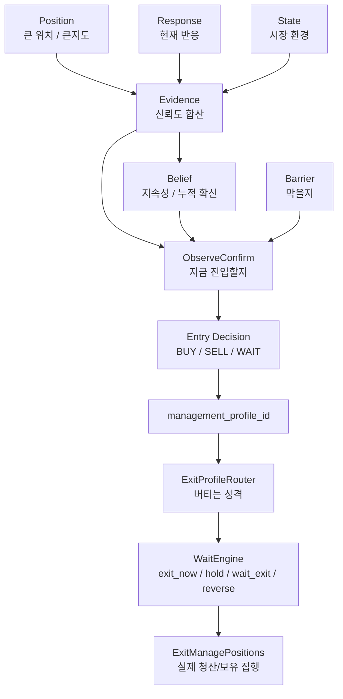

# 신뢰 / 기다림 / 보유지속 Owner 정리

## 목적

이 문서는 아래 3개를 명확히 구분하기 위한 문서다.

- `신뢰할지`
- `얼마나 기다릴지`
- `얼마나 오래 들고 갈지`

이 3개는 비슷해 보여도 owner가 다르다.

즉 이 문서는

- `Response`
- `Evidence`
- `Belief`
- `Barrier`
- `ObserveConfirm`
- `WaitEngine`
- `ExitProfileRouter`
- `ExitManagePositions`

중 누가 무엇을 직접 결정하는지 선명하게 나누는 기준서다.

---

## 가장 짧은 결론

```text
Response는 반응을 말한다.
Evidence는 그 반응을 얼마나 믿을지 말한다.
Belief는 그 믿음이 얼마나 지속되는지 말한다.
Barrier는 지금 막아야 하는지를 말한다.
ObserveConfirm은 지금 진입할지 기다릴지를 정한다.
ExitProfileRouter / WaitEngine / ExitManagePositions는 진입 후 얼마나 버틸지 정한다.
```

즉:

- `신뢰`의 핵심 owner = `Evidence + Belief`
- `엔트리 기다림`의 핵심 owner = `ObserveConfirm + Barrier + WaitEngine`
- `보유 지속`의 핵심 owner = `ExitProfileRouter + WaitEngine + ExitManagePositions`

---

## 한눈에 보는 표

| 질문 | 직접 owner | 보조 owner | 큰지도(Position/State)의 역할 | 결과물 |
|---|---|---|---|---|
| `이 반응을 신뢰할까?` | `Evidence` | `Belief` | Position fit, State gain으로 신뢰도 보정 | `buy/sell evidence`, `buy/sell belief` |
| `지금 바로 들어갈까, 기다릴까?` | `ObserveConfirm` | `Barrier`, `WaitEngine` | 큰지도가 반응을 살리거나 약하게 만듦 | `CONFIRM / OBSERVE / WAIT` |
| `들어간 뒤 얼마나 더 버틸까?` | `ExitProfileRouter`, `WaitEngine` | `ExitManagePositions` | 큰지도와 archetype에 따라 hold 성격 결정 | `hold / wait_exit / exit_now / reverse` |

---

## 전체 흐름 그림



---

## 1. `신뢰할지`는 누가 정하나

### 직접 owner

- `Evidence`

### 지속성 owner

- `Belief`

### 왜 그런가

`Response`는 반응을 보여줄 뿐이다.

예:

- 하단 지지 반등
- 상단 거절
- 중심 reclaim
- 하단 break

이런 반응이 나왔더라도,
그 반응이 실제로 믿을 만한지는
다른 층과 결합해봐야 한다.

그 결합을 하는 곳이 `Evidence`다.

---

### Evidence가 실제로 하는 일

[evidence_engine.py](/Users/bhs33/Desktop/project/cfd/backend/trading/engine/core/evidence_engine.py)

여기서는 실제로:

- `Response`
- `Position fit`
- `State gain`

을 합쳐서 아래를 만든다.

- `buy_reversal_evidence`
- `sell_reversal_evidence`
- `buy_continuation_evidence`
- `sell_continuation_evidence`

즉:

```text
Response가 좋다
+ Position이 맞다
+ State가 허용한다
= Evidence가 올라간다
```

반대로:

```text
Response가 좋아도
Position이 반대거나
State가 나쁘면
Evidence가 깎인다
```

---

### 큰지도는 여기서 어떻게 쓰이나

큰지도는 `Evidence` 안에서 주로 두 가지로 들어간다.

#### 1) Position fit

- 지금 위치가 이 archetype과 맞는지
- 예: 하단 반등이면 lower 쪽이 맞는지
- 예: 상단 거절이면 upper 쪽이 맞는지

#### 2) State gain

- 지금 장이 range인지 trend인지
- noise/conflict/liquidity가 어떤지
- direction policy가 어떤지

즉 큰지도는 직접 `BUY/SELL`를 누르는 것이 아니라,
`이 반응을 얼마나 믿어줄지`
를 정하는 필터로 들어간다.

---

### Belief는 뭐가 다르나

[belief_engine.py](/Users/bhs33/Desktop/project/cfd/backend/trading/engine/core/belief_engine.py)

Belief는 `한 번 나온 근거`를 바로 확정하지 않고,
몇 봉째 유지되는지를 누적한다.

즉:

- `Evidence` = 순간 신뢰도
- `Belief` = 지속 신뢰도

예:

- `buy_reversal_evidence`가 1봉만 강한가
- 아니면 3봉째 이어지는가

이 차이를 Belief가 본다.

---

### 정리

`신뢰`의 직접 owner는 `Evidence`,
지속성 owner는 `Belief`다.

즉 질문을 바꾸면:

```text
이 반응이 그럴듯한가? -> Evidence
그 그럴듯함이 계속 유지되는가? -> Belief
```

---

## 2. `얼마나 기다릴지`는 누가 정하나

이 부분이 가장 자주 헷갈린다.

결론부터 말하면:

### 엔트리 기다림의 직접 owner

- `ObserveConfirm`

### 엔트리 기다림을 막거나 늦추는 owner

- `Barrier`
- `WaitEngine`

즉 `기다림`은 Response 자체가 정하지 않는다.

Response는

- 반응이 있다 / 없다
- 어느 축이 강하다

만 말하고,

실제로

- `지금 확정(confirm)할지`
- `조금 더 observe할지`
- `그냥 wait할지`

를 정하는 것은 다른 친구들이다.

---

### ObserveConfirm의 역할

[observe_confirm_router.py](/Users/bhs33/Desktop/project/cfd/backend/trading/engine/core/observe_confirm_router.py)

ObserveConfirm은

- `Position`
- `Response`
- `State`
- 경우에 따라 `Evidence / Belief / Barrier / Forecast`

를 받아서 실제 action에 가까운 상태를 만든다.

즉 여기서:

- `CONFIRM`
- `OBSERVE`
- `WAIT`

가 갈린다.

쉽게 말하면:

```text
반응은 좋지만 아직 확정하기 이르다 -> OBSERVE
반응도 좋고 근거도 충분하다 -> CONFIRM
반응은 있어도 애매하다 -> WAIT
```

---

### Barrier의 역할

[barrier_engine.py](/Users/bhs33/Desktop/project/cfd/backend/trading/engine/core/barrier_engine.py)

Barrier는

- conflict
- middle chop
- liquidity
- direction policy

같은 이유로
지금 들어가면 안 되는지를 정한다.

즉 Barrier는
`기다림의 차단자`다.

#### 대표 예

- 가운데 장이라 애매함
- position conflict가 큼
- liquidity가 나쁨
- BUY_ONLY / SELL_ONLY 정책과 충돌

이럴 때는 Response가 좋아도
Barrier가 높으면 확정이 눌린다.

---

### WaitEngine의 역할

[wait_engine.py](/Users/bhs33/Desktop/project/cfd/backend/services/wait_engine.py)

WaitEngine은
이미 생긴 `wait 성향`을 공식 상태로 정리해준다.

예:

- `hard_wait`
- `soft_wait`
- `helper_wait`
- `policy_block`
- `conflict_wait`
- `noise_wait`

즉 WaitEngine은
`왜 기다리고 있는지`
를 사람이 읽을 수 있는 상태로 정리하는 역할이 크다.

---

### 큰지도는 기다림에 어떻게 영향을 주나

큰지도는 직접 `WAIT 30초` 같은 걸 정하지 않는다.

대신:

- `Evidence`를 올리거나 내리고
- `Barrier`를 키우거나 줄이고
- `ObserveConfirm`의 confirm support를 바꾸는 방식으로

결과적으로 기다림에 영향을 준다.

즉:

```text
큰지도가 좋으면
반응을 더 빨리 confirm할 수 있고

큰지도가 나쁘면
같은 반응도 observe / wait로 밀릴 수 있다
```

---

### 정리

`엔트리 기다림`의 직접 owner는 `ObserveConfirm`,
억제 owner는 `Barrier`,
wait 상태 정리 owner는 `WaitEngine`이다.

즉:

```text
지금 바로 들어갈까? -> ObserveConfirm
지금 막아야 하나? -> Barrier
그 기다림을 어떤 wait 상태로 볼까? -> WaitEngine
```

---

## 3. `얼마나 오래 들고 갈지`는 누가 정하나

이건 PRSEBB 코어 바깥까지 넘어간다.

즉:

- `Evidence`
- `Belief`
- `Barrier`

만으로 끝나지 않는다.

진입 후 관리 레이어가 따로 owner다.

---

### 1단계. ObserveConfirm이 archetype과 management profile을 붙인다

[observe_confirm_router.py](/Users/bhs33/Desktop/project/cfd/backend/trading/engine/core/observe_confirm_router.py)

여기서 archetype에 따라 management profile이 달라진다.

예:

- `support_hold_profile`
- `reversal_profile`
- `breakout_hold_profile`
- `breakdown_hold_profile`

이게 중요하다.

왜냐하면 이 profile이
나중에 얼마나 오래 들고 갈지를 크게 바꾸기 때문이다.

---

### 2단계. ExitProfileRouter가 버티는 성격을 정한다

[exit_profile_router.py](/Users/bhs33/Desktop/project/cfd/backend/services/exit_profile_router.py)

여기서 실제로 이런 값들이 정해진다.

- `allow_wait_be`
- `allow_wait_tp1`
- `max_wait_seconds`
- `prefer_reverse`

즉:

- 손실이어도 BE 회복까지 기다릴지
- 소익절까지 기다릴지
- 몇 초까지 기다릴지
- 반전 청산을 선호할지

같은 것이 여기서 정해진다.

이게 사실상
`얼마나 참을 수 있나`
의 핵심이다.

---

### 3단계. WaitEngine이 exit_now / hold / wait_exit / reverse를 비교한다

[wait_engine.py](/Users/bhs33/Desktop/project/cfd/backend/services/wait_engine.py)

여기서는 exit 쪽 utility 비교가 들어간다.

예:

- `utility_exit_now`
- `utility_hold`
- `utility_wait_exit`
- `utility_reverse`

즉 여기서:

- 지금 바로 팔지
- 더 들고 갈지
- 조금 더 기다렸다가 나갈지
- 반대로 돌릴지

를 utility 기준으로 비교한다.

이 단계가
`보유 지속 시간`을 사실상 실무적으로 결정하는 층이다.

---

### 4단계. ExitManagePositions가 실제 집행한다

[exit_manage_positions.py](/Users/bhs33/Desktop/project/cfd/backend/services/exit_manage_positions.py)

여기서는 실제로:

- protect
- lock
- hold
- recovery_wait
- reverse

같은 로직을 통해
포지션을 실제로 끌고 갈지 종료할지 집행한다.

즉 최종 실행 owner다.

---

### 큰지도는 보유 지속에 어떻게 관여하나

직접 owner는 아니지만,
큰지도와 archetype이
management profile을 바꾸고,
그게 exit policy를 바꾸며,
결국 보유 지속에 영향을 준다.

즉:

```text
큰지도와 맞는 방향의 진입
-> 더 오래 버틸 수 있는 profile
-> hold / wait_exit 쪽 유리

큰지도와 반대 방향의 진입
-> 더 짧고 보수적인 profile
-> exit_now / protect 쪽 유리
```

---

### 정리

`보유 지속`의 직접 owner는

- `ExitProfileRouter`
- `WaitEngine`
- `ExitManagePositions`

이다.

ObserveConfirm은 그 전에
`어떤 archetype으로 들어갔는가`
를 정해서 간접 영향을 준다.

---

## 4. owner를 문장으로 다시 자르면

### Response

- 지금 무슨 반응이 나왔는지 말한다
- 직접 기다림을 정하지 않는다
- 직접 보유시간을 정하지 않는다

### Evidence

- 그 반응을 지금 얼마나 믿을지 정한다

### Belief

- 그 믿음이 얼마나 지속되는지 정한다

### Barrier

- 지금 들어가면 안 되는지를 정한다

### ObserveConfirm

- 지금 바로 진입할지, observe할지, wait할지 정한다

### WaitEngine

- entry/exit 둘 다에서 `기다림`을 공식 상태와 utility로 정리한다

### ExitProfileRouter

- 진입 후 얼마나 버틸 수 있는 profile인지 정한다

### ExitManagePositions

- 실제로 들고 갈지, 팔지, 뒤집을지 집행한다

---

## 5. 질문별 owner 표

| 질문 | 직접 owner | 왜 이 친구가 owner인가 |
|---|---|---|
| `이 반응을 믿어도 되나?` | `Evidence` | Position/Response/State를 합쳐 신뢰도를 만듦 |
| `그 믿음이 계속 유지되나?` | `Belief` | EMA와 streak로 지속성을 누적함 |
| `지금 바로 진입할까?` | `ObserveConfirm` | confirm / observe / wait를 실제로 내림 |
| `지금 막아야 하나?` | `Barrier` | conflict/chop/liquidity/policy로 suppress함 |
| `왜 wait 중인가?` | `WaitEngine` | hard_wait / soft_wait / helper_wait를 정리함 |
| `얼마나 더 버틸까?` | `ExitProfileRouter` | wait 허용 범위와 max_wait_seconds를 정함 |
| `결국 hold냐 exit냐 reverse냐?` | `WaitEngine` | exit_now / hold / wait_exit / reverse utility를 비교함 |
| `실제로 청산할까?` | `ExitManagePositions` | 최종 실행을 담당함 |

---

## 6. 최종 정리

질문을 바꾸면 owner도 명확해진다.

```text
반응이 나왔나? -> Response
그 반응을 믿을 만한가? -> Evidence
그 믿음이 이어지는가? -> Belief
지금 막아야 하나? -> Barrier
지금 진입할까, 기다릴까? -> ObserveConfirm + WaitEngine
들어간 뒤 얼마나 버틸까? -> ExitProfileRouter + WaitEngine + ExitManagePositions
```

즉:

- `신뢰`는 `Evidence/Belief`
- `엔트리 기다림`은 `ObserveConfirm/Barrier/WaitEngine`
- `보유 지속`은 `ExitProfileRouter/WaitEngine/ExitManagePositions`

이렇게 외우면 된다.
